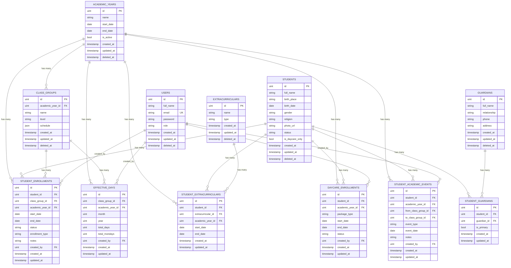

# ERD: Alizzah Manajemen

> Berdasarkan: `prd-feature-detail.md`

## Konvensi Model

- **PrimaryKey**: `id` uint auto-increment
- **BaseModelTimeAt**: `created_at`, `updated_at`, `deleted_at` (soft delete via GORM)
- Tidak semua entitas menggunakan soft delete — hanya entitas yang datanya bersifat master/historis penting
- Tabel existing yang digunakan ulang: `users`

---

## Diagram A — Modul Administrasi

---

## Diagram B — Modul Keuangan

```mermaid
erDiagram
    STUDENTS {
        uint id PK
        string full_name
        string gender
        string status
    }

    ACADEMIC_YEARS {
        uint id PK
        string name
        bool is_active
    }

    USERS {
        uint id PK
        string full_name
        string role
    }

    FEE_CONFIGS {
        uint id PK
        uint academic_year_id FK
        decimal savings_admin_rate
        timestamp created_at
        timestamp updated_at
    }

    FEE_CONFIG_ITEMS {
        uint id PK
        uint fee_config_id FK
        string category
        string item_key
        string name
        string level
        string gender
        decimal amount
        string unit
        timestamp created_at
        timestamp updated_at
    }

    INVOICES {
        uint id PK
        uint student_id FK
        uint academic_year_id FK
        string type
        uint month
        uint year
        string status
        decimal total_amount
        decimal paid_amount
        date due_date
        string notes
        timestamp created_at
        timestamp updated_at
        timestamp deleted_at
    }

    INVOICE_ITEMS {
        uint id PK
        uint invoice_id FK
        string name
        string category
        decimal amount
        decimal paid_amount
        string status
        bool is_mandatory
        timestamp created_at
        timestamp updated_at
    }

    INVOICE_INSTALLMENTS {
        uint id PK
        uint invoice_id FK
        uint installment_number
        date due_date
        decimal amount
        string notes
        timestamp created_at
        timestamp updated_at
    }

    PAYMENTS {
        uint id PK
        uint student_id FK
        uint academic_year_id FK
        date payment_date
        decimal total_amount
        string source
        string notes
        uint created_by FK
        timestamp created_at
        timestamp updated_at
    }

    PAYMENT_ITEMS {
        uint id PK
        uint payment_id FK
        uint invoice_item_id FK
        decimal amount
        timestamp created_at
        timestamp updated_at
    }

    STUDENT_SAVINGS {
        uint id PK
        uint student_id FK
        string type
        decimal balance
        timestamp created_at
        timestamp updated_at
    }

    SAVINGS_TRANSACTIONS {
        uint id PK
        uint student_savings_id FK
        string transaction_type
        decimal amount
        decimal admin_fee
        decimal net_amount
        string source_type
        uint source_id
        string notes
        uint created_by FK
        timestamp created_at
        timestamp updated_at
    }

    EXPENSE_CATEGORIES {
        uint id PK
        uint parent_id FK
        string name
        timestamp created_at
        timestamp updated_at
        timestamp deleted_at
    }

    EXPENSES {
        uint id PK
        uint academic_year_id FK
        uint expense_category_id FK
        date expense_date
        decimal amount
        string description
        string receipt_url
        uint created_by FK
        timestamp created_at
        timestamp updated_at
        timestamp deleted_at
    }

    CASH_TRANSACTIONS {
        uint id PK
        uint academic_year_id FK
        date transaction_date
        string transaction_type
        decimal amount
        string source_type
        uint source_id
        string description
        uint created_by FK
        timestamp created_at
        timestamp updated_at
    }

    VAULT_TRANSACTIONS {
        uint id PK
        uint academic_year_id FK
        date transaction_date
        string transaction_type
        decimal amount
        string source_type
        uint source_id
        string description
        uint created_by FK
        timestamp created_at
        timestamp updated_at
    }

    DAILY_CLOSINGS {
        uint id PK
        uint academic_year_id FK
        date closing_date
        decimal physical_cash_amount
        decimal system_cash_amount
        decimal difference
        string notes
        bool is_confirmed
        uint closed_by FK
        timestamp created_at
        timestamp updated_at
    }

    ACADEMIC_YEARS ||--|| FEE_CONFIGS : "has one"
    ACADEMIC_YEARS ||--o{ INVOICES : "has many"
    ACADEMIC_YEARS ||--o{ PAYMENTS : "has many"
    ACADEMIC_YEARS ||--o{ EXPENSES : "has many"
    ACADEMIC_YEARS ||--o{ CASH_TRANSACTIONS : "has many"
    ACADEMIC_YEARS ||--o{ VAULT_TRANSACTIONS : "has many"
    ACADEMIC_YEARS ||--o{ DAILY_CLOSINGS : "has many"
    STUDENTS ||--o{ INVOICES : "has many"
    STUDENTS ||--o{ PAYMENTS : "has many"
    STUDENTS ||--o{ STUDENT_SAVINGS : "has many"
    FEE_CONFIGS ||--o{ FEE_CONFIG_ITEMS : "has many"
    INVOICES ||--o{ INVOICE_ITEMS : "has many"
    INVOICES ||--o{ INVOICE_INSTALLMENTS : "has many"
    INVOICE_ITEMS ||--o{ PAYMENT_ITEMS : "paid via"
    PAYMENTS ||--o{ PAYMENT_ITEMS : "has many"
    STUDENT_SAVINGS ||--o{ SAVINGS_TRANSACTIONS : "has many"
    EXPENSE_CATEGORIES ||--o{ EXPENSE_CATEGORIES : "has sub-categories"
    EXPENSE_CATEGORIES ||--o{ EXPENSES : "has many"
    USERS ||--o{ PAYMENTS : "created_by"
    USERS ||--o{ EXPENSES : "created_by"
    USERS ||--o{ SAVINGS_TRANSACTIONS : "created_by"
    USERS ||--o{ CASH_TRANSACTIONS : "created_by"
    USERS ||--o{ VAULT_TRANSACTIONS : "created_by"
    USERS ||--o{ DAILY_CLOSINGS : "closed_by"
```

---

## Deskripsi Entitas

### users *(existing)*
| Field | Type | Constraint | Keterangan |
|---|---|---|---|
| id | uint | PK, auto-inc | Primary key |
| full_name | varchar(100) | NOT NULL | Nama lengkap |
| email | varchar(100) | NOT NULL, UNIQUE | Email login |
| password | varchar(255) | NOT NULL | Hashed password |
| role | varchar(30) | NOT NULL | Enum: `superadmin`, `admin_administrasi`, `admin_keuangan`, `kepala_sekolah`, `yayasan` |
| created_at | timestamp | auto | — |
| updated_at | timestamp | auto | — |
| deleted_at | timestamp | nullable, index | Soft delete |

---

### academic_years
| Field | Type | Constraint | Keterangan |
|---|---|---|---|
| id | uint | PK, auto-inc | — |
| name | varchar(20) | NOT NULL | Contoh: "2025/2026" |
| start_date | date | NOT NULL | Tanggal mulai tahun ajaran |
| end_date | date | NOT NULL | Tanggal selesai tahun ajaran |
| is_active | bool | DEFAULT false | Hanya satu yang aktif pada satu waktu |
| created_at | timestamp | auto | — |
| updated_at | timestamp | auto | — |
| deleted_at | timestamp | nullable | Soft delete |

---

### students
| Field | Type | Constraint | Keterangan |
|---|---|---|---|
| id | uint | PK, auto-inc | — |
| full_name | varchar(100) | NOT NULL | Nama lengkap siswa |
| birth_place | varchar(100) | NOT NULL | Tempat lahir |
| birth_date | date | NOT NULL | Tanggal lahir |
| gender | varchar(1) | NOT NULL | Enum: `L`, `P` |
| religion | varchar(30) | nullable | Agama |
| photo_url | varchar(255) | nullable | URL foto siswa |
| status | varchar(20) | NOT NULL, DEFAULT active | Enum: `active`, `graduated`, `transferred`, `dropped` |
| is_daycare_only | bool | DEFAULT false | Siswa daycare dari luar sekolah (tanpa rombel reguler) |
| created_at | timestamp | auto | — |
| updated_at | timestamp | auto | — |
| deleted_at | timestamp | nullable | Soft delete |

---

### guardians
| Field | Type | Constraint | Keterangan |
|---|---|---|---|
| id | uint | PK, auto-inc | — |
| full_name | varchar(100) | NOT NULL | Nama wali murid |
| relationship | varchar(20) | NOT NULL | Enum: `ayah`, `ibu`, `wali` |
| phone | varchar(20) | NOT NULL | Nomor telepon |
| address | text | nullable | Alamat |
| created_at | timestamp | auto | — |
| updated_at | timestamp | auto | — |
| deleted_at | timestamp | nullable | Soft delete |

---

### student_guardians *(junction table)*
| Field | Type | Constraint | Keterangan |
|---|---|---|---|
| id | uint | PK, auto-inc | — |
| student_id | uint | FK → students.id | — |
| guardian_id | uint | FK → guardians.id | — |
| is_primary | bool | DEFAULT false | Wali utama yang dihubungi |
| created_at | timestamp | auto | — |
| updated_at | timestamp | auto | — |

> Satu wali murid bisa terhubung ke lebih dari satu siswa. Satu siswa bisa punya lebih dari satu wali.

---

### class_groups
| Field | Type | Constraint | Keterangan |
|---|---|---|---|
| id | uint | PK, auto-inc | — |
| academic_year_id | uint | FK → academic_years.id | Rombel terikat ke satu tahun ajaran |
| name | varchar(50) | NOT NULL | Contoh: "Intan 1", "Berlian 3" |
| level | varchar(20) | NOT NULL | Enum: `mutiara`, `intan`, `berlian` |
| schedule | json | NOT NULL | Jadwal hari, jam masuk, jam pulang, jam pulang calisan per kelompok hari |
| created_at | timestamp | auto | — |
| updated_at | timestamp | auto | — |
| deleted_at | timestamp | nullable | Soft delete |

> Field `schedule` menyimpan konfigurasi jadwal dalam format JSON untuk mengakomodasi variasi jadwal per rombel (misal Mutiara 3 hari vs Intan/Berlian 6 hari, jam pulang berbeda Senin–Kamis vs Jumat–Sabtu).

---

### student_enrollments
| Field | Type | Constraint | Keterangan |
|---|---|---|---|
| id | uint | PK, auto-inc | — |
| student_id | uint | FK → students.id | — |
| class_group_id | uint | FK → class_groups.id | Rombel yang diikuti |
| academic_year_id | uint | FK → academic_years.id | — |
| start_date | date | NOT NULL | Tanggal mulai efektif (penting untuk mutasi masuk) |
| end_date | date | nullable | Tanggal selesai (null jika masih aktif) |
| status | varchar(20) | NOT NULL | Enum: `active`, `completed`, `transferred`, `dropped` |
| enrollment_type | varchar(20) | NOT NULL | Enum: `new` (siswa baru), `promotion` (naik kelas), `mutation` (mutasi masuk), `retained` (tinggal kelas), `class_change` (pindah rombel) |
| notes | text | nullable | Catatan tambahan |
| created_by | uint | FK → users.id | — |
| created_at | timestamp | auto | — |
| updated_at | timestamp | auto | — |

> Tabel ini menjadi riwayat lengkap perjalanan akademik siswa. Satu siswa bisa punya banyak record (per tahun ajaran, per pergantian rombel).

---

### effective_days
| Field | Type | Constraint | Keterangan |
|---|---|---|---|
| id | uint | PK, auto-inc | — |
| class_group_id | uint | FK → class_groups.id | — |
| academic_year_id | uint | FK → academic_years.id | — |
| month | uint | NOT NULL | Bulan (1–12) |
| year | uint | NOT NULL | Tahun (misal 2025) |
| total_days | uint | NOT NULL | Total hari efektif bulan tersebut (untuk infaq harian) |
| total_mondays | uint | NOT NULL | Total hari Senin bulan tersebut (untuk tabungan wajib Berlian) |
| created_by | uint | FK → users.id | — |
| created_at | timestamp | auto | — |
| updated_at | timestamp | auto | — |

> UNIQUE constraint pada `(class_group_id, month, year)`. Data ini menjadi acuan otomatis saat generate tagihan bulanan.

---

### extracurriculars
| Field | Type | Constraint | Keterangan |
|---|---|---|---|
| id | uint | PK, auto-inc | — |
| name | varchar(100) | NOT NULL | Contoh: "Robotika", "Taekwondo", "Calisan KB" |
| type | varchar(20) | NOT NULL | Enum: `pasta`, `calisan`, `ekskul` |
| created_at | timestamp | auto | — |
| updated_at | timestamp | auto | — |
| deleted_at | timestamp | nullable | Soft delete |

---

### student_extracurriculars
| Field | Type | Constraint | Keterangan |
|---|---|---|---|
| id | uint | PK, auto-inc | — |
| student_id | uint | FK → students.id | — |
| extracurricular_id | uint | FK → extracurriculars.id | — |
| academic_year_id | uint | FK → academic_years.id | — |
| start_date | date | NOT NULL | Mulai ikut ekskul/pasta |
| end_date | date | nullable | Selesai/berhenti (null jika masih aktif) |
| created_at | timestamp | auto | — |
| updated_at | timestamp | auto | — |

> Satu siswa bisa terdaftar lebih dari satu pasta. Data ini menjadi trigger item tagihan pasta pada tagihan bulanan.

---

### daycare_enrollments
| Field | Type | Constraint | Keterangan |
|---|---|---|---|
| id | uint | PK, auto-inc | — |
| student_id | uint | FK → students.id | Bisa siswa reguler maupun siswa daycare-only |
| academic_year_id | uint | FK → academic_years.id | — |
| package_type | varchar(30) | NOT NULL | Enum: `monthly_kb`, `monthly_tk`, `monthly_package_kb`, `monthly_package_tk`, `daily` |
| start_date | date | NOT NULL | Tanggal mulai daycare |
| end_date | date | nullable | Tanggal selesai daycare |
| status | varchar(20) | NOT NULL | Enum: `active`, `inactive` |
| created_by | uint | FK → users.id | — |
| created_at | timestamp | auto | — |
| updated_at | timestamp | auto | — |

---

### student_academic_events
| Field | Type | Constraint | Keterangan |
|---|---|---|---|
| id | uint | PK, auto-inc | — |
| student_id | uint | FK → students.id | — |
| academic_year_id | uint | FK → academic_years.id | — |
| from_class_group_id | uint | FK → class_groups.id, nullable | Rombel asal (null untuk siswa baru) |
| to_class_group_id | uint | FK → class_groups.id, nullable | Rombel tujuan (null untuk keluar/dropout) |
| event_type | varchar(30) | NOT NULL | Enum: `promotion`, `retained`, `graduation`, `transfer_in`, `transfer_out`, `class_change`, `dropout` |
| event_date | date | NOT NULL | Tanggal kejadian |
| notes | text | nullable | Catatan (misal alasan tinggal kelas, asal sekolah mutasi) |
| created_by | uint | FK → users.id | — |
| created_at | timestamp | auto | — |
| updated_at | timestamp | auto | — |

> Log audit seluruh siklus akademik siswa. Setiap perubahan status siswa wajib tercatat di sini.

---

### fee_configs
| Field | Type | Constraint | Keterangan |
|---|---|---|---|
| id | uint | PK, auto-inc | — |
| academic_year_id | uint | FK → academic_years.id, UNIQUE | Satu konfigurasi per tahun ajaran |
| savings_admin_rate | decimal(5,2) | NOT NULL, DEFAULT 2.50 | Persentase biaya admin penarikan tabungan umum oleh wali murid |
| created_at | timestamp | auto | — |
| updated_at | timestamp | auto | — |

---

### fee_config_items
| Field | Type | Constraint | Keterangan |
|---|---|---|---|
| id | uint | PK, auto-inc | — |
| fee_config_id | uint | FK → fee_configs.id | — |
| category | varchar(30) | NOT NULL | Enum: `initial`, `registration`, `monthly_spp`, `monthly_infaq`, `pasta`, `calisan`, `ekskul`, `savings_mandatory`, `daycare`, `graduation` |
| item_key | varchar(50) | NOT NULL | Slug unik per item (misal `spp_kb`, `infaq_harian`, `pasta_robotika`, `biaya_mpls`) |
| name | varchar(100) | NOT NULL | Nama tampilan item |
| level | varchar(20) | NOT NULL, DEFAULT all | Enum: `all`, `mutiara`, `intan`, `berlian` — jenjang yang dikenakan tarif ini |
| gender | varchar(1) | NOT NULL, DEFAULT all | Enum: `all`, `L`, `P` — untuk item khusus gender (misal jilbab field trip) |
| amount | decimal(15,2) | NOT NULL | Nominal tarif |
| unit | varchar(20) | NOT NULL, DEFAULT fixed | Enum: `fixed` (nominal tetap), `per_day` (dikalikan hari efektif), `per_monday` (dikalikan jumlah Senin), `percent` |
| created_at | timestamp | auto | — |
| updated_at | timestamp | auto | — |

> UNIQUE constraint pada `(fee_config_id, item_key, level, gender)`. Field `unit` menentukan cara kalkulasi saat generate tagihan: `per_day` untuk infaq harian, `per_monday` untuk tabungan wajib Berlian, `fixed` untuk SPP dan lainnya.

---

### invoices
| Field | Type | Constraint | Keterangan |
|---|---|---|---|
| id | uint | PK, auto-inc | — |
| student_id | uint | FK → students.id | — |
| academic_year_id | uint | FK → academic_years.id | — |
| type | varchar(20) | NOT NULL | Enum: `initial` (biaya awal), `registration` (registrasi tahunan), `monthly` (bulanan), `graduation` (wisuda) |
| month | uint | nullable | Bulan tagihan (hanya untuk type `monthly`) |
| year | uint | nullable | Tahun tagihan (hanya untuk type `monthly`) |
| status | varchar(20) | NOT NULL, DEFAULT unpaid | Enum: `unpaid`, `partial`, `paid` |
| total_amount | decimal(15,2) | NOT NULL | Total tagihan (sum dari invoice_items) |
| paid_amount | decimal(15,2) | NOT NULL, DEFAULT 0 | Total yang sudah dibayar |
| due_date | date | nullable | Jatuh tempo (opsional, untuk cicilan registrasi) |
| notes | text | nullable | Catatan admin |
| created_at | timestamp | auto | — |
| updated_at | timestamp | auto | — |
| deleted_at | timestamp | nullable | Soft delete |

---

### invoice_items
| Field | Type | Constraint | Keterangan |
|---|---|---|---|
| id | uint | PK, auto-inc | — |
| invoice_id | uint | FK → invoices.id | — |
| name | varchar(100) | NOT NULL | Nama item tagihan |
| category | varchar(30) | NOT NULL | Mengacu pada kategori fee_config_items (atau `incidental` untuk tambahan manual) |
| amount | decimal(15,2) | NOT NULL | Nominal tagihan item |
| paid_amount | decimal(15,2) | NOT NULL, DEFAULT 0 | Sudah dibayar untuk item ini |
| status | varchar(20) | NOT NULL, DEFAULT unpaid | Enum: `unpaid`, `partial`, `paid` |
| is_mandatory | bool | DEFAULT true | False untuk item insidental yang bisa dihapus |
| created_at | timestamp | auto | — |
| updated_at | timestamp | auto | — |

---

### invoice_installments
| Field | Type | Constraint | Keterangan |
|---|---|---|---|
| id | uint | PK, auto-inc | — |
| invoice_id | uint | FK → invoices.id | Hanya untuk tagihan `registration` |
| installment_number | uint | NOT NULL | Nomor urut cicilan (1, 2, 3, …) |
| due_date | date | NOT NULL | Tanggal jatuh tempo cicilan |
| amount | decimal(15,2) | NOT NULL | Nominal cicilan ini |
| notes | text | nullable | Catatan (misal denda jika ada) |
| created_at | timestamp | auto | — |
| updated_at | timestamp | auto | — |

> Tabel ini hanya untuk jadwal referensi cicilan registrasi tahunan. Pelacakan pembayaran aktual tetap pada `payment_items → invoice_items`.

---

### payments
| Field | Type | Constraint | Keterangan |
|---|---|---|---|
| id | uint | PK, auto-inc | — |
| student_id | uint | FK → students.id | — |
| academic_year_id | uint | FK → academic_years.id | — |
| payment_date | date | NOT NULL | Tanggal transaksi |
| total_amount | decimal(15,2) | NOT NULL | Total nominal yang dibayarkan |
| source | varchar(20) | NOT NULL | Enum: `cash` (dari kas), `savings` (dari tabungan umum siswa) |
| notes | text | nullable | Catatan admin |
| created_by | uint | FK → users.id | — |
| created_at | timestamp | auto | — |
| updated_at | timestamp | auto | — |

> Satu record payment mewakili satu sesi transaksi pembayaran. Detail item yang dibayar ada di `payment_items`. Saat payment dibuat, sistem otomatis membuat record di `cash_transactions`.

---

### payment_items
| Field | Type | Constraint | Keterangan |
|---|---|---|---|
| id | uint | PK, auto-inc | — |
| payment_id | uint | FK → payments.id | — |
| invoice_item_id | uint | FK → invoice_items.id | Item tagihan yang dibayar |
| amount | decimal(15,2) | NOT NULL | Nominal yang dibayarkan untuk item ini |
| created_at | timestamp | auto | — |
| updated_at | timestamp | auto | — |

> Validasi: `amount ≤ (invoice_item.amount − invoice_item.paid_amount)`.

---

### student_savings
| Field | Type | Constraint | Keterangan |
|---|---|---|---|
| id | uint | PK, auto-inc | — |
| student_id | uint | FK → students.id | — |
| type | varchar(20) | NOT NULL | Enum: `general` (tabungan umum), `mandatory` (tabungan wajib Berlian) |
| balance | decimal(15,2) | NOT NULL, DEFAULT 0 | Saldo berjalan (di-update setiap mutasi) |
| created_at | timestamp | auto | — |
| updated_at | timestamp | auto | — |

> UNIQUE constraint pada `(student_id, type)`. Siswa Berlian memiliki dua record: `general` dan `mandatory`. Siswa lain hanya `general`.

---

### savings_transactions
| Field | Type | Constraint | Keterangan |
|---|---|---|---|
| id | uint | PK, auto-inc | — |
| student_savings_id | uint | FK → student_savings.id | — |
| transaction_type | varchar(10) | NOT NULL | Enum: `credit` (masuk), `debit` (keluar) |
| amount | decimal(15,2) | NOT NULL | Nominal bruto |
| admin_fee | decimal(15,2) | NOT NULL, DEFAULT 0 | Biaya administrasi (hanya untuk penarikan oleh wali murid) |
| net_amount | decimal(15,2) | NOT NULL | Nominal neto yang diterima (amount − admin_fee) |
| source_type | varchar(30) | NOT NULL | Enum: `payment_deposit` (setoran saat bayar), `guardian_withdrawal` (tarik tunai wali), `payment_usage` (dipakai bayar tagihan), `graduation_allocation` (alokasi ke wisuda), `transfer_return` (sisa tabungan wajib dikembalikan ke umum) |
| source_id | uint | nullable | ID referensi sumber (misal payment_id atau invoice_id) |
| notes | text | nullable | Keterangan tambahan |
| created_by | uint | FK → users.id | — |
| created_at | timestamp | auto | — |
| updated_at | timestamp | auto | — |

---

### expense_categories
| Field | Type | Constraint | Keterangan |
|---|---|---|---|
| id | uint | PK, auto-inc | — |
| parent_id | uint | FK → expense_categories.id, nullable | Null untuk kategori utama, diisi untuk sub-kategori |
| name | varchar(100) | NOT NULL | Nama kategori / sub-kategori |
| created_at | timestamp | auto | — |
| updated_at | timestamp | auto | — |
| deleted_at | timestamp | nullable | Soft delete |

> Struktur dua level: kategori (Biaya Awal, Biaya Registrasi, SPP) dan sub-kategori di bawahnya mengikuti pos pengeluaran yang sudah didokumentasikan.

---

### expenses
| Field | Type | Constraint | Keterangan |
|---|---|---|---|
| id | uint | PK, auto-inc | — |
| academic_year_id | uint | FK → academic_years.id | — |
| expense_category_id | uint | FK → expense_categories.id | Sub-kategori yang dipilih |
| expense_date | date | NOT NULL | Tanggal pengeluaran |
| amount | decimal(15,2) | NOT NULL | Nominal pengeluaran |
| description | text | NOT NULL | Keterangan pengeluaran |
| receipt_url | varchar(255) | nullable | URL bukti pengeluaran (upload opsional) |
| created_by | uint | FK → users.id | — |
| created_at | timestamp | auto | — |
| updated_at | timestamp | auto | — |
| deleted_at | timestamp | nullable | Soft delete |

---

### cash_transactions
| Field | Type | Constraint | Keterangan |
|---|---|---|---|
| id | uint | PK, auto-inc | — |
| academic_year_id | uint | FK → academic_years.id | — |
| transaction_date | date | NOT NULL | Tanggal transaksi |
| transaction_type | varchar(10) | NOT NULL | Enum: `credit` (masuk), `debit` (keluar) |
| amount | decimal(15,2) | NOT NULL | Nominal |
| source_type | varchar(30) | NOT NULL | Enum: `payment` (dari pembayaran siswa), `expense` (pengeluaran), `transfer_to_vault` (transfer ke berangkas), `transfer_from_vault` (transfer dari berangkas) |
| source_id | uint | nullable | ID referensi (misal payment_id atau expense_id) |
| description | varchar(255) | NOT NULL | Keterangan otomatis dari sistem atau manual |
| created_by | uint | FK → users.id | — |
| created_at | timestamp | auto | — |
| updated_at | timestamp | auto | — |

> Saldo kas dihitung dari `SUM(credit) − SUM(debit)` pada tabel ini per periode. Setiap payment dengan source `cash` otomatis membuat record credit di sini.

---

### vault_transactions
| Field | Type | Constraint | Keterangan |
|---|---|---|---|
| id | uint | PK, auto-inc | — |
| academic_year_id | uint | FK → academic_years.id | — |
| transaction_date | date | NOT NULL | Tanggal transaksi |
| transaction_type | varchar(10) | NOT NULL | Enum: `credit` (masuk), `debit` (keluar) |
| amount | decimal(15,2) | NOT NULL | Nominal |
| source_type | varchar(30) | NOT NULL | Enum: `transfer_from_cash` (transfer dari kas), `savings_deposit` (setoran tabungan), `savings_withdrawal` (penarikan tabungan wali), `graduation_allocation` (alokasi wisuda dari tabungan wajib) |
| source_id | uint | nullable | ID referensi sumber |
| description | varchar(255) | NOT NULL | Keterangan |
| created_by | uint | FK → users.id | — |
| created_at | timestamp | auto | — |
| updated_at | timestamp | auto | — |

> Saldo berangkas dihitung dari `SUM(credit) − SUM(debit)` pada tabel ini per periode.

---

### daily_closings
| Field | Type | Constraint | Keterangan |
|---|---|---|---|
| id | uint | PK, auto-inc | — |
| academic_year_id | uint | FK → academic_years.id | — |
| closing_date | date | NOT NULL, UNIQUE | Satu tutup buku per hari |
| physical_cash_amount | decimal(15,2) | NOT NULL | Saldo kas fisik yang dihitung admin |
| system_cash_amount | decimal(15,2) | NOT NULL | Saldo kas sistem per akhir hari tersebut |
| difference | decimal(15,2) | NOT NULL | `physical − system` (positif = lebih, negatif = kurang) |
| notes | text | nullable | Wajib diisi jika `difference ≠ 0` |
| is_confirmed | bool | NOT NULL, DEFAULT false | Dikonfirmasi oleh admin keuangan |
| closed_by | uint | FK → users.id | — |
| created_at | timestamp | auto | — |
| updated_at | timestamp | auto | — |

> Setelah `is_confirmed = true`, seluruh transaksi pada `closing_date` dikunci dari perubahan. Untuk tutup buku hari yang terlewat, diperlukan konfirmasi superadmin.

---

## Ringkasan Relasi Antar Entitas

### Modul Administrasi

| Relasi | Kardinalitas | Keterangan |
|---|---|---|
| academic_years → class_groups | 1 : N | Rombel dibuat per tahun ajaran |
| academic_years → student_enrollments | 1 : N | Enrollment terikat tahun ajaran |
| academic_years → effective_days | 1 : N | Hari efektif per bulan per tahun |
| students ↔ guardians | M : N via student_guardians | Satu siswa bisa banyak wali, satu wali bisa banyak siswa |
| students → student_enrollments | 1 : N | Riwayat rombel per tahun ajaran |
| students → student_extracurriculars | 1 : N | Ekskul/pasta yang diikuti |
| students → daycare_enrollments | 1 : N | Pendaftaran daycare |
| class_groups → effective_days | 1 : N | Hari efektif per rombel |
| extracurriculars → student_extracurriculars | 1 : N | — |
| students → student_academic_events | 1 : N | Log audit siklus akademik |

### Modul Keuangan

| Relasi | Kardinalitas | Keterangan |
|---|---|---|
| academic_years → fee_configs | 1 : 1 | Satu konfigurasi tarif per tahun ajaran |
| fee_configs → fee_config_items | 1 : N | Detail item tarif |
| students → invoices | 1 : N | Tagihan per siswa lintas tahun ajaran |
| invoices → invoice_items | 1 : N | Detail item dalam tagihan |
| invoices → invoice_installments | 1 : N | Jadwal cicilan (khusus tagihan registrasi) |
| payments → payment_items | 1 : N | Detail item yang dibayar dalam satu sesi |
| invoice_items → payment_items | 1 : N | Satu item tagihan bisa dibayar beberapa kali (cicilan) |
| students → student_savings | 1 : N | Tabungan umum dan wajib per siswa |
| student_savings → savings_transactions | 1 : N | Riwayat mutasi tabungan |
| expense_categories → expense_categories | 1 : N (self) | Hierarki kategori dan sub-kategori |
| expense_categories → expenses | 1 : N | — |
| academic_years → cash_transactions | 1 : N | Mutasi kas per tahun ajaran |
| academic_years → vault_transactions | 1 : N | Mutasi berangkas per tahun ajaran |
| academic_years → daily_closings | 1 : N | Tutup buku harian |

### Alur Otomatis Lintas Modul

| Trigger (Administrasi) | Efek Database (Keuangan) |
|---|---|
| INSERT student_enrollments (type=`new`) | INSERT invoices (type=`initial`) + invoice_items |
| INSERT student_enrollments (type=`promotion`/`retained`) | INSERT invoices (type=`registration` + `monthly` x12) |
| INSERT student_enrollments (type=`mutation`) | INSERT invoices (type=`registration` + `monthly` mulai bulan masuk) |
| UPDATE effective_days | UPDATE invoice_items.amount untuk item `monthly_infaq` bulan terkait |
| INSERT student_extracurriculars | Tambah item ke invoice bulanan berikutnya |
| UPDATE student_academic_events (type=`graduation`) | INSERT invoices (type=`graduation`) + alokasi savings_transactions |
| UPDATE student_enrollments (status=`transferred`/`dropped`) | UPDATE invoices.status menjadi `frozen` (tidak generate baru) |
