# UX Flow: Administrasi — Master Data

> Berdasarkan: `prd-feature-detail.md`, `ux-flow-global.md`
> Direferensikan oleh: `ux-flow-administrasi-siklus.md`, `ux-flow-keuangan.md`

---

## Sitemap (Scope Dokumen Ini)

```
/dashboard/administrasi/
├── /tahun-ajaran                   → Manajemen tahun ajaran
├── /rombel
│   ├── /                           → List rombel
│   ├── /baru                       → Form buat rombel baru
│   └── /:id
│       ├── /                       → Detail & edit rombel
│       └── /hari-efektif           → Input hari efektif per bulan
├── /siswa
│   ├── /                           → List siswa
│   ├── /baru                       → Form tambah siswa baru
│   ├── /import                     → Import siswa massal
│   └── /:id
│       ├── /profil                 → Tab: profil & wali murid
│       ├── /akademik               → Tab: riwayat akademik
│       ├── /ekskul                 → Tab: pasta & ekstrakurikuler
│       └── /keuangan               → Tab: ringkasan keuangan
├── /ekskul                         → Master data ekstrakurikuler
└── /daycare
    ├── /                           → List pendaftaran daycare
    └── /baru                       → Daftarkan siswa ke daycare
```

---

## 1. Tahun Ajaran

### 1.1 Halaman Tahun Ajaran (`/administrasi/tahun-ajaran`)

Halaman ini menampilkan daftar semua tahun ajaran dan form pengelolaan dalam satu halaman (tidak ada halaman detail terpisah karena datanya sederhana).

#### Layout

```
┌────────────────────────────────────────────────────────┐
│ PageHeader: "Tahun Ajaran"              [+ Buat Baru]  │
├────────────────────────────────────────────────────────┤
│                                                        │
│  ┌──────────────────────────────────────────────────┐  │
│  │ ● 2025/2026   14 Jul 2025 – 30 Jun 2026  [Aktif] │  │
│  │               ──────── Hanya dapat diedit        │  │
│  ├──────────────────────────────────────────────────┤  │
│  │   2024/2025   15 Jul 2024 – 28 Jun 2025          │  │
│  │               [Aktifkan]               [Edit]    │  │
│  ├──────────────────────────────────────────────────┤  │
│  │   2023/2024   17 Jul 2023 – 29 Jun 2024          │  │
│  │               [Aktifkan]               [Edit]    │  │
│  └──────────────────────────────────────────────────┘  │
│                                                        │
└────────────────────────────────────────────────────────┘
```

#### Flow: Buat Tahun Ajaran Baru

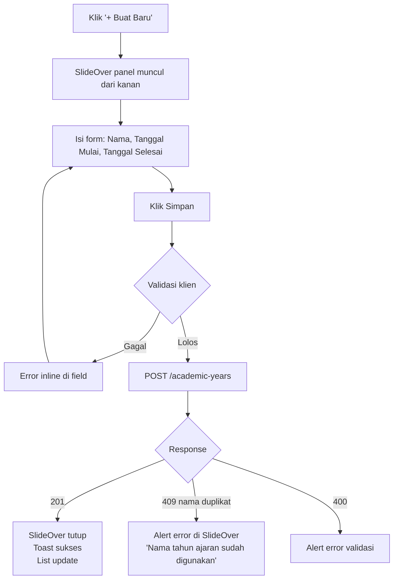
```mermaid
flowchart TD
    A[Klik '+ Buat Baru'] --> B[SlideOver panel muncul dari kanan]
    B --> C[Isi form: Nama, Tanggal Mulai, Tanggal Selesai]
    C --> D[Klik Simpan]
    D --> E{Validasi klien}
    E -->|Gagal| F[Error inline di field]
    F --> C
    E -->|Lolos| G[POST /academic-years]
    G --> H{Response}
    H -->|201| I[SlideOver tutup\nToast sukses\nList update]
    H -->|409 nama duplikat| J[Alert error di SlideOver\n'Nama tahun ajaran sudah digunakan']
    H -->|400| K[Alert error validasi]
```

#### Flow: Aktifkan Tahun Ajaran

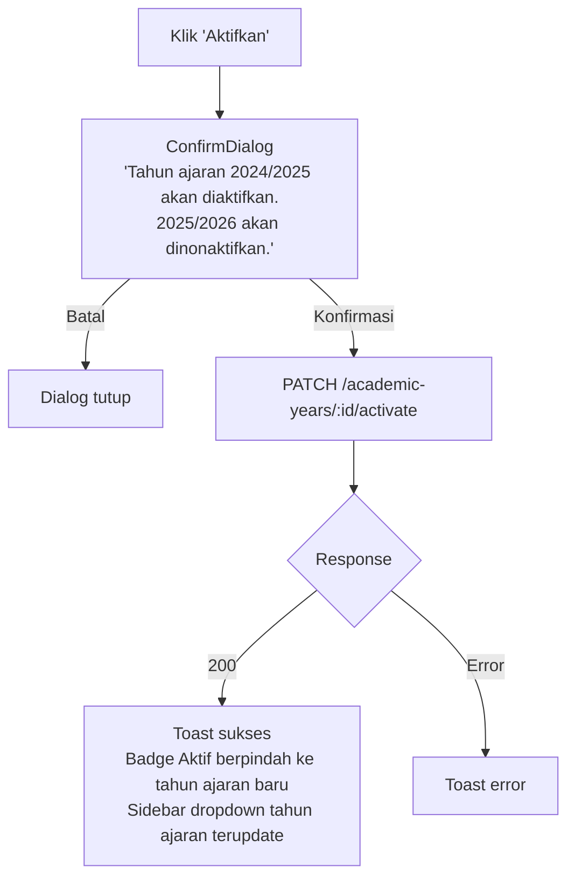
```mermaid
flowchart TD
    A[Klik 'Aktifkan'] --> B[ConfirmDialog\n'Tahun ajaran 2024/2025 akan diaktifkan.\n2025/2026 akan dinonaktifkan.']
    B -->|Batal| C[Dialog tutup]
    B -->|Konfirmasi| D[PATCH /academic-years/:id/activate]
    D --> E{Response}
    E -->|200| F[Toast sukses\nBadge Aktif berpindah ke tahun ajaran baru\nSidebar dropdown tahun ajaran terupdate]
    E -->|Error| G[Toast error]
```

#### Flow: Edit Tahun Ajaran

> Tahun ajaran **aktif** tidak dapat diedit jika sudah memiliki data (invoice, enrollment). Tombol Edit hanya tampil untuk tahun ajaran yang bukan aktif.

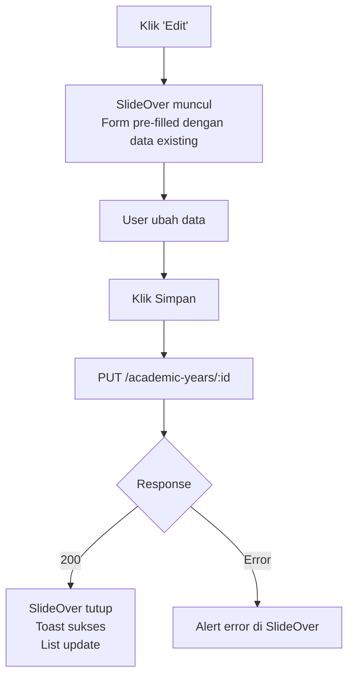
```mermaid
flowchart TD
    A[Klik 'Edit'] --> B[SlideOver muncul\nForm pre-filled dengan data existing]
    B --> C[User ubah data]
    C --> D[Klik Simpan]
    D --> E[PUT /academic-years/:id]
    E --> F{Response}
    F -->|200| G[SlideOver tutup\nToast sukses\nList update]
    F -->|Error| H[Alert error di SlideOver]
```

#### State Halaman

| State | Tampilan |
|---|---|
| Loading | 3 baris skeleton card |
| Empty | EmptyState: "Belum ada tahun ajaran. Buat yang pertama!" + tombol Buat Baru |
| Error | Alert error + tombol Coba Lagi |
| Success | Daftar tahun ajaran |

---

## 2. Rombel (Class Groups)

### 2.1 List Rombel (`/administrasi/rombel`)

#### Layout

```
┌────────────────────────────────────────────────────────┐
│ PageHeader: "Rombel"           [Filter TA ▼] [+ Baru]  │
├────────────────────────────────────────────────────────┤
│                                                        │
│  MUTIARA (KB)                                          │
│  ┌──────────┬──────────┬──────────┐                   │
│  │ Mutiara 1│ Mutiara 2│ Mutiara 3│  ...              │
│  │ 15 siswa │ 14 siswa │ 16 siswa │                   │
│  │ Sen,Rab,Jum│Sel,Kam,Sab│Sen,Rab,Jum│               │
│  │ [Detail] │ [Detail] │ [Detail] │                   │
│  └──────────┴──────────┴──────────┘                   │
│                                                        │
│  INTAN (TK-A)                                         │
│  ┌──────────┬──────────┬──────────┐                   │
│  │ Intan 1  │ Intan 2  │ Intan 3  │  ...              │
│  │ 20 siswa │ 19 siswa │ 21 siswa │                   │
│  │ [Detail] │ [Detail] │ [Detail] │                   │
│  └──────────┴──────────┴──────────┘                   │
│                                                        │
│  BERLIAN (TK-B)                                       │
│  ┌──────────┬──────────┬──────────┐                   │
│  │ Berlian 1│ Berlian 2│ Berlian 3│  ...              │
│  │ [Detail] │ [Detail] │ [Detail] │                   │
│  └──────────┴──────────┴──────────┘                   │
│                                                        │
└────────────────────────────────────────────────────────┘
```

Rombel dikelompokkan per jenjang (Mutiara, Intan, Berlian) dan ditampilkan sebagai grid card.

#### Flow: Buat Rombel Baru

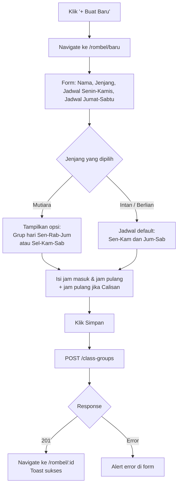
```mermaid
flowchart TD
    A[Klik '+ Buat Baru'] --> B[Navigate ke /rombel/baru]
    B --> C[Form: Nama, Jenjang, Jadwal Senin-Kamis, Jadwal Jumat-Sabtu]
    C --> D{Jenjang yang dipilih}
    D -->|Mutiara| E[Tampilkan opsi:\nGrup hari Sen-Rab-Jum\natau Sel-Kam-Sab]
    D -->|Intan / Berlian| F[Jadwal default:\nSen-Kam dan Jum-Sab]
    E --> G[Isi jam masuk & jam pulang\n+ jam pulang jika Calisan]
    F --> G
    G --> H[Klik Simpan]
    H --> I[POST /class-groups]
    I --> J{Response}
    J -->|201| K[Navigate ke /rombel/:id\nToast sukses]
    J -->|Error| L[Alert error di form]
```

### 2.2 Detail Rombel (`/administrasi/rombel/:id`)

#### Layout

```
┌────────────────────────────────────────────────────────┐
│ PageHeader: "Intan 1"   [Edit Rombel]  [Hapus Rombel]  │
│ Breadcrumb: Administrasi > Rombel > Intan 1            │
├───────────────────────────────┬────────────────────────┤
│ INFO ROMBEL                   │ DAFTAR SISWA           │
│                               │                        │
│ Jenjang: Intan (TK-A)         │ [SearchInput]          │
│ Tahun Ajaran: 2025/2026       │                        │
│                               │ ┌────────────────────┐ │
│ JADWAL                        │ │ Ahmad Fauzan       │ │
│ Sen-Kam: 07.15 – 10.00        │ │ [Lihat Profil →]   │ │
│ Jika Calisan: 10.30           │ ├────────────────────┤ │
│ Jum-Sab: 07.15 – 09.00        │ │ Budi Santosa       │ │
│                               │ │ [Lihat Profil →]   │ │
│ Jumlah Siswa: 20              │ └────────────────────┘ │
│                               │                        │
│ [Hari Efektif →]              │ Total: 20 siswa        │
└───────────────────────────────┴────────────────────────┘
```

#### Flow: Edit Rombel

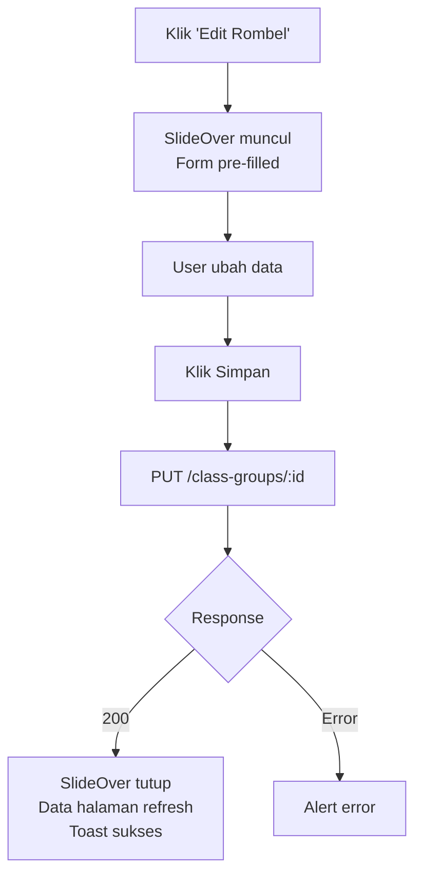
```mermaid
flowchart TD
    A[Klik 'Edit Rombel'] --> B[SlideOver muncul\nForm pre-filled]
    B --> C[User ubah data]
    C --> D[Klik Simpan]
    D --> E[PUT /class-groups/:id]
    E --> F{Response}
    F -->|200| G[SlideOver tutup\nData halaman refresh\nToast sukses]
    F -->|Error| H[Alert error]
```

#### Flow: Hapus Rombel

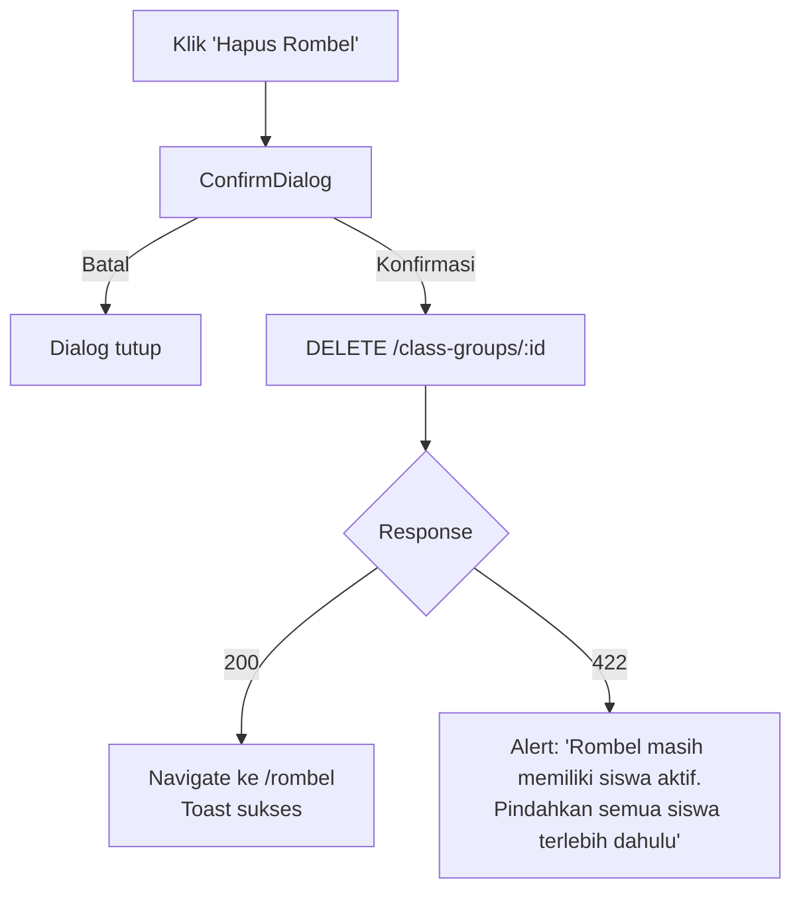
```mermaid
flowchart TD
    A[Klik 'Hapus Rombel'] --> B[ConfirmDialog]
    B -->|Batal| C[Dialog tutup]
    B -->|Konfirmasi| D[DELETE /class-groups/:id]
    D --> E{Response}
    E -->|200| F[Navigate ke /rombel\nToast sukses]
    E -->|422| G[Alert: 'Rombel masih memiliki siswa aktif.\nPindahkan semua siswa terlebih dahulu']
```

### 2.3 Hari Efektif (`/administrasi/rombel/:id/hari-efektif`)

Halaman ini diakses via tombol "Hari Efektif →" di detail rombel.

#### Layout

```
┌────────────────────────────────────────────────────────┐
│ PageHeader: "Hari Efektif — Intan 1"                   │
│ Breadcrumb: Rombel > Intan 1 > Hari Efektif            │
├────────────────────────────────────────────────────────┤
│ Tahun Ajaran: 2025/2026                                │
│                                                        │
│  ┌──────────┬──────────┬──────────┬──────────────────┐ │
│  │ Bulan    │ Hari Efektif│ Jumlah Senin│ Aksi      │ │
│  ├──────────┼──────────┼──────────┼──────────────────┤ │
│  │ Juli 2025│    20    │    4     │ [Edit]           │ │
│  │ Agu 2025 │    22    │    4     │ [Edit]           │ │
│  │ Sep 2025 │  —       │  —       │ [+ Input]        │ │
│  │ Okt 2025 │  —       │  —       │ [+ Input]        │ │
│  │  ...     │  ...     │  ...     │  ...             │ │
│  └──────────┴──────────┴──────────┴──────────────────┘ │
│                                                        │
│  ⚠️  Bulan yang belum diinput akan menyebabkan         │
│     nominal infaq harian = Rp 0 di tagihan siswa.      │
└────────────────────────────────────────────────────────┘
```

Tabel menampilkan semua bulan dalam tahun ajaran aktif. Bulan yang belum diinput ditandai dengan dash (—) dan tombol `+ Input`.

#### Flow: Input / Edit Hari Efektif

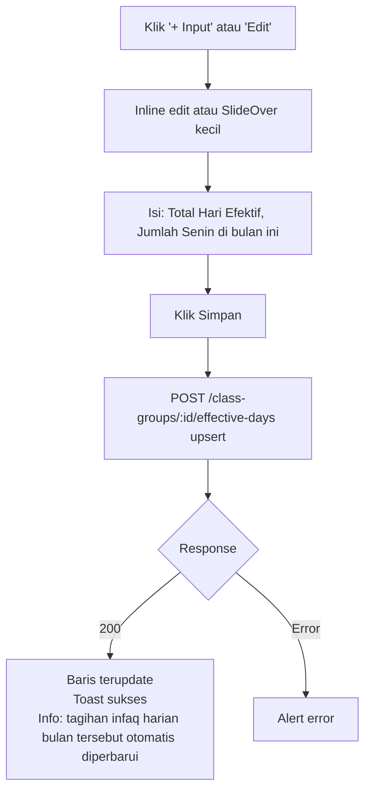
```mermaid
flowchart TD
    A[Klik '+ Input' atau 'Edit'] --> B[Inline edit atau SlideOver kecil]
    B --> C[Isi: Total Hari Efektif, Jumlah Senin di bulan ini]
    C --> D[Klik Simpan]
    D --> E[POST /class-groups/:id/effective-days upsert]
    E --> F{Response}
    F -->|200| G[Baris terupdate\nToast sukses\nInfo: tagihan infaq harian bulan tersebut otomatis diperbarui]
    F -->|Error| H[Alert error]
```

#### State Halaman

| State | Tampilan |
|---|---|
| Loading | Skeleton tabel 12 baris |
| Empty | Tidak ada — tabel selalu tampil 12 bulan (sebagian belum diisi) |
| Error | Alert error + tombol Coba Lagi |
| Success | Tabel 12 bulan |

---

## 3. Siswa

### 3.1 List Siswa (`/administrasi/siswa`)

#### Layout

```
┌────────────────────────────────────────────────────────┐
│ PageHeader: "Siswa"  [Import] [+ Tambah Siswa]         │
├────────────────────────────────────────────────────────┤
│ [🔍 Cari nama siswa...]  [Jenjang ▼] [Status ▼]        │
│ [Rombel ▼]               [Tahun Ajaran ▼]   [Reset]    │
├────────────────────────────────────────────────────────┤
│ ┌──────┬───────────────┬──────────┬──────────┬───────┐ │
│ │  #   │ Nama          │ Rombel   │ Jenjang  │Status │ │
│ ├──────┼───────────────┼──────────┼──────────┼───────┤ │
│ │  1   │ Ahmad Fauzan  │ Intan 1  │ TK-A     │●Aktif │ │
│ │  2   │ Budi Santosa  │ Berlian 2│ TK-B     │●Aktif │ │
│ │  3   │ Citra Dewi    │ Mutiara 3│ KB       │●Aktif │ │
│ └──────┴───────────────┴──────────┴──────────┴───────┘ │
│ < 1 2 3 ... 10 >                        Tampil 20/200  │
└────────────────────────────────────────────────────────┘
```

#### Flow: Navigasi dari List

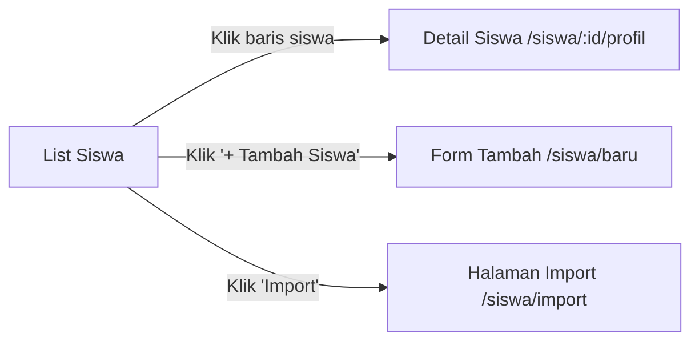
```mermaid
flowchart LR
    A[List Siswa] -->|Klik baris siswa| B[Detail Siswa /siswa/:id/profil]
    A -->|Klik '+ Tambah Siswa'| C[Form Tambah /siswa/baru]
    A -->|Klik 'Import'| D[Halaman Import /siswa/import]
```

### 3.2 Tambah Siswa Baru (`/administrasi/siswa/baru`)

Form dibagi dua bagian: **Data Siswa** dan **Data Wali Murid**.

#### Layout

```
┌────────────────────────────────────────────────────────┐
│ PageHeader: "Tambah Siswa Baru"                        │
│ Breadcrumb: Siswa > Tambah Baru                        │
├────────────────────────────────────────────────────────┤
│                                                        │
│  SECTION: DATA SISWA                                   │
│  ┌──────────────────┐  ┌──────────────────┐           │
│  │ Nama Lengkap *   │  │ Jenis Kelamin *  │           │
│  └──────────────────┘  └──────────────────┘           │
│  ┌──────────────────┐  ┌──────────────────┐           │
│  │ Tempat Lahir *   │  │ Tanggal Lahir *  │           │
│  └──────────────────┘  └──────────────────┘           │
│  ┌──────────────────┐  ┌──────────────────────────┐   │
│  │ Agama            │  │ Siswa Daycare Saja? [ ]  │   │
│  └──────────────────┘  └──────────────────────────┘   │
│                                                        │
│  SECTION: DATA WALI MURID                             │
│  [+ Tambah Wali Murid]                                │
│                                                        │
│  ┌──────────────────────────────────────────────────┐ │
│  │ Wali 1 (Utama)                           [Hapus] │ │
│  │ ┌──────────────┐ ┌──────────────────────────┐   │ │
│  │ │ Nama Wali *  │ │ Hubungan * (Ayah/Ibu/Wali)│  │ │
│  │ └──────────────┘ └──────────────────────────┘   │ │
│  │ ┌──────────────┐ ┌──────────────────────────┐   │ │
│  │ │ No. Telepon *│ │ Alamat                   │   │ │
│  │ └──────────────┘ └──────────────────────────┘   │ │
│  └──────────────────────────────────────────────────┘ │
│                                                        │
│  [Batal]                              [Simpan Siswa]  │
└────────────────────────────────────────────────────────┘
```

#### Flow: Submit Form Tambah Siswa

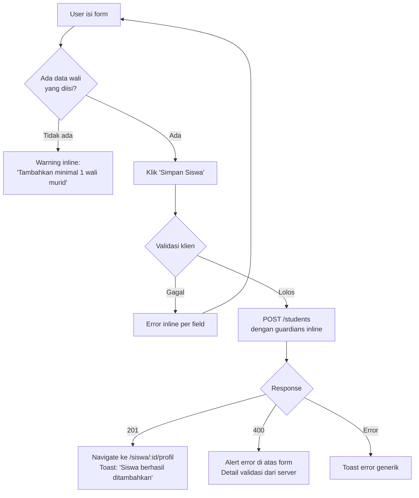
```mermaid
flowchart TD
    A[User isi form] --> B{Ada data wali\nyang diisi?}
    B -->|Tidak ada| C[Warning inline:\n'Tambahkan minimal 1 wali murid']
    B -->|Ada| D[Klik 'Simpan Siswa']
    D --> E{Validasi klien}
    E -->|Gagal| F[Error inline per field]
    F --> A
    E -->|Lolos| G[POST /students\ndengan guardians inline]
    G --> H{Response}
    H -->|201| I[Navigate ke /siswa/:id/profil\nToast: 'Siswa berhasil ditambahkan']
    H -->|400| J[Alert error di atas form\nDetail validasi dari server]
    H -->|Error| K[Toast error generik]
```

#### Flow: Tambah Wali Murid Tambahan

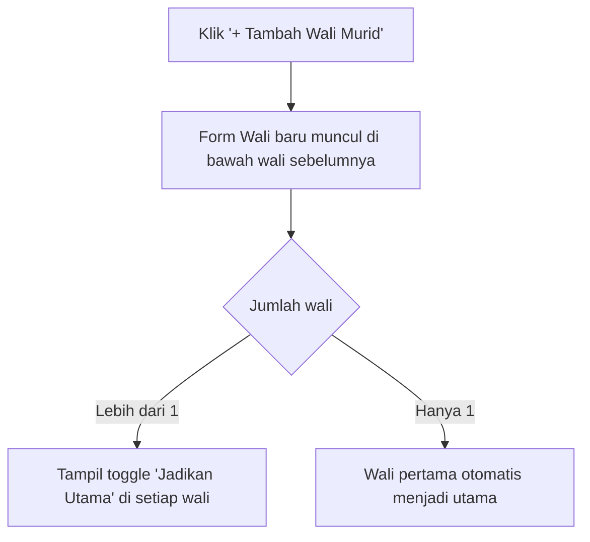
```mermaid
flowchart TD
    A[Klik '+ Tambah Wali Murid'] --> B[Form Wali baru muncul di bawah wali sebelumnya]
    B --> C{Jumlah wali}
    C -->|Lebih dari 1| D[Tampil toggle 'Jadikan Utama' di setiap wali]
    C -->|Hanya 1| E[Wali pertama otomatis menjadi utama]
```

### 3.3 Import Siswa (`/administrasi/siswa/import`)

#### Layout

```
┌────────────────────────────────────────────────────────┐
│ PageHeader: "Import Data Siswa"                        │
│ Breadcrumb: Siswa > Import                             │
├────────────────────────────────────────────────────────┤
│                                                        │
│  LANGKAH 1 — Upload File                              │
│  ┌──────────────────────────────────────────────────┐ │
│  │                                                  │ │
│  │         📂 Drag & drop file di sini              │ │
│  │         atau [Pilih File]                         │ │
│  │                                                  │ │
│  │  Format yang diterima: .csv, .sql                │ │
│  │  [Unduh template CSV]                            │ │
│  └──────────────────────────────────────────────────┘ │
│                                                        │
│  [Batal]                                   [Upload]   │
├────────────────────────────────────────────────────────┤
│  (Setelah upload — LANGKAH 2: Hasil Import)           │
│                                                        │
│  ✅ Berhasil: 83 siswa                                │
│  ❌ Gagal: 2 baris                                    │
│                                                        │
│  ┌────┬───────────────────────────────────────────┐   │
│  │Baris│ Keterangan Error                         │   │
│  ├────┼───────────────────────────────────────────┤   │
│  │ 12 │ Nama tidak boleh kosong                   │   │
│  │ 47 │ Format tanggal lahir tidak valid          │   │
│  └────┴───────────────────────────────────────────┘   │
│                                                        │
│  [Import Ulang]              [Lihat Daftar Siswa →]   │
└────────────────────────────────────────────────────────┘
```

#### Flow: Import

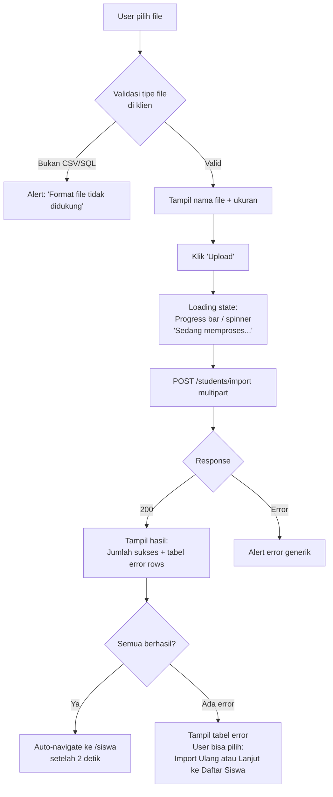
```mermaid
flowchart TD
    A[User pilih file] --> B{Validasi tipe file\ndi klien}
    B -->|Bukan CSV/SQL| C[Alert: 'Format file tidak didukung']
    B -->|Valid| D[Tampil nama file + ukuran]
    D --> E[Klik 'Upload']
    E --> F[Loading state:\nProgress bar / spinner\n'Sedang memproses...']
    F --> G[POST /students/import multipart]
    G --> H{Response}
    H -->|200| I[Tampil hasil:\nJumlah sukses + tabel error rows]
    H -->|Error| J[Alert error generik]
    I --> K{Semua berhasil?}
    K -->|Ya| L[Auto-navigate ke /siswa\nsetelah 2 detik]
    K -->|Ada error| M[Tampil tabel error\nUser bisa pilih:\nImport Ulang atau Lanjut ke Daftar Siswa]
```

### 3.4 Detail Siswa (`/administrasi/siswa/:id`)

Halaman detail menggunakan **tab navigation** dengan 4 tab. Default tab adalah `Profil`.

#### Layout Umum Detail Siswa

```
┌────────────────────────────────────────────────────────┐
│ PageHeader: "Ahmad Fauzan"                             │
│ Breadcrumb: Siswa > Ahmad Fauzan                       │
│                                                        │
│  [Foto/Avatar]  Ahmad Fauzan                          │
│                 ● Aktif  |  Intan 1  |  TK-A          │
│                 TA: 2025/2026                          │
├────────────────────────────────────────────────────────┤
│ [Profil]  [Akademik]  [Pasta & Ekskul]  [Keuangan]    │
├────────────────────────────────────────────────────────┤
│                                                        │
│  (Konten tab aktif)                                    │
│                                                        │
└────────────────────────────────────────────────────────┘
```

### 3.5 Tab Profil (`/administrasi/siswa/:id/profil`)

#### Layout

```
┌────────────────────────────────────────────────────────┐
│  DATA DIRI                                  [Edit]     │
│  ┌─────────────────┬──────────────────────────────┐   │
│  │ Nama Lengkap    │ Ahmad Fauzan                 │   │
│  │ Tempat Lahir    │ Surabaya                     │   │
│  │ Tanggal Lahir   │ 15 Maret 2020                │   │
│  │ Jenis Kelamin   │ Laki-laki                    │   │
│  │ Agama           │ Islam                        │   │
│  └─────────────────┴──────────────────────────────┘   │
├────────────────────────────────────────────────────────┤
│  DATA WALI MURID              [+ Tambah Wali Murid]    │
│                                                        │
│  ┌────────────────────────────────────────────────┐   │
│  │ ★ UTAMA  Ayah — Budi Santoso                   │   │
│  │ 📞 08123456789                        [Edit]   │   │
│  │ 📍 Jl. Raya No.1, Surabaya            [Hapus]  │   │
│  └────────────────────────────────────────────────┘   │
│  ┌────────────────────────────────────────────────┐   │
│  │ Ibu — Siti Aminah                              │   │
│  │ 📞 08198765432         [Jadikan Utama] [Hapus] │   │
│  └────────────────────────────────────────────────┘   │
│                                                        │
└────────────────────────────────────────────────────────┘
```

#### Flow: Edit Data Diri Siswa

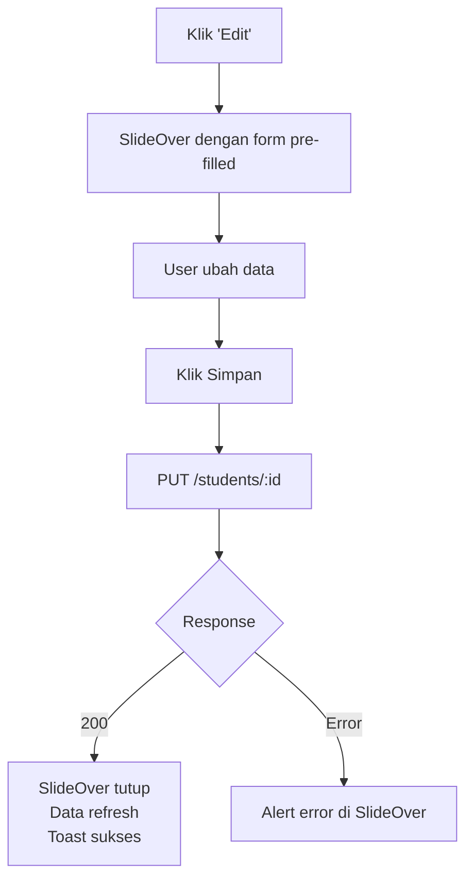
```mermaid
flowchart TD
    A[Klik 'Edit'] --> B[SlideOver dengan form pre-filled]
    B --> C[User ubah data]
    C --> D[Klik Simpan]
    D --> E[PUT /students/:id]
    E --> F{Response}
    F -->|200| G[SlideOver tutup\nData refresh\nToast sukses]
    F -->|Error| H[Alert error di SlideOver]
```

#### Flow: Tambah Wali Murid (dari halaman detail)

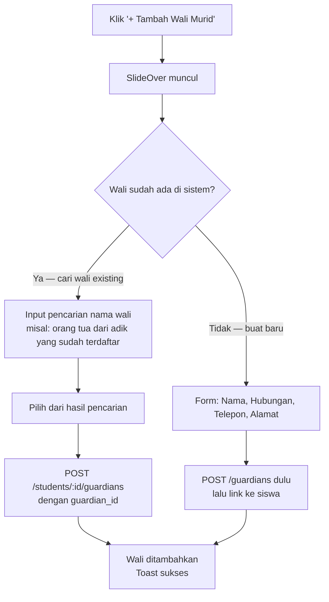
```mermaid
flowchart TD
    A[Klik '+ Tambah Wali Murid'] --> B[SlideOver muncul]
    B --> C{Wali sudah ada di sistem?}
    C -->|Ya — cari wali existing| D[Input pencarian nama wali\nmisal: orang tua dari adik yang sudah terdaftar]
    C -->|Tidak — buat baru| E[Form: Nama, Hubungan, Telepon, Alamat]
    D --> F[Pilih dari hasil pencarian]
    F --> G[POST /students/:id/guardians\ndengan guardian_id]
    E --> H[POST /guardians dulu\nlalu link ke siswa]
    G --> I[Wali ditambahkan\nToast sukses]
    H --> I
```

#### Flow: Hapus Wali Murid

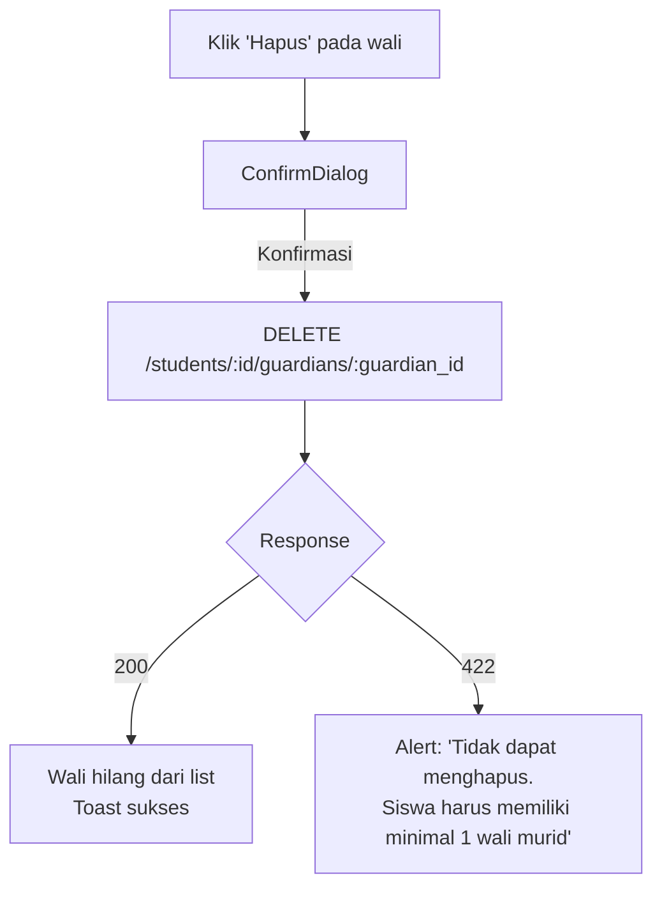
```mermaid
flowchart TD
    A[Klik 'Hapus' pada wali] --> B[ConfirmDialog]
    B -->|Konfirmasi| C[DELETE /students/:id/guardians/:guardian_id]
    C --> D{Response}
    D -->|200| E[Wali hilang dari list\nToast sukses]
    D -->|422| F[Alert: 'Tidak dapat menghapus.\nSiswa harus memiliki minimal 1 wali murid']
```

### 3.6 Tab Akademik (`/administrasi/siswa/:id/akademik`)

#### Layout

```
┌────────────────────────────────────────────────────────┐
│  ENROLLMENT AKTIF                                      │
│  ┌──────────────────────────────────────────────────┐ │
│  │ Tahun Ajaran : 2025/2026                         │ │
│  │ Rombel       : Intan 1                           │ │
│  │ Jenjang      : TK-A                              │ │
│  │ Mulai        : 14 Juli 2025                      │ │
│  │ Tipe         : Siswa Baru                        │ │
│  └──────────────────────────────────────────────────┘ │
├────────────────────────────────────────────────────────┤
│  RIWAYAT AKADEMIK                                      │
│  ┌──────────┬──────────┬──────────┬──────────────┐    │
│  │ TA       │ Rombel   │ Jenjang  │ Status       │    │
│  ├──────────┼──────────┼──────────┼──────────────┤    │
│  │ 2025/26  │ Intan 1  │ TK-A     │ ● Aktif      │    │
│  │ 2024/25  │ Mutiara 2│ KB       │ ✓ Selesai    │    │
│  └──────────┴──────────┴──────────┴──────────────┘    │
├────────────────────────────────────────────────────────┤
│  LOG EVENT AKADEMIK                                    │
│                                                        │
│  📅 14 Jul 2025 — Masuk sebagai siswa baru            │
│     Rombel: Mutiara 2 → Intan 1 (kenaikan kelas)      │
│     Oleh: Admin Administrasi                          │
│                                                        │
│  📅 15 Jul 2024 — Masuk sebagai siswa baru            │
│     Rombel: Mutiara 2                                 │
│     Oleh: Admin Administrasi                          │
└────────────────────────────────────────────────────────┘
```

> Tab ini bersifat **read only**. Aksi siklus akademik (pindah rombel, keluar, dsb) dilakukan via menu Siklus Akademik, bukan dari sini.

### 3.7 Tab Pasta & Ekskul (`/administrasi/siswa/:id/ekskul`)

#### Layout

```
┌────────────────────────────────────────────────────────┐
│  PASTA & EKSTRAKURIKULER          [+ Daftarkan Ekskul] │
│  Tahun Ajaran: 2025/2026                               │
├────────────────────────────────────────────────────────┤
│  ┌────────────────────────────────────────────────┐   │
│  │ 🤖 Robotika             PASTA    Aktif  [Henti]│   │
│  │ Mulai: 14 Jul 2025                             │   │
│  ├────────────────────────────────────────────────┤   │
│  │ 💻 Laptop Kids          PASTA    Aktif  [Henti]│   │
│  │ Mulai: 14 Jul 2025                             │   │
│  ├────────────────────────────────────────────────┤   │
│  │ ✂️  Calisan TK          CALISAN  Aktif  [Henti]│   │
│  │ Mulai: 1 Agu 2025                              │   │
│  └────────────────────────────────────────────────┘   │
│                                                        │
│  ⚠️  Perubahan ekskul akan mempengaruhi tagihan bulanan│
│     bulan berikutnya.                                  │
└────────────────────────────────────────────────────────┘
```

#### Flow: Daftarkan Ekskul

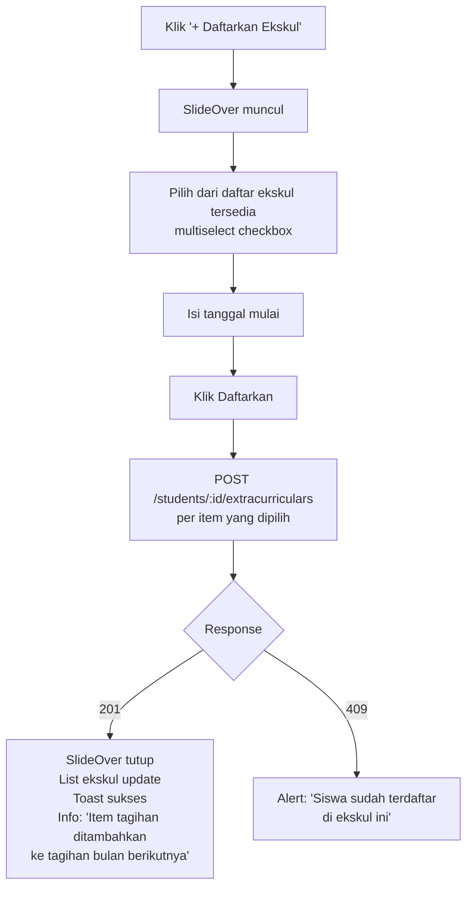
```mermaid
flowchart TD
    A[Klik '+ Daftarkan Ekskul'] --> B[SlideOver muncul]
    B --> C[Pilih dari daftar ekskul tersedia\nmultiselect checkbox]
    C --> D[Isi tanggal mulai]
    D --> E[Klik Daftarkan]
    E --> F[POST /students/:id/extracurriculars\nper item yang dipilih]
    F --> G{Response}
    G -->|201| H[SlideOver tutup\nList ekskul update\nToast sukses\nInfo: 'Item tagihan ditambahkan\nke tagihan bulan berikutnya']
    G -->|409| I[Alert: 'Siswa sudah terdaftar\ndi ekskul ini']
```

#### Flow: Hentikan Ekskul

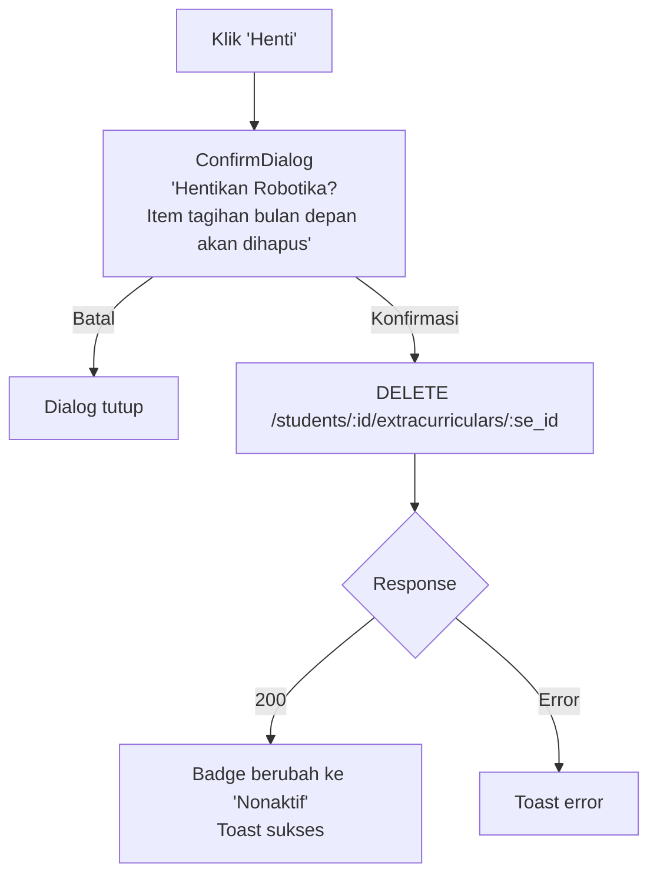
```mermaid
flowchart TD
    A[Klik 'Henti'] --> B[ConfirmDialog\n'Hentikan Robotika?\nItem tagihan bulan depan akan dihapus']
    B -->|Batal| C[Dialog tutup]
    B -->|Konfirmasi| D[DELETE /students/:id/extracurriculars/:se_id]
    D --> E{Response}
    E -->|200| F[Badge berubah ke 'Nonaktif'\nToast sukses]
    E -->|Error| G[Toast error]
```

### 3.8 Tab Keuangan (`/administrasi/siswa/:id/keuangan`)

Tab ini bersifat **ringkasan saja** — bukan pengelolaan keuangan. Diperuntukkan agar admin administrasi bisa melihat kondisi keuangan siswa tanpa harus berpindah modul.

#### Layout

```
┌────────────────────────────────────────────────────────┐
│  RINGKASAN KEUANGAN                                    │
│  Tahun Ajaran: 2025/2026                               │
├─────────────────────┬──────────────────────────────────┤
│  Total Tunggakan    │  Saldo Tabungan Umum             │
│  Rp 177.000         │  Rp 150.000                      │
├─────────────────────┴──────────────────────────────────┤
│                         [Lihat Detail Tagihan →]       │
│                                                        │
│  TAGIHAN TERBARU                                       │
│  ┌────────────────────────────────────────────────┐   │
│  │ Juli 2025   Total: Rp 327.000   ⚠ Sebagian    │   │
│  ├────────────────────────────────────────────────┤   │
│  │ Registrasi  Total: Rp 725.000   ✓ Lunas       │   │
│  ├────────────────────────────────────────────────┤   │
│  │ Biaya Awal  Total: Rp 2.410.000 ✓ Lunas       │   │
│  └────────────────────────────────────────────────┘   │
└────────────────────────────────────────────────────────┘
```

Tombol **"Lihat Detail Tagihan →"** melakukan navigate ke `/keuangan/tagihan/siswa/:id` (cross-module navigation).

Tab ini **tidak tampil** untuk admin keuangan karena mereka langsung mengakses modul keuangan. Hanya tampil untuk admin administrasi dan superadmin.

---

## 4. Ekstrakurikuler (Master Data)

### 4.1 Halaman Ekskul (`/administrasi/ekskul`)

Halaman sederhana — semua aksi dalam satu halaman tanpa halaman detail terpisah.

#### Layout

```
┌────────────────────────────────────────────────────────┐
│ PageHeader: "Master Ekstrakurikuler"   [+ Tambah Ekskul]│
├────────────────────────────────────────────────────────┤
│ [Filter: Semua ▼ / Pasta / Calisan / Ekskul]           │
├────────────────────────────────────────────────────────┤
│                                                        │
│  PASTA (Pengayaan Akademik)                            │
│  ┌────────────────────────────────────────────────┐   │
│  │ Robotika         Jumat 09.00-10.00   [Edit][Hapus]│ │
│  │ Sempoa Kids      Jumat 09.00-10.00   [Edit][Hapus]│ │
│  │ Tilawah          Jumat 09.00-10.00   [Edit][Hapus]│ │
│  │ Laptop Kids      Jumat 09.00-10.00   [Edit][Hapus]│ │
│  └────────────────────────────────────────────────┘   │
│                                                        │
│  CALISAN                                               │
│  ┌────────────────────────────────────────────────┐   │
│  │ Calisan KB       3x/minggu            [Edit][Hapus]│ │
│  │ Calisan TK       4x/minggu            [Edit][Hapus]│ │
│  └────────────────────────────────────────────────┘   │
│                                                        │
│  EKSTRAKURIKULER                                       │
│  ┌────────────────────────────────────────────────┐   │
│  │ Aslin (TK-B)                          [Edit][Hapus]│ │
│  └────────────────────────────────────────────────┘   │
└────────────────────────────────────────────────────────┘
```

#### Flow: Tambah / Edit Ekskul

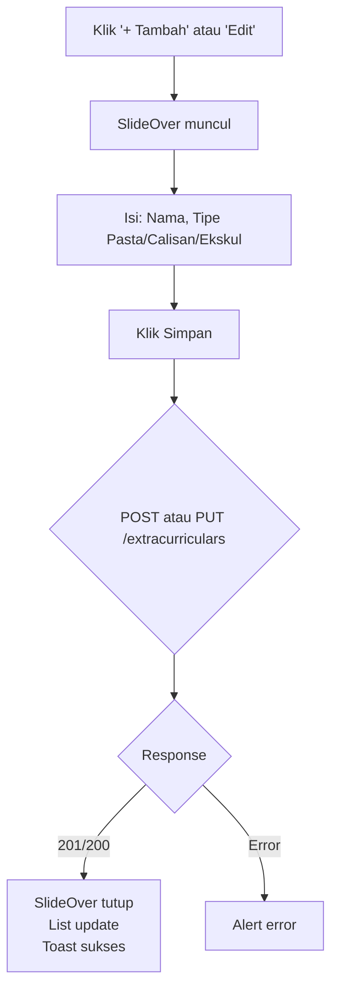
```mermaid
flowchart TD
    A[Klik '+ Tambah' atau 'Edit'] --> B[SlideOver muncul]
    B --> C[Isi: Nama, Tipe Pasta/Calisan/Ekskul]
    C --> D[Klik Simpan]
    D --> E{POST atau PUT /extracurriculars}
    E --> F{Response}
    F -->|201/200| G[SlideOver tutup\nList update\nToast sukses]
    F -->|Error| H[Alert error]
```

#### Flow: Hapus Ekskul

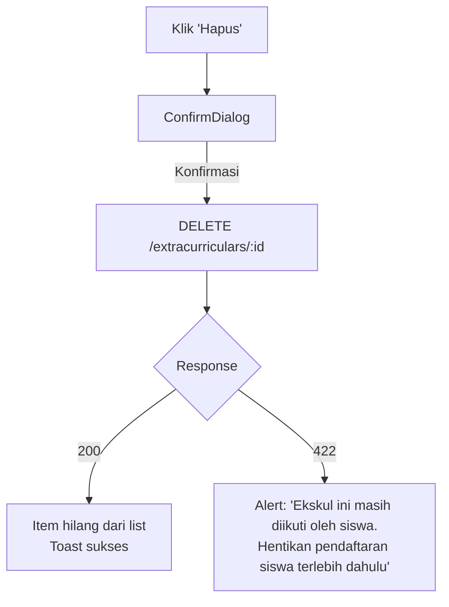
```mermaid
flowchart TD
    A[Klik 'Hapus'] --> B[ConfirmDialog]
    B -->|Konfirmasi| C[DELETE /extracurriculars/:id]
    C --> D{Response}
    D -->|200| E[Item hilang dari list\nToast sukses]
    D -->|422| F[Alert: 'Ekskul ini masih diikuti oleh siswa.\nHentikan pendaftaran siswa terlebih dahulu']
```

#### State Halaman

| State | Tampilan |
|---|---|
| Loading | Skeleton list per grup |
| Empty | EmptyState per grup jika tidak ada data di tipe tersebut |
| Error | Alert + Coba Lagi |
| Success | List dikelompokkan per tipe |

---

## 5. Daycare

### 5.1 List Daycare (`/administrasi/daycare`)

#### Layout

```
┌────────────────────────────────────────────────────────┐
│ PageHeader: "Daycare"          [Filter TA ▼] [+ Daftar]│
├────────────────────────────────────────────────────────┤
│ [🔍 Cari nama siswa...]  [Paket ▼]  [Status ▼]  [Reset]│
├────────────────────────────────────────────────────────┤
│ ┌──────┬──────────────┬──────────────┬────────┬──────┐ │
│ │  #   │ Nama Siswa   │ Paket        │ Mulai  │Status│ │
│ ├──────┼──────────────┼──────────────┼────────┼──────┤ │
│ │  1   │ Ahmad Fauzan │ Bulanan TK   │14/7/25 │●Aktif│ │
│ │  2   │ Nur Laila    │ Harian Lepas │14/7/25 │●Aktif│ │
│ │      │ (luar sekolah│              │        │      │ │
│ └──────┴──────────────┴──────────────┴────────┴──────┘ │
│                                    [Lihat Detail] per baris│
└────────────────────────────────────────────────────────┘
```

Siswa yang berasal dari luar sekolah (`is_daycare_only = true`) diberi label kecil "(luar sekolah)" di bawah namanya.

#### Flow: Klik Lihat Detail

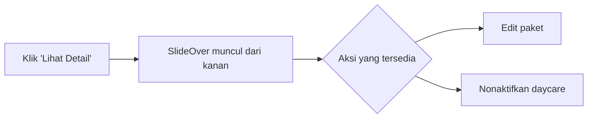
```mermaid
flowchart LR
    A[Klik 'Lihat Detail'] --> B[SlideOver muncul dari kanan]
    B --> C{Aksi yang tersedia}
    C --> D[Edit paket]
    C --> E[Nonaktifkan daycare]
```

### 5.2 Daftarkan ke Daycare (`/administrasi/daycare/baru`)

#### Layout

```
┌────────────────────────────────────────────────────────┐
│ PageHeader: "Pendaftaran Daycare"                      │
│ Breadcrumb: Daycare > Pendaftaran Baru                 │
├────────────────────────────────────────────────────────┤
│                                                        │
│  ┌──────────────────────────────────────────────────┐ │
│  │ Siswa *                                          │ │
│  │ [🔍 Cari nama siswa...]                          │ │
│  │                                                  │ │
│  │ ○ Siswa Reguler (sudah terdaftar)                │ │
│  │ ● Siswa Daycare Saja (dari luar sekolah)         │ │
│  └──────────────────────────────────────────────────┘ │
│                                                        │
│  ┌──────────────────────────────────────────────────┐ │
│  │ Paket Daycare *                                  │ │
│  │ ○ SPD Bulanan KB         Rp 200.000/bln          │ │
│  │ ○ SPD Bulanan TK         Rp 400.000/bln          │ │
│  │ ○ Paket Bulanan KB       Rp 500.000/bln          │ │
│  │ ● Paket Bulanan TK       Rp 900.000/bln          │ │
│  │ ○ Harian Lepas           Rp 15.000/hari          │ │
│  └──────────────────────────────────────────────────┘ │
│                                                        │
│  ┌──────────────────────────────────────────────────┐ │
│  │ Tanggal Mulai *  [📅 14/07/2025]                 │ │
│  │ Tahun Ajaran    [2025/2026 ▼]                    │ │
│  └──────────────────────────────────────────────────┘ │
│                                                        │
│  INFO BIAYA AWAL DAYCARE                              │
│  ┌──────────────────────────────────────────────────┐ │
│  │ Pendaftaran  : Rp 150.000                        │ │
│  │ Akomodasi    : Rp 250.000                        │ │
│  │ Total Awal   : Rp 400.000                        │ │
│  │                                                  │ │
│  │ ⚠️  Tagihan biaya awal akan di-generate          │ │
│  │    otomatis setelah pendaftaran disimpan.        │ │
│  └──────────────────────────────────────────────────┘ │
│                                                        │
│  [Batal]                          [Simpan Pendaftaran]│
└────────────────────────────────────────────────────────┘
```

#### Flow: Submit Pendaftaran Daycare

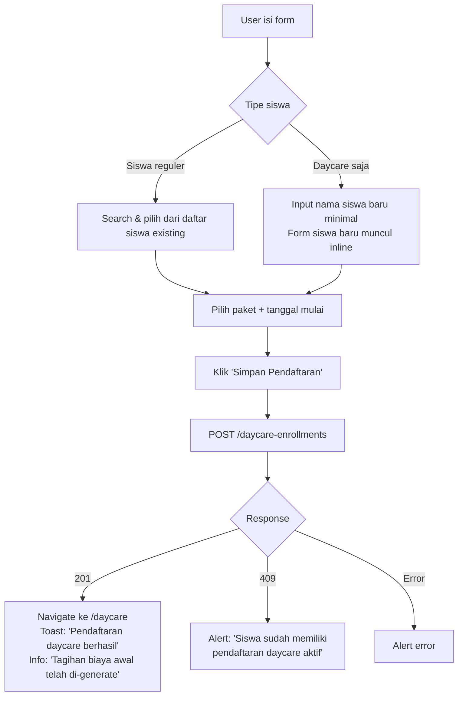
```mermaid
flowchart TD
    A[User isi form] --> B{Tipe siswa}
    B -->|Siswa reguler| C[Search & pilih dari daftar siswa existing]
    B -->|Daycare saja| D[Input nama siswa baru minimal\nForm siswa baru muncul inline]
    C --> E[Pilih paket + tanggal mulai]
    D --> E
    E --> F[Klik 'Simpan Pendaftaran']
    F --> G[POST /daycare-enrollments]
    G --> H{Response}
    H -->|201| I[Navigate ke /daycare\nToast: 'Pendaftaran daycare berhasil'\nInfo: 'Tagihan biaya awal telah di-generate']
    H -->|409| J[Alert: 'Siswa sudah memiliki\npendaftaran daycare aktif']
    H -->|Error| K[Alert error]
```

#### Flow: Nonaktifkan Daycare

```mermaid
flowchart TD
    A[Klik 'Nonaktifkan' di SlideOver detail] --> B[ConfirmDialog\n'Nonaktifkan daycare siswa ini?'\nInput: Tanggal Selesai]
    B -->|Konfirmasi| C[PATCH /daycare-enrollments/:id/status\nbody: status=inactive, end_date]
    C --> D{Response}
    D -->|200| E[SlideOver tutup\nStatus berubah ke Nonaktif\nToast sukses]
    D -->|Error| F[Alert error]
```

---

## 6. State & Edge Cases per Halaman

### Ringkasan State Global

| Halaman | Empty State | Error State | Loading State |
|---|---|---|---|
| List Siswa | "Belum ada siswa. Tambah atau import." | Alert + Retry | Skeleton tabel |
| Detail Siswa | — | Alert + tombol Kembali ke list | Skeleton detail |
| List Rombel | "Belum ada rombel untuk TA ini." | Alert + Retry | Skeleton grid card |
| Hari Efektif | Tidak ada (selalu 12 bulan tampil) | Alert + Retry | Skeleton tabel |
| List Ekskul | "Belum ada data ekskul." per grup | Alert + Retry | Skeleton list |
| List Daycare | "Belum ada pendaftaran daycare." | Alert + Retry | Skeleton tabel |
| Tahun Ajaran | "Buat tahun ajaran pertama." | Alert + Retry | Skeleton card list |

### Edge Cases Penting

| Skenario | Penanganan |
|---|---|
| Siswa daycare saja mengakses tab Akademik | Tab Akademik disembunyikan atau tampil pesan "Siswa ini tidak memiliki rombel reguler" |
| Berlian tidak punya tab Ekskul yang kosong | Tab tetap tampil tapi ditambah info "Aslin" tersedia |
| Hari efektif belum diisi saat bulan berjalan | Banner warning kuning di halaman list siswa dan detail rombel |
| Admin keuangan akses halaman detail siswa | Semua tab tampil tapi tanpa tombol edit — read only. Tab Keuangan menampilkan shortcut ke modul keuangan |
| Siswa pindah rombel → tab Akademik | Enrollment baru langsung muncul di atas list riwayat |
