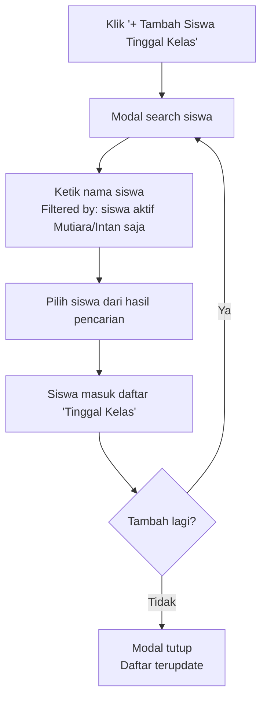
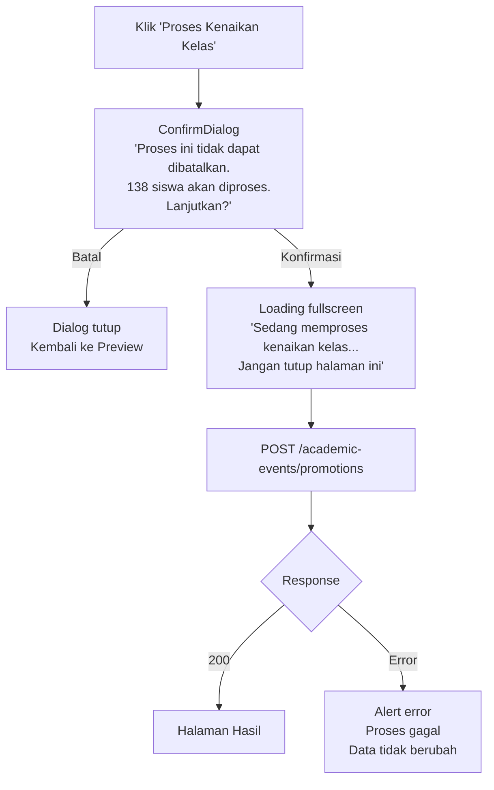
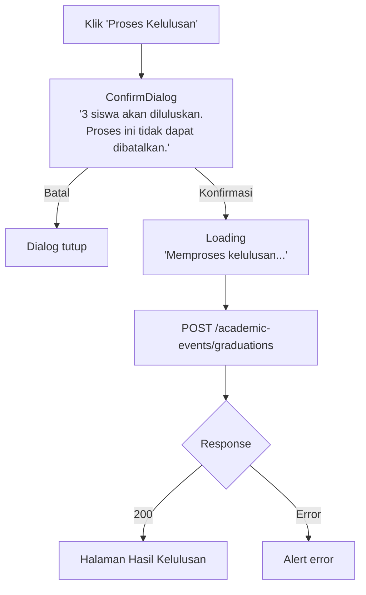
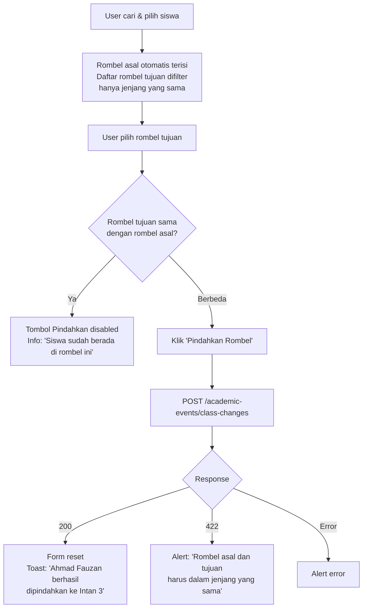
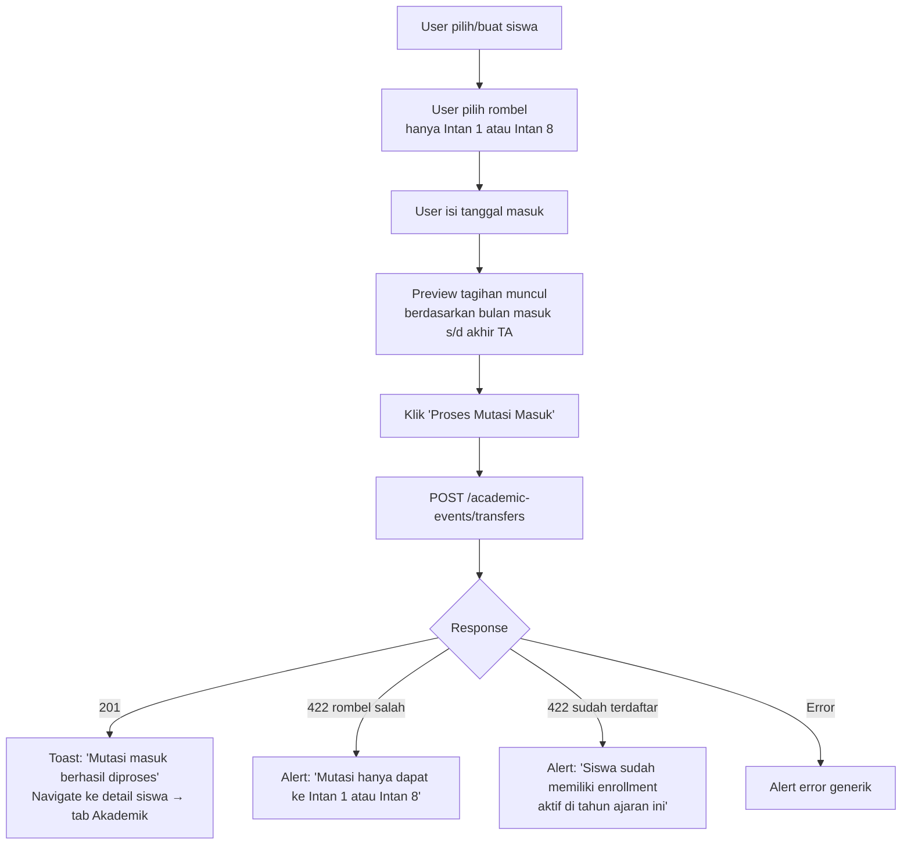
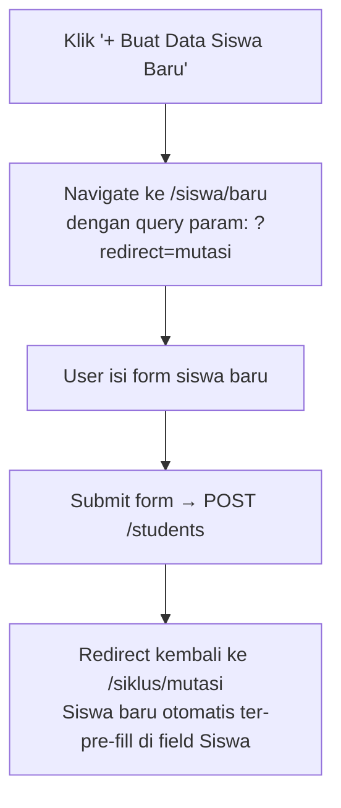
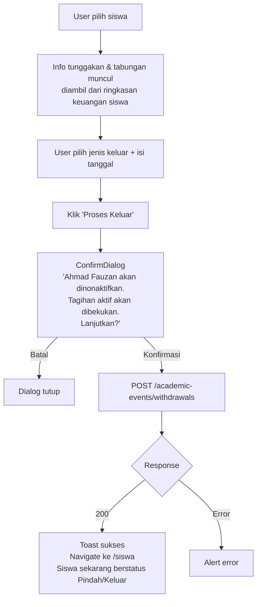

# UX Flow: Administrasi — Siklus Akademik

> Berdasarkan: `prd-feature-detail.md`, `ux-flow-global.md`, `ux-flow-administrasi-master-data.md`
> Direferensikan oleh: `ux-flow-keuangan.md`

---

## Konteks & Prinsip Desain

Siklus akademik berbeda secara fundamental dari CRUD biasa karena:

1. **Beberapa aksi tidak dapat dibatalkan** — kenaikan kelas massal dan kelulusan yang sudah dikonfirmasi tidak bisa di-rollback dari UI
2. **Efek samping lintas modul** — setiap aksi memicu generate atau perubahan tagihan di modul keuangan
3. **Preview sebelum konfirmasi** — user harus bisa melihat apa yang akan terjadi sebelum menekan tombol konfirmasi final
4. **Aksi massal dengan pengecualian** — kenaikan kelas dilakukan untuk semua siswa sekaligus, tapi admin bisa mengecualikan siswa tertentu

Prinsip yang diterapkan: **"Show, then confirm"** — selalu tampilkan preview dampak sebelum aksi destruktif/irreversible dikonfirmasi.

---

## Sitemap (Scope Dokumen Ini)

```
/dashboard/administrasi/siklus/
├── /kenaikan-kelas             → Proses kenaikan kelas massal
├── /kelulusan                  → Proses kelulusan siswa Berlian
├── /mutasi                     → Mutasi masuk dari sekolah luar
├── /pindah-rombel              → Pindah rombel individual
└── /keluar                     → Siswa keluar / pindah sekolah
```

---

## 1. Kenaikan Kelas Massal

### 1.1 Halaman Kenaikan Kelas (`/administrasi/siklus/kenaikan-kelas`)

Proses ini dijalankan **satu kali di akhir tahun ajaran** untuk memindahkan semua siswa ke jenjang berikutnya. Karena dampaknya massal dan tidak bisa dibatalkan, UI dirancang dengan tiga fase yang jelas.

#### Fase 1 — Konfigurasi

```
┌────────────────────────────────────────────────────────┐
│ PageHeader: "Kenaikan Kelas"                           │
│ Breadcrumb: Administrasi > Siklus > Kenaikan Kelas     │
├────────────────────────────────────────────────────────┤
│                                                        │
│  ⚠️  PERHATIAN                                         │
│  Proses kenaikan kelas akan memindahkan seluruh        │
│  siswa aktif ke jenjang berikutnya. Pastikan semua     │
│  data sudah benar sebelum melanjutkan.                 │
│  Proses ini tidak dapat dibatalkan.                    │
│                                                        │
├────────────────────────────────────────────────────────┤
│                                                        │
│  KONFIGURASI KENAIKAN KELAS                           │
│                                                        │
│  Dari Tahun Ajaran *  [2025/2026 ▼]                   │
│  Ke Tahun Ajaran *    [2026/2027 ▼]                   │
│                                                        │
│  ⚠️  Tahun ajaran tujuan harus sudah dibuat            │
│     sebelum proses ini dijalankan.                    │
│                                                        │
│  Tanggal Efektif *    [📅 14/07/2026]                  │
│                                                        │
├────────────────────────────────────────────────────────┤
│                                                        │
│  SISWA YANG AKAN TINGGAL KELAS                        │
│  [🔍 Cari siswa untuk dikecualikan...]                 │
│                                                        │
│  (Kosong — semua siswa naik kelas)                    │
│  [+ Tambah Siswa Tinggal Kelas]                       │
│                                                        │
│  Catatan: Siswa Berlian yang tidak ditinggalkan        │
│  akan di-skip. Proses kelulusan dilakukan terpisah.   │
│                                                        │
├────────────────────────────────────────────────────────┤
│                           [Preview Kenaikan Kelas →]  │
└────────────────────────────────────────────────────────┘
```

#### Flow: Tambah Siswa Tinggal Kelas



#### Fase 2 — Preview

```
┌────────────────────────────────────────────────────────┐
│ PageHeader: "Preview Kenaikan Kelas"                   │
├────────────────────────────────────────────────────────┤
│                                                        │
│  RINGKASAN                                             │
│  ┌────────────────┬─────────────────────────────┐     │
│  │ Naik Kelas     │ 95 siswa                    │     │
│  │ Tinggal Kelas  │ 3 siswa                     │     │
│  │ Di-skip (Berlian│ 40 siswa (proses kelulusan)│     │
│  │ Total Diproses │ 138 siswa                   │     │
│  └────────────────┴─────────────────────────────┘     │
│                                                        │
│  DETAIL PER JENJANG                                    │
│                                                        │
│  MUTIARA → INTAN (55 naik, 2 tinggal)                 │
│  ┌─────────────────┬──────────────┬──────────────┐    │
│  │ Nama            │ Status Saat  │ Status Baru  │    │
│  ├─────────────────┼──────────────┼──────────────┤    │
│  │ Ahmad Fauzan    │ Mutiara 1    │ → Intan (auto│    │
│  │ Budi Santosa    │ Mutiara 2    │ → Intan (auto│    │
│  │ ⚠ Citra Dewi   │ Mutiara 3    │ Tinggal Kelas│    │
│  └─────────────────┴──────────────┴──────────────┘    │
│  [Lihat semua 57 siswa ▼]                             │
│                                                        │
│  INTAN → BERLIAN (40 naik, 1 tinggal)                 │
│  [Lihat detail ▼]                                     │
│                                                        │
│  ⚠️  Assignment rombel baru bersifat otomatis.         │
│     Gunakan fitur Pindah Rombel setelah kenaikan      │
│     kelas untuk menyesuaikan rombel siswa.            │
│                                                        │
│  INFO TAGIHAN                                          │
│  ✅ Tagihan registrasi tahunan untuk TA 2026/2027      │
│     akan di-generate otomatis untuk semua siswa       │
│     yang naik kelas.                                  │
│                                                        │
├────────────────────────────────────────────────────────┤
│  [← Kembali ke Konfigurasi]  [Proses Kenaikan Kelas]  │
└────────────────────────────────────────────────────────┘
```

#### Fase 3 — Konfirmasi Final



#### Halaman Hasil

```
┌────────────────────────────────────────────────────────┐
│ ✅ Kenaikan Kelas Selesai                               │
├────────────────────────────────────────────────────────┤
│                                                        │
│  ✅  95 siswa berhasil naik kelas                      │
│  📌  3 siswa tinggal kelas                             │
│  ⏭   40 siswa Berlian di-skip (belum diluluskan)       │
│  ❌  0 error                                           │
│                                                        │
│  LANGKAH SELANJUTNYA                                   │
│  ┌──────────────────────────────────────────────────┐ │
│  │ 1. Sesuaikan rombel siswa jika diperlukan        │ │
│  │    → [Ke Pindah Rombel]                          │ │
│  │                                                  │ │
│  │ 2. Proses kelulusan untuk siswa Berlian          │ │
│  │    → [Ke Proses Kelulusan]                       │ │
│  │                                                  │ │
│  │ 3. Aktivasi tahun ajaran 2026/2027               │ │
│  │    → [Ke Tahun Ajaran]                           │ │
│  └──────────────────────────────────────────────────┘ │
│                                                        │
└────────────────────────────────────────────────────────┘
```

#### State Halaman

| State | Tampilan |
|---|---|
| Sudah pernah diproses untuk TA yang dipilih | Banner: "Kenaikan kelas untuk TA ini sudah diproses" + disabled form |
| TA tujuan belum dibuat | Alert warning: "Buat tahun ajaran tujuan dahulu" + link ke halaman TA |
| Loading proses | Fullscreen overlay dengan progress info |
| Error sebagian | Tabel error rows, siswa yang gagal bisa diproses ulang |

---

## 2. Kelulusan

### 2.1 Halaman Kelulusan (`/administrasi/siklus/kelulusan`)

Proses kelulusan untuk siswa Berlian yang menyelesaikan jenjang TK-B. Bisa diproses **massal atau per siswa**.

#### Layout Awal — Pilih Siswa

```
┌────────────────────────────────────────────────────────┐
│ PageHeader: "Proses Kelulusan"                         │
│ Breadcrumb: Administrasi > Siklus > Kelulusan          │
├────────────────────────────────────────────────────────┤
│                                                        │
│  KONFIGURASI                                           │
│  Tahun Ajaran    [2025/2026 ▼]                        │
│  Tanggal Wisuda  [📅 15/06/2026]                       │
│                                                        │
├────────────────────────────────────────────────────────┤
│                                                        │
│  SISWA BERLIAN AKTIF                                   │
│  [☑ Pilih Semua]          [🔍 Cari nama...]            │
│                                                        │
│  ┌───┬──────────────────┬───────────┬──────────────┐  │
│  │ ☑ │ Nama             │ Rombel    │ Tab. Wajib   │  │
│  ├───┼──────────────────┼───────────┼──────────────┤  │
│  │ ☑ │ Ahmad Fauzan     │ Berlian 1 │ Rp 480.000   │  │
│  │ ☑ │ Budi Santosa     │ Berlian 2 │ Rp 510.000   │  │
│  │ ☑ │ Citra Dewi       │ Berlian 1 │ Rp 420.000   │  │
│  │ □ │ Dinda Ayu        │ Berlian 3 │ Rp 480.000   │  │
│  └───┴──────────────────┴───────────┴──────────────┘  │
│                                                        │
│  Biaya Wisuda (dari Tarif): Rp 500.000/siswa          │
│  Total dipilih: 3 siswa                               │
│                                                        │
├────────────────────────────────────────────────────────┤
│                         [Preview Kelulusan →]         │
└────────────────────────────────────────────────────────┘
```

#### Preview Kelulusan

```
┌────────────────────────────────────────────────────────┐
│ PageHeader: "Preview Kelulusan"                        │
├────────────────────────────────────────────────────────┤
│  3 siswa akan diproses kelulusan                       │
│  Biaya wisuda per siswa: Rp 500.000                   │
├────────────────────────────────────────────────────────┤
│  ┌──────────────┬──────────┬──────────┬──────────────┐ │
│  │ Nama         │Tab. Wajib│Wisuda    │ Selisih      │ │
│  ├──────────────┼──────────┼──────────┼──────────────┤ │
│  │ Ahmad Fauzan │480.000   │500.000   │⚠ -20.000 (hutang)│
│  │ Budi Santosa │510.000   │500.000   │✅ +10.000 (ke tab. umum)│
│  │ Citra Dewi   │420.000   │500.000   │⚠ -80.000 (hutang)│
│  └──────────────┴──────────┴──────────┴──────────────┘ │
│                                                        │
│  INFO                                                  │
│  • Tabungan wajib akan langsung dialokasikan ke        │
│    tagihan wisuda                                     │
│  • Surplus dikembalikan ke tabungan umum siswa         │
│  • Kekurangan menjadi hutang tagihan wisuda           │
│                                                        │
├────────────────────────────────────────────────────────┤
│  [← Kembali]              [Proses Kelulusan]          │
└────────────────────────────────────────────────────────┘
```

#### Flow: Konfirmasi & Proses Kelulusan



#### Halaman Hasil Kelulusan

```
┌────────────────────────────────────────────────────────┐
│ ✅ Proses Kelulusan Selesai                             │
├────────────────────────────────────────────────────────┤
│  3 siswa berhasil diluluskan                           │
├────────────────────────────────────────────────────────┤
│  ┌──────────────┬───────────┬──────────┬─────────────┐ │
│  │ Nama         │ Tab. Wajib│ Tagihan  │ Keterangan  │ │
│  │              │ Dialokasi │ Wisuda   │             │ │
│  ├──────────────┼───────────┼──────────┼─────────────┤ │
│  │ Ahmad Fauzan │ 480.000   │ 500.000  │ Sisa hutang │ │
│  │              │           │          │ Rp 20.000   │ │
│  │ Budi Santosa │ 500.000   │ 500.000  │ Lunas ✅    │ │
│  │              │ (dari 510.│          │ +10.000 → tab umum│ │
│  │ Citra Dewi   │ 420.000   │ 500.000  │ Sisa hutang │ │
│  │              │           │          │ Rp 80.000   │ │
│  └──────────────┴───────────┴──────────┴─────────────┘ │
│                                                        │
│  [Lihat Tagihan Siswa]   [Kembali ke Daftar Siswa]    │
└────────────────────────────────────────────────────────┘
```

---

## 3. Pindah Rombel

### 3.1 Halaman Pindah Rombel (`/administrasi/siklus/pindah-rombel`)

Operasi ringan — bisa diakses dari menu Siklus atau langsung dari halaman detail siswa.

#### Layout

```
┌────────────────────────────────────────────────────────┐
│ PageHeader: "Pindah Rombel"                            │
│ Breadcrumb: Administrasi > Siklus > Pindah Rombel      │
├────────────────────────────────────────────────────────┤
│                                                        │
│  Siswa *                                              │
│  [🔍 Cari nama siswa...]                               │
│                                                        │
│  ┌──────────────────────────────────────────────────┐ │
│  │ Ahmad Fauzan                                     │ │
│  │ Saat ini: Intan 1 · TK-A · TA 2025/2026         │ │
│  └──────────────────────────────────────────────────┘ │
│                                                        │
│  Rombel Tujuan *  (hanya tampil rombel jenjang sama)  │
│  ○ Intan 2   (19 siswa)                               │
│  ○ Intan 3   (21 siswa)                               │
│  ○ Intan 4   (20 siswa)                               │
│  ...                                                  │
│                                                        │
│  Tanggal Efektif *  [📅 hari ini]                      │
│  Catatan           [opsional...]                       │
│                                                        │
│  ℹ️  Pindah rombel tidak mempengaruhi tagihan.         │
│                                                        │
│  [Batal]                          [Pindahkan Rombel]  │
└────────────────────────────────────────────────────────┘
```

#### Flow: Pindah Rombel



#### Akses Cepat dari Detail Siswa

Pindah Rombel juga bisa diakses dari **Tab Akademik** di halaman detail siswa via tombol kecil "Pindah Rombel" di samping enrollment aktif. Jika diakses dari sana, field Siswa sudah pre-filled dan tidak bisa diubah.

---

## 4. Mutasi Masuk

### 4.1 Halaman Mutasi Masuk (`/administrasi/siklus/mutasi`)

Untuk siswa yang pindah dari sekolah lain ke jenjang TK (Intan 1 atau Intan 8).

#### Layout

```
┌────────────────────────────────────────────────────────┐
│ PageHeader: "Mutasi Masuk"                             │
│ Breadcrumb: Administrasi > Siklus > Mutasi Masuk       │
├────────────────────────────────────────────────────────┤
│                                                        │
│  DATA SISWA                                            │
│  Siswa *                                              │
│  [🔍 Cari siswa existing...]                           │
│  atau [+ Buat Data Siswa Baru]                        │
│                                                        │
│  ┌──────────────────────────────────────────────────┐ │
│  │ Jika siswa belum pernah terdaftar, klik          │ │
│  │ "Buat Data Siswa Baru" untuk membuat profil      │ │
│  │ siswa terlebih dahulu.                           │ │
│  └──────────────────────────────────────────────────┘ │
│                                                        │
├────────────────────────────────────────────────────────┤
│                                                        │
│  PENEMPATAN ROMBEL                                     │
│  Tahun Ajaran *   [2025/2026 ▼]                       │
│                                                        │
│  Rombel Tujuan *                                      │
│  ● Intan 1   (hanya Intan 1 atau Intan 8)             │
│  ○ Intan 8                                            │
│                                                        │
│  Tanggal Masuk *  [📅 01/09/2025]                      │
│                                                        │
│  ⚠️  Tagihan akan dihitung mulai bulan masuk.          │
│     Bulan-bulan sebelumnya tidak akan ditagihkan.     │
│                                                        │
│  Asal Sekolah    [opsional, untuk catatan...]          │
│                                                        │
├────────────────────────────────────────────────────────┤
│                                                        │
│  PREVIEW TAGIHAN YANG AKAN DIGENERATE                 │
│  (muncul setelah siswa dan tanggal dipilih)           │
│  ┌──────────────────────────────────────────────────┐ │
│  │ ✅ Tagihan Registrasi Tahunan    Rp 725.000       │ │
│  │ ✅ Tagihan Bulanan Sep 2025      Rp 327.000       │ │
│  │ ✅ Tagihan Bulanan Okt 2025      Rp 327.000       │ │
│  │ ... (s/d akhir TA)                               │ │
│  └──────────────────────────────────────────────────┘ │
│                                                        │
│  [Batal]                         [Proses Mutasi Masuk]│
└────────────────────────────────────────────────────────┘
```

#### Flow: Mutasi Masuk



#### Flow: Buat Siswa Baru untuk Mutasi



---

## 5. Siswa Keluar / Pindah Sekolah

### 5.1 Halaman Keluar (`/administrasi/siklus/keluar`)

Menangani dua kasus: siswa pindah ke sekolah lain (`transfer_out`) dan siswa berhenti sekolah (`dropout`).

#### Layout

```
┌────────────────────────────────────────────────────────┐
│ PageHeader: "Siswa Keluar"                             │
│ Breadcrumb: Administrasi > Siklus > Siswa Keluar       │
├────────────────────────────────────────────────────────┤
│                                                        │
│  Siswa *                                              │
│  [🔍 Cari nama siswa aktif...]                         │
│                                                        │
│  ┌──────────────────────────────────────────────────┐ │
│  │ Ahmad Fauzan                                     │ │
│  │ Intan 1 · TK-A · TA 2025/2026                   │ │
│  └──────────────────────────────────────────────────┘ │
│                                                        │
│  Jenis Keluar *                                       │
│  ● Pindah Sekolah                                     │
│  ○ Keluar / Berhenti                                  │
│                                                        │
│  Tanggal Keluar *  [📅 hari ini]                       │
│  Catatan          [Pindah ke TK Al-Hikmah Sidoarjo]   │
│                                                        │
├────────────────────────────────────────────────────────┤
│  ⚠️  PERHATIAN                                         │
│  Tagihan aktif yang belum lunas akan dibekukan         │
│  (tidak akan generate tagihan baru). Riwayat           │
│  keuangan siswa tetap dapat diakses.                  │
│                                                        │
│  Tunggakan saat ini: Rp 177.000                       │
│  Saldo Tabungan Umum: Rp 150.000                      │
├────────────────────────────────────────────────────────┤
│  [Batal]                             [Proses Keluar]  │
└────────────────────────────────────────────────────────┘
```

#### Flow: Proses Keluar



#### Akses Cepat dari Detail Siswa

Sama seperti Pindah Rombel, menu "Proses Keluar" juga tersedia di **Tab Akademik** halaman detail siswa — field Siswa sudah pre-filled.

---

## 6. Halaman Hub Siklus Akademik

Karena ada 5 jenis proses siklus yang berbeda, halaman utama siklus berfungsi sebagai **hub navigasi** bukan form langsung.

### Layout Hub (`/administrasi/siklus`)

```
┌────────────────────────────────────────────────────────┐
│ PageHeader: "Siklus Akademik"                          │
│ Breadcrumb: Administrasi > Siklus Akademik             │
├────────────────────────────────────────────────────────┤
│                                                        │
│  PROSES AKHIR TAHUN AJARAN                            │
│                                                        │
│  ┌───────────────────────┐  ┌───────────────────────┐ │
│  │ 🎓 Kenaikan Kelas     │  │ 🏆 Kelulusan          │ │
│  │                       │  │                       │ │
│  │ Pindahkan semua siswa │  │ Proses wisuda siswa   │ │
│  │ ke jenjang berikutnya │  │ Berlian (TK-B)        │ │
│  │                       │  │                       │ │
│  │ [Mulai Proses →]      │  │ [Mulai Proses →]      │ │
│  └───────────────────────┘  └───────────────────────┘ │
│                                                        │
│  PROSES SEWAKTU-WAKTU                                  │
│                                                        │
│  ┌───────────────────────┐  ┌───────────────────────┐ │
│  │ 🔄 Pindah Rombel      │  │ 🚌 Mutasi Masuk       │ │
│  │                       │  │                       │ │
│  │ Pindahkan siswa antar │  │ Terima siswa dari     │ │
│  │ rombel satu jenjang   │  │ sekolah lain          │ │
│  │                       │  │                       │ │
│  │ [Pindahkan Siswa →]   │  │ [Proses Mutasi →]     │ │
│  └───────────────────────┘  └───────────────────────┘ │
│                                                        │
│  ┌───────────────────────┐                            │
│  │ 🚪 Siswa Keluar       │                            │
│  │                       │                            │
│  │ Catat siswa yang      │                            │
│  │ pindah atau berhenti  │                            │
│  │                       │                            │
│  │ [Proses Keluar →]     │                            │
│  └───────────────────────┘                            │
│                                                        │
└────────────────────────────────────────────────────────┘
```

---

## 7. State & Edge Cases per Halaman

### State Per Halaman Siklus

| Halaman | Loading | Empty / Disabled | Error |
|---|---|---|---|
| Kenaikan Kelas — Konfigurasi | — | Banner jika TA tujuan belum ada atau sudah pernah diproses | Alert |
| Kenaikan Kelas — Preview | Skeleton tabel siswa | — | Alert + tombol kembali |
| Kenaikan Kelas — Proses | Fullscreen overlay | — | Alert, data tidak berubah |
| Kelulusan | Skeleton tabel siswa Berlian | "Tidak ada siswa Berlian aktif" + EmptyState | Alert |
| Pindah Rombel | — | Tombol disabled jika rombel tujuan = asal | Alert |
| Mutasi Masuk | — | Preview tagihan belum muncul sebelum siswa & tanggal dipilih | Alert |
| Keluar | — | — | Alert |

### Edge Cases Penting

| Skenario | Penanganan |
|---|---|
| Kenaikan kelas dijalankan dua kali untuk TA yang sama | Form disabled + banner: "Kenaikan kelas untuk TA 2026/2027 sudah diproses pada [tanggal]" |
| Siswa Berlian tidak dipilih di proses kelulusan | Mereka tetap aktif — tidak ada efek. Bisa diproses di lain waktu |
| Mutasi siswa yang sudah pernah terdaftar | Field siswa bisa search dari data existing, tidak perlu buat data baru |
| Pindah rombel ke rombel jenjang berbeda | Dropdown difilter — hanya tampilkan rombel jenjang yang sama dengan siswa |
| Siswa keluar tapi punya tunggakan | Info tunggakan tampil di form. Admin tetap bisa proses — tagihan dibekukan, tidak dihapus |
| Siswa keluar tapi punya saldo tabungan | Info saldo tampil. Admin perlu mengingatkan wali murid untuk mengambil tabungan via menu Tabungan di modul keuangan |
| Kenaikan kelas: siswa Berlian tidak ditinggalkan tapi juga tidak diluluskan | Di-skip saat kenaikan kelas. Muncul di halaman Kelulusan sebagai "belum diproses" |
| Proses kelulusan gagal di tengah jalan (beberapa siswa sukses, beberapa gagal) | Tampilkan partial result — siswa yang berhasil tetap berhasil, error per siswa yang gagal ditampilkan jelas |
