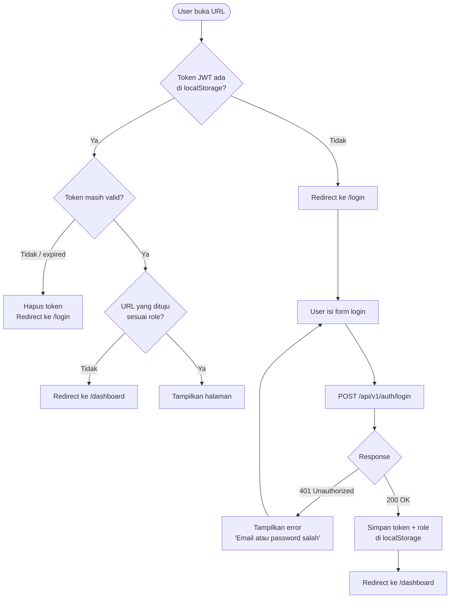
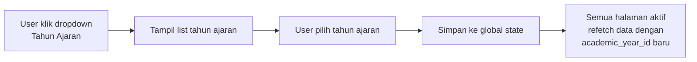
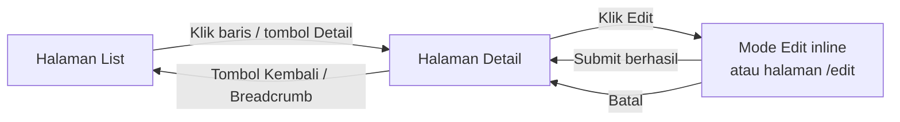
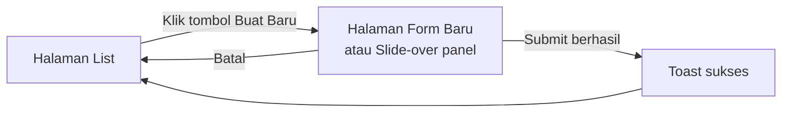
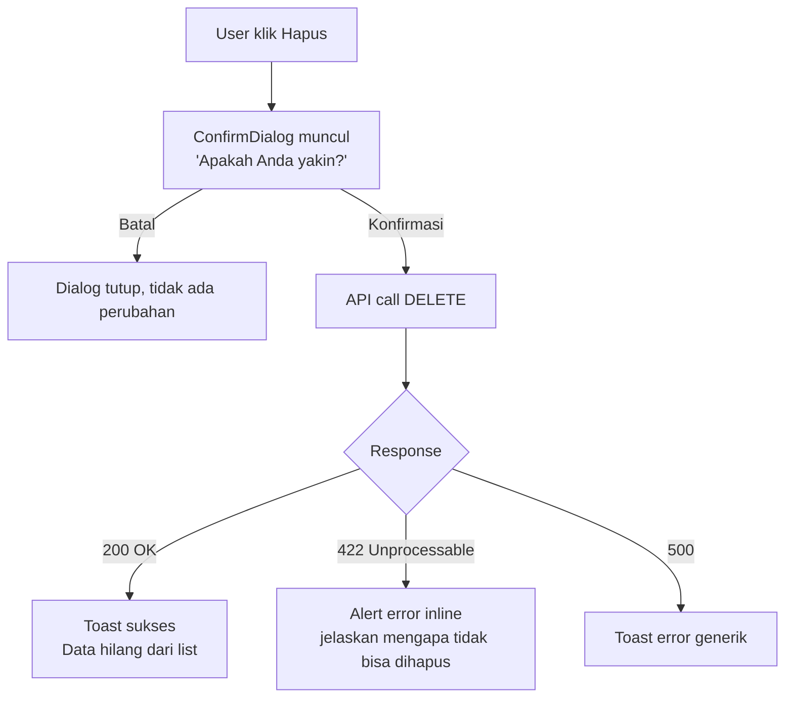
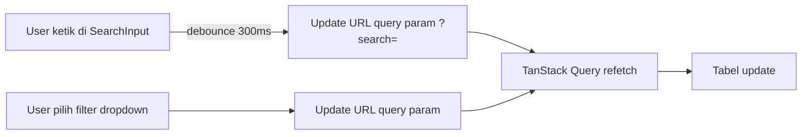
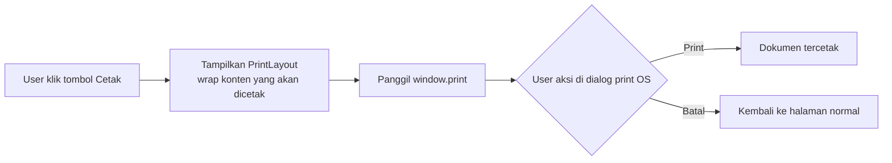

# UX Flow: Global — Alizzah Manajemen

> Berdasarkan: `prd.md`, `prd-feature-detail.md`
> Direferensikan oleh: `ux-flow-administrasi.md`, `ux-flow-keuangan.md`

---

## 1. Sitemap Global

```
/                               → Redirect ke /dashboard (jika sudah login)
                                  atau /login (jika belum login)
│
├── /login                      → Halaman login
│
└── /dashboard                  → Layout utama (auth guard)
    │
    ├── /                       → Dashboard overview (ringkasan per modul)
    │
    ├── /administrasi/          → Modul Administrasi
    │   ├── /tahun-ajaran       → Manajemen tahun ajaran
    │   ├── /rombel             → Daftar rombel
    │   │   ├── /               → List rombel
    │   │   ├── /baru           → Buat rombel baru
    │   │   └── /:id            → Detail & edit rombel
    │   │       └── /hari-efektif → Input hari efektif per bulan
    │   ├── /siswa              → Manajemen siswa
    │   │   ├── /               → List siswa
    │   │   ├── /baru           → Tambah siswa baru
    │   │   ├── /import         → Import siswa massal
    │   │   └── /:id            → Detail siswa
    │   │       ├── /profil     → Tab: profil & wali murid
    │   │       ├── /akademik   → Tab: riwayat akademik & siklus
    │   │       ├── /ekskul     → Tab: pasta & ekstrakurikuler
    │   │       └── /keuangan   → Tab: ringkasan keuangan (shortcut → /keuangan/tagihan/siswa/:id)
    │   ├── /ekskul             → Master data ekstrakurikuler
    │   ├── /daycare            → Manajemen daycare
    │   │   ├── /               → List pendaftaran daycare
    │   │   └── /baru           → Daftarkan siswa ke daycare
    │   └── /siklus             → Proses siklus akademik
    │       ├── /kenaikan-kelas → Proses kenaikan kelas massal
    │       ├── /kelulusan      → Proses kelulusan
    │       ├── /mutasi         → Mutasi masuk dari luar
    │       └── /pindah-rombel  → Pindah rombel individual
    │
    ├── /keuangan/              → Modul Keuangan
    │   ├── /                   → Overview keuangan (saldo kas, berangkas, tunggakan hari ini)
    │   ├── /tagihan            → Manajemen tagihan
    │   │   ├── /               → List semua tagihan (filter by siswa/bulan/status)
    │   │   ├── /:id            → Detail tagihan + kelola item + jadwal cicilan
    │   │   └── /siswa/:id      → Semua tagihan satu siswa
    │   ├── /pembayaran         → Manajemen pembayaran
    │   │   ├── /               → List pembayaran + riwayat
    │   │   ├── /baru           → Form pembayaran baru (wizard)
    │   │   └── /:id            → Detail pembayaran + cetak struk
    │   ├── /tabungan           → Manajemen tabungan
    │   │   ├── /               → List siswa + saldo tabungan
    │   │   └── /siswa/:id      → Detail tabungan + riwayat mutasi
    │   ├── /pengeluaran        → Manajemen pengeluaran
    │   │   ├── /               → List pengeluaran
    │   │   └── /baru           → Catat pengeluaran baru
    │   ├── /kas                → Kas & Berangkas
    │   │   ├── /               → Saldo kas + saldo berangkas + mutasi terkini
    │   │   ├── /transaksi      → Riwayat transaksi kas
    │   │   └── /tutup-buku     → Form tutup buku harian
    │   └── /laporan            → Laporan keuangan
    │       ├── /harian         → Laporan harian
    │       ├── /bulanan        → Laporan bulanan
    │       ├── /tahunan        → Laporan tahunan
    │       ├── /siswa          → Rekap per siswa
    │       └── /kelas          → Rekap per kelas
    │
    └── /pengaturan/            → Pengaturan sistem (superadmin only)
        ├── /pengguna           → Manajemen user & role
        └── /tarif              → Konfigurasi tarif per tahun ajaran
```

---

## 2. Role & Akses Halaman

| Halaman | Superadmin | Admin Administrasi | Admin Keuangan | Kepala Sekolah | Yayasan |
|---|:---:|:---:|:---:|:---:|:---:|
| Dashboard overview | ✅ | ✅ | ✅ | ✅ | ✅ |
| Seluruh /administrasi | ✅ | ✅ | 👁 (read only) | ❌ | ❌ |
| Seluruh /keuangan | ✅ | ❌ | ✅ | 👁 laporan | 👁 laporan tahunan |
| /keuangan/laporan/harian | ✅ | ❌ | ✅ | ✅ | ❌ |
| /keuangan/laporan/bulanan | ✅ | ❌ | ✅ | ✅ | ❌ |
| /keuangan/laporan/tahunan | ✅ | ❌ | ✅ | ✅ | ✅ |
| /keuangan/laporan/siswa | ✅ | ❌ | ✅ | ❌ | ❌ |
| /keuangan/laporan/kelas | ✅ | ❌ | ✅ | ✅ | ❌ |
| /pengaturan | ✅ | ❌ | ❌ | ❌ | ❌ |

> 👁 = dapat melihat data tapi tidak bisa melakukan aksi (tambah/edit/hapus)

---

## 3. Auth Flow



### Catatan Auth

- Token disimpan di `localStorage` dengan key `alizzah_token`
- Role user disimpan di `localStorage` dengan key `alizzah_role`  
- Setiap request API menyertakan header `Authorization: Bearer <token>`
- Jika API mengembalikan `401` → hapus token → redirect ke `/login`
- Route guard diimplementasikan di TanStack Router via `beforeLoad` pada layout route `_authenticated`

---

## 4. Layout Dashboard

### 4.1 Struktur Layout Desktop

```
┌─────────────────────────────────────────────────────────────────┐
│ SIDEBAR (240px, fixed)        │ MAIN CONTENT AREA               │
│                               │                                 │
│ ┌───────────────────────────┐ │ ┌─────────────────────────────┐ │
│ │ 🏫 Alizzah Manajemen      │ │ │ TOPBAR                      │ │
│ │ TA: 2025/2026  [▼]        │ │ │ Breadcrumb        [👤 Admin]│ │
│ └───────────────────────────┘ │ └─────────────────────────────┘ │
│                               │                                 │
│ NAVIGASI                      │ PAGE CONTENT                    │
│ ─────────                     │                                 │
│ 📊 Dashboard                  │ (konten halaman)                │
│                               │                                 │
│ ADMINISTRASI                  │                                 │
│  └ Tahun Ajaran               │                                 │
│  └ Rombel                     │                                 │
│  └ Siswa                      │                                 │
│  └ Ekstrakurikuler            │                                 │
│  └ Daycare                    │                                 │
│  └ Siklus Akademik            │                                 │
│                               │                                 │
│ KEUANGAN                      │                                 │
│  └ Overview                   │                                 │
│  └ Tagihan                    │                                 │
│  └ Pembayaran                 │                                 │
│  └ Tabungan                   │                                 │
│  └ Pengeluaran                │                                 │
│  └ Kas & Berangkas            │                                 │
│  └ Laporan                    │                                 │
│    ├ Harian                   │                                 │
│    ├ Bulanan                  │                                 │
│    ├ Tahunan                  │                                 │
│    ├ Per Siswa                │                                 │
│    └ Per Kelas                │                                 │
│                               │                                 │
│ ─────────                     │                                 │
│ ⚙️  Pengaturan                │                                 │
│ 🚪 Keluar                     │                                 │
└─────────────────────────────────────────────────────────────────┘
```

### 4.2 Topbar

- **Kiri:** Breadcrumb navigasi (misal: `Keuangan > Tagihan > Detail`)
- **Tengah:** Tidak ada konten
- **Kanan:** Nama user + role badge + tombol logout

### 4.3 Sidebar — Tampil Berdasarkan Role

| Section Sidebar | Tampil untuk |
|---|---|
| Dashboard | Semua role |
| Administrasi (section header) | superadmin, admin_administrasi |
| Keuangan → semua sub-menu | superadmin, admin_keuangan |
| Keuangan → Laporan saja | kepala_sekolah, yayasan |
| Pengaturan | superadmin |

Sidebar tidak ditampilkan di halaman `/login`.

### 4.4 Pemilih Tahun Ajaran

Di bagian atas sidebar terdapat **dropdown tahun ajaran aktif**. Perubahan tahun ajaran di sini mempengaruhi seluruh data yang ditampilkan di halaman manapun.



State tahun ajaran aktif disimpan di **Jotai atom** dan dipakai sebagai default query param di semua halaman.

---

## 5. Pola Navigasi Global

### 5.1 List → Detail



### 5.2 List → Buat Baru



### 5.3 Aksi Destruktif (Hapus)



### 5.4 Cross-Module Navigation

Titik navigasi lintas modul yang perlu diperhatikan:

| Dari | Ke | Trigger |
|---|---|---|
| Detail siswa → tab Keuangan | `/keuangan/tagihan/siswa/:id` | Klik tombol "Lihat Tagihan" |
| Detail tagihan | Detail siswa | Klik nama siswa di header tagihan |
| List pembayaran | Detail tagihan | Klik nomor tagihan di baris pembayaran |
| Laporan per kelas | Detail siswa | Klik nama siswa di tabel laporan |

---

## 6. Pola Komponen Global

### 6.1 Komponen yang Tersedia (Atomic Design)

| Level | Komponen | Digunakan untuk |
|---|---|---|
| Atom | `Button` | Semua tombol aksi |
| Atom | `Input` | Semua field teks |
| Atom | `Label` | Label field form |
| Atom | `Alert` | Pesan error inline, peringatan |
| Molecule | `FormField` | Label + Input + pesan error validasi |
| Molecule | `ConfirmDialog` | Konfirmasi aksi destruktif |
| Molecule | `Toast` | Notifikasi sukses/error auto-dismiss |

### 6.2 Komponen Tambahan yang Perlu Dibuat

| Komponen | Tipe | Digunakan untuk |
|---|---|---|
| `DataTable` | Organism | Tabel data dengan sorting, filter, pagination |
| `PageHeader` | Organism | Header halaman: judul + breadcrumb + action button |
| `StatCard` | Molecule | Kartu ringkasan angka di dashboard & overview |
| `StatusBadge` | Atom | Badge warna untuk status (paid/unpaid/partial/active/dll) |
| `SearchInput` | Molecule | Input pencarian dengan debounce 300ms |
| `FilterBar` | Molecule | Kumpulan filter (dropdown + search) di atas tabel |
| `EmptyState` | Molecule | Ilustrasi + teks + CTA saat data kosong |
| `SlideOver` | Organism | Panel slide dari kanan untuk form create/edit ringan |
| `AcademicYearSelector` | Molecule | Dropdown pemilih tahun ajaran di sidebar |
| `PrintLayout` | Organism | Wrapper khusus print (laporan & struk) |

### 6.3 Status Badge

| Status | Warna | Digunakan pada |
|---|---|---|
| `active` | Hijau | Siswa, daycare enrollment |
| `graduated` | Biru | Status siswa |
| `transferred` | Abu-abu | Status siswa |
| `paid` | Hijau | Invoice, invoice item |
| `partial` | Kuning | Invoice, invoice item |
| `unpaid` | Merah | Invoice, invoice item |
| `confirmed` | Hijau | Daily closing |
| `pending` | Kuning | Daily closing belum dikonfirmasi |

---

## 7. State Per Halaman (Pola Global)

Setiap halaman yang menampilkan data dari API harus menangani 4 state berikut secara konsisten:

| State | Tampilan |
|---|---|
| **Loading** | Skeleton placeholder sesuai layout halaman |
| **Empty** | `EmptyState` component: ilustrasi + teks kontekstual + tombol CTA jika ada |
| **Error** | `Alert` variant error + tombol "Coba lagi" yang memanggil ulang query |
| **Success** | Konten normal |

### Skeleton per Tipe Halaman

| Tipe Halaman | Skeleton |
|---|---|
| List / Tabel | Baris-baris placeholder dengan lebar bervariasi |
| Detail / Card | Blok-blok placeholder sesuai posisi konten |
| Form | Field-field placeholder dengan label |
| Dashboard / Stats | Kotak-kotak `StatCard` placeholder |

---

## 8. Pola Form Global

### 8.1 Validasi

- Validasi dilakukan **sisi klien** terlebih dulu (menggunakan library validasi — misal `zod` via TanStack Form atau `react-hook-form`)
- Error validasi tampil di bawah field masing-masing via `FormField` molecule
- Setelah submit dan API mengembalikan error validasi (`400`), error dari server juga ditampilkan inline

### 8.2 Submit State

```
Default → Loading (button disabled + spinner) → Berhasil (Toast + redirect/refresh)
                                              → Gagal (Alert error di atas form)
```

### 8.3 Konfirmasi Navigasi Keluar

Jika user sudah mengisi form dan mencoba keluar halaman (klik link lain / tombol back browser), tampilkan dialog konfirmasi:

> "Perubahan belum disimpan. Yakin ingin meninggalkan halaman ini?"

---

## 9. Pola Pencarian & Filter Global

Setiap halaman list menggunakan pola berikut:



- Filter dan search **selalu disimpan di URL** (`?search=&status=&page=`) agar bisa di-bookmark dan di-share
- Pagination juga di URL (`?page=1&limit=20`)
- Reset filter via tombol "Reset" yang menghapus semua query param

---

## 10. Pola Print

Laporan dan struk pembayaran dicetak langsung dari browser via `window.print()`.



### Aturan Print Layout

- Sidebar dan topbar **disembunyikan** saat print (via CSS `@media print { display: none }`)
- `PrintLayout` menambahkan header institusi (nama sekolah, logo, tanggal cetak)
- Font diubah ke serif untuk keterbacaan pada kertas
- Tabel menggunakan border penuh agar terlihat jelas saat dicetak

---

## 11. Pola Error Global

### 11.1 HTTP Error → Tampilan

| HTTP Status | Tampilan |
|---|---|
| `400` Bad Request | Alert inline di form dengan pesan dari API |
| `401` Unauthorized | Hapus token → redirect `/login` |
| `403` Forbidden | Halaman "Akses Ditolak" dengan tombol kembali |
| `404` Not Found | Halaman "Data tidak ditemukan" dengan tombol kembali |
| `409` Conflict | Alert inline dengan pesan konflik |
| `422` Unprocessable | Alert inline dengan pesan logika bisnis |
| `500` Server Error | Toast error generik "Terjadi kesalahan, coba lagi" |

### 11.2 Network Error

Jika tidak ada koneksi atau API tidak dapat dijangkau:

- Tampilkan banner di atas halaman: "Koneksi bermasalah. Beberapa fitur mungkin tidak berfungsi."
- Query yang gagal di-retry otomatis oleh TanStack Query (3x dengan backoff)

---

## 12. Global State Management (Jotai)

| Atom | Tipe | Isi |
|---|---|---|
| `academicYearAtom` | `{ id: number, name: string }` | Tahun ajaran yang sedang dipilih di sidebar |
| `currentUserAtom` | `{ id, fullName, role }` | Data user yang sedang login |
| `toastAtom` | `{ message, type, id }[]` | Antrian notifikasi toast |

### Cara Pakai `academicYearAtom`

```ts
// Di setiap halaman yang butuh academic_year_id
const [academicYear] = useAtom(academicYearAtom)

const { data } = useQuery({
    queryKey: ['invoices', academicYear.id, filters],
    queryFn: () => getInvoices({ academic_year_id: academicYear.id, ...filters }),
})
```

---

## 13. Routing Pattern (TanStack Router)

```
apps/platform/src/routes/
├── __root.tsx                          ← Root layout (providers, global error boundary)
├── login.tsx                           ← Halaman login (public)
└── _authenticated.tsx                  ← Auth guard layout
    └── _authenticated/
        ├── index.tsx                   ← Dashboard overview
        ├── administrasi/
        │   ├── tahun-ajaran.tsx
        │   ├── rombel/
        │   │   ├── index.tsx
        │   │   ├── baru.tsx
        │   │   └── $id/
        │   │       ├── index.tsx
        │   │       └── hari-efektif.tsx
        │   ├── siswa/
        │   │   ├── index.tsx
        │   │   ├── baru.tsx
        │   │   ├── import.tsx
        │   │   └── $id/
        │   │       ├── index.tsx       ← redirect ke /profil
        │   │       ├── profil.tsx
        │   │       ├── akademik.tsx
        │   │       ├── ekskul.tsx
        │   │       └── keuangan.tsx
        │   ├── ekskul.tsx
        │   ├── daycare/
        │   │   ├── index.tsx
        │   │   └── baru.tsx
        │   └── siklus/
        │       ├── kenaikan-kelas.tsx
        │       ├── kelulusan.tsx
        │       ├── mutasi.tsx
        │       └── pindah-rombel.tsx
        ├── keuangan/
        │   ├── index.tsx
        │   ├── tagihan/
        │   │   ├── index.tsx
        │   │   ├── $id.tsx
        │   │   └── siswa.$id.tsx
        │   ├── pembayaran/
        │   │   ├── index.tsx
        │   │   ├── baru.tsx
        │   │   └── $id.tsx
        │   ├── tabungan/
        │   │   ├── index.tsx
        │   │   └── siswa.$id.tsx
        │   ├── pengeluaran/
        │   │   ├── index.tsx
        │   │   └── baru.tsx
        │   ├── kas/
        │   │   ├── index.tsx
        │   │   ├── transaksi.tsx
        │   │   └── tutup-buku.tsx
        │   └── laporan/
        │       ├── harian.tsx
        │       ├── bulanan.tsx
        │       ├── tahunan.tsx
        │       ├── siswa.tsx
        │       └── kelas.tsx
        └── pengaturan/
            ├── pengguna.tsx
            └── tarif/
                ├── index.tsx
                └── $id.tsx             ← Detail konfigurasi tarif
```

### Auth Guard di `_authenticated.tsx`

```ts
// _authenticated.tsx
export const Route = createFileRoute('/_authenticated')({
    beforeLoad: ({ context }) => {
        const token = localStorage.getItem('alizzah_token')
        const role = localStorage.getItem('alizzah_role')
        if (!token) {
            throw redirect({ to: '/login' })
        }
        return { role }
    },
    component: AuthenticatedLayout,
})
```

### Role Guard per Route

```ts
// Contoh: pengaturan hanya untuk superadmin
export const Route = createFileRoute('/_authenticated/pengaturan/')({
    beforeLoad: ({ context }) => {
        if (context.role !== 'superadmin') {
            throw redirect({ to: '/dashboard' })
        }
    },
})
```

---

## 14. API Integration Pattern

Menggunakan **Orval** untuk generate TanStack Query hooks dari Swagger. Setelah hooks di-generate, pola penggunaan di halaman:

```ts
// List dengan filter + pagination
const { data, isLoading, isError, refetch } = useGetInvoices({
    academic_year_id: academicYear.id,
    status: filters.status,
    page: pagination.page,
    limit: pagination.limit,
})

// Mutation (create/update/delete)
const { mutate, isPending } = useCreatePayment({
    mutation: {
        onSuccess: () => {
            toast.success('Pembayaran berhasil dicatat')
            queryClient.invalidateQueries({ queryKey: ['payments'] })
            navigate({ to: '/keuangan/pembayaran' })
        },
        onError: (error) => {
            toast.error(error.message ?? 'Terjadi kesalahan')
        },
    },
})
```

---

## 15. Responsive Behavior

Prioritas utama adalah **desktop** (karena pengguna adalah staf admin yang bekerja di komputer). Mobile adalah nice-to-have.

| Breakpoint | Perilaku |
|---|---|
| Desktop (≥1024px) | Sidebar tampil permanen di kiri |
| Tablet (768–1023px) | Sidebar collapse menjadi icon-only, bisa di-expand via tombol |
| Mobile (<768px) | Sidebar tersembunyi, muncul sebagai drawer via hamburger button |

Tabel data di mobile menggunakan **horizontal scroll** — tidak di-convert ke card layout agar konsistensi data tetap terjaga.
