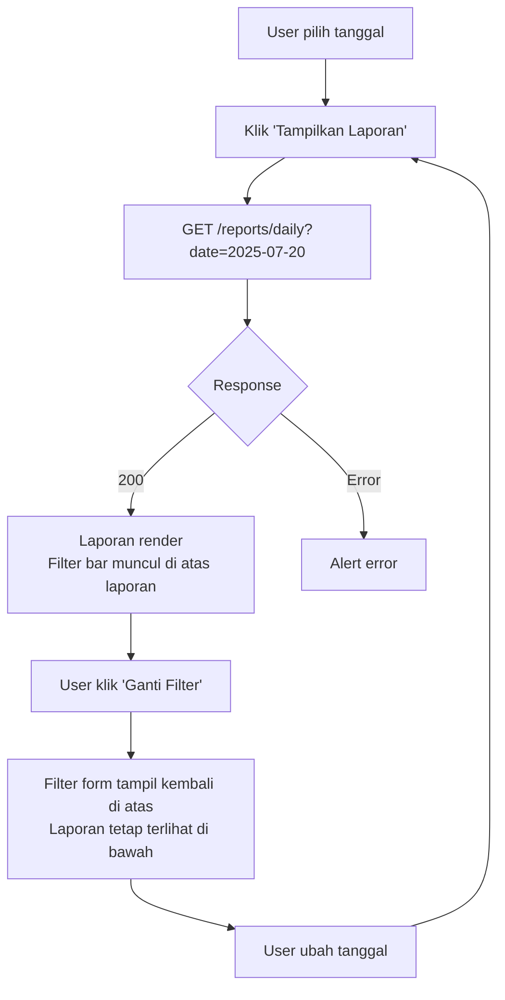
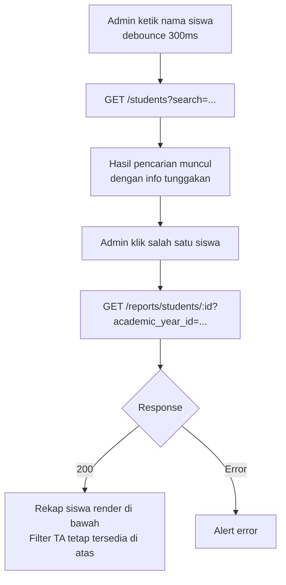
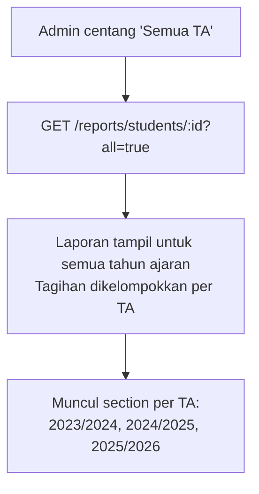
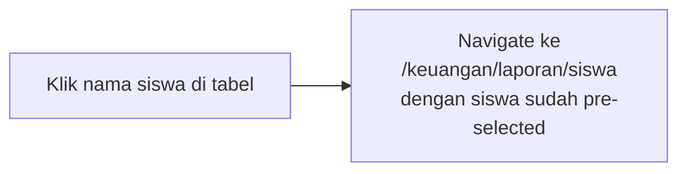
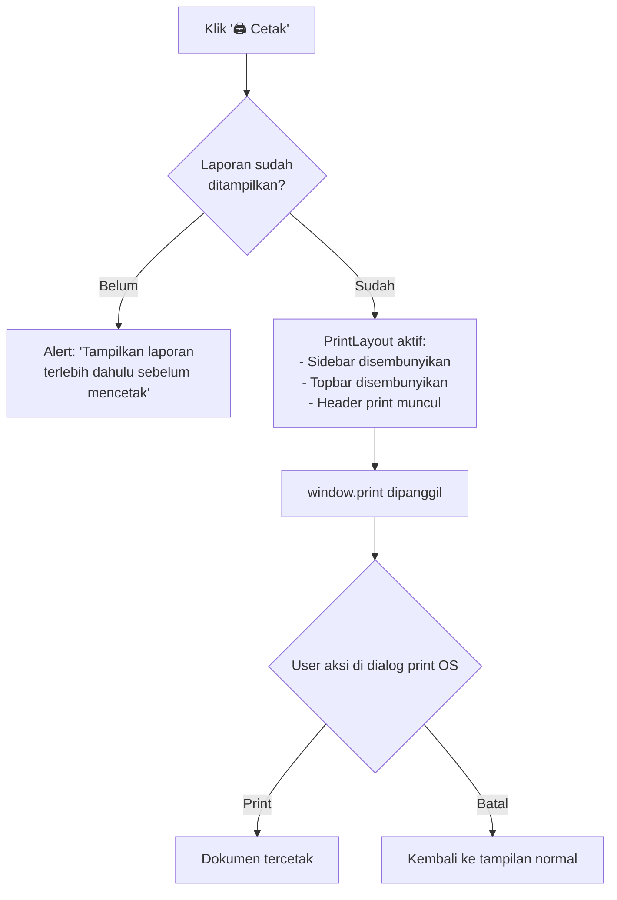

# UX Flow: Keuangan — Laporan

> Berdasarkan: `prd-feature-detail.md`, `ux-flow-global.md`, `ux-flow-keuangan-transaksi.md`, `ux-flow-keuangan-operasional.md`
> Ini adalah dokumen UX Flow terakhir.

---

## Konteks & Prinsip Desain

Laporan adalah fitur read-only yang diakses oleh beberapa role dengan tingkat akses berbeda. Prinsip desain yang diterapkan:

1. **Filter dulu, tampil kemudian** — laporan tidak langsung render semua data. User memilih parameter (tanggal/bulan/tahun/siswa/kelas) lalu klik "Tampilkan". Ini menghindari loading berat tanpa tujuan
2. **Print-ready selalu tersedia** — setiap laporan punya tombol cetak yang bisa diakses kapan saja tanpa perlu navigasi tambahan
3. **Konsisten secara visual** — semua laporan menggunakan pola layout yang sama (filter di atas, ringkasan angka, detail di bawah) agar admin dan kepala sekolah tidak perlu belajar ulang di setiap halaman laporan
4. **Role visibility** — konten yang ditampilkan disesuaikan per role. Kepala sekolah dan Yayasan tidak melihat tombol edit atau navigasi ke data sensitif dari dalam laporan

---

## Sitemap (Scope Dokumen Ini)

```
/dashboard/keuangan/laporan/
├── /harian                     → Laporan harian (per tanggal)
├── /bulanan                    → Laporan bulanan
├── /tahunan                    → Laporan tahunan per tahun ajaran
├── /siswa                      → Rekap keuangan per siswa
└── /kelas                      → Rekap pembayaran per kelas/rombel
```

---

## 1. Navigasi Hub Laporan

Sebelum masuk ke masing-masing jenis laporan, user melihat halaman hub yang menjadi pintu masuk dengan ringkasan akses per role.

### Layout Hub (`/keuangan/laporan`)

```
┌────────────────────────────────────────────────────────┐
│ PageHeader: "Laporan Keuangan"                         │
├────────────────────────────────────────────────────────┤
│                                                        │
│  ┌───────────────────────┐  ┌───────────────────────┐ │
│  │ 📅 Laporan Harian     │  │ 📆 Laporan Bulanan    │ │
│  │                       │  │                       │ │
│  │ Ringkasan pemasukan,  │  │ Total tagihan vs       │ │
│  │ pengeluaran, dan      │  │ realisasi, tunggakan   │ │
│  │ tutup buku per hari   │  │ per kelas, dan kas     │ │
│  │                       │  │                       │ │
│  │ [Buka →]              │  │ [Buka →]              │ │
│  └───────────────────────┘  └───────────────────────┘ │
│                                                        │
│  ┌───────────────────────┐  ┌───────────────────────┐ │
│  │ 📊 Laporan Tahunan    │  │ 👤 Rekap per Siswa    │ │
│  │                       │  │                       │ │
│  │ Ringkasan keuangan    │  │ Riwayat tagihan dan   │ │
│  │ satu tahun ajaran     │  │ pembayaran individual  │ │
│  │ penuh                 │  │ untuk dicetak ke       │ │
│  │                       │  │ wali murid            │ │
│  │ [Buka →]              │  │ [Buka →]              │ │
│  └───────────────────────┘  └───────────────────────┘ │
│                                                        │
│  ┌───────────────────────┐                            │
│  │ 🏫 Rekap per Kelas    │                            │
│  │                       │                            │
│  │ Status pembayaran     │                            │
│  │ semua siswa per       │                            │
│  │ rombel per bulan      │                            │
│  │                       │                            │
│  │ [Buka →]              │                            │
│  └───────────────────────┘                            │
│                                                        │
└────────────────────────────────────────────────────────┘
```

**Visibilitas card per role:**

| Card | Admin Keuangan | Kepala Sekolah | Yayasan |
|---|:---:|:---:|:---:|
| Harian | ✅ | ✅ | ❌ |
| Bulanan | ✅ | ✅ | ❌ |
| Tahunan | ✅ | ✅ | ✅ |
| Per Siswa | ✅ | ❌ | ❌ |
| Per Kelas | ✅ | ✅ | ❌ |

Jika role tidak punya akses ke suatu laporan, card-nya tidak ditampilkan sama sekali.

---

## 2. Laporan Harian

### 2.1 Halaman Laporan Harian (`/keuangan/laporan/harian`)

#### Layout — State Filter (Belum Pilih Tanggal)

```
┌────────────────────────────────────────────────────────┐
│ PageHeader: "Laporan Harian"           [🖨 Cetak]      │
│ Breadcrumb: Laporan > Laporan Harian                   │
├────────────────────────────────────────────────────────┤
│                                                        │
│  Tanggal *        [📅 20 Juli 2025]                    │
│  Tahun Ajaran     [2025/2026 ▼]  (auto-detect aktif)   │
│                                                        │
│  [Tampilkan Laporan]                                   │
│                                                        │
└────────────────────────────────────────────────────────┘
```

#### Layout — Setelah Tampilkan

```
┌────────────────────────────────────────────────────────┐
│ PageHeader: "Laporan Harian — 20 Juli 2025" [🖨 Cetak] │
│ Breadcrumb: Laporan > Laporan Harian                   │
│ TA: 2025/2026                                          │
├────────────────────────────────────────────────────────┤
│                                                        │
│  [Tanggal: 20 Jul 25] [TA: 2025/2026] [Ganti Filter]  │
│                                                        │
├──────────────────────────┬─────────────────────────────┤
│ PEMASUKAN                │ PENGELUARAN                 │
│ Rp 1.500.000             │ Rp 250.000                  │
│ dari 8 transaksi         │ dari 1 transaksi            │
│                          │                             │
│ Per Kategori:            │ Per Kategori:               │
│ • SPP        Rp 900.000  │ • SPP > Gaji   Rp 250.000  │
│ • Infaq Hrn  Rp 420.000  │                             │
│ • Pasta      Rp 180.000  │                             │
├──────────────────────────┴─────────────────────────────┤
│ RINGKASAN KAS                                          │
│ ┌──────────────────────────────────────────────────┐  │
│ │ Saldo Awal (kemarin)         Rp 11.500.000       │  │
│ │ + Total Pemasukan            + Rp  1.500.000     │  │
│ │ - Total Pengeluaran          - Rp    250.000     │  │
│ │ ─────────────────────────────────────────────    │  │
│ │ Saldo Kas Akhir              Rp 12.750.000       │  │
│ │ Saldo Berangkas              Rp  3.200.000       │  │
│ └──────────────────────────────────────────────────┘  │
│                                                        │
├────────────────────────────────────────────────────────┤
│ TUTUP BUKU HARIAN                                      │
│ ┌──────────────────────────────────────────────────┐  │
│ │ Status         ✅ Dikonfirmasi                   │  │
│ │ Kas Fisik      Rp 12.750.000                     │  │
│ │ Kas Sistem     Rp 12.750.000                     │  │
│ │ Selisih        Rp          0                     │  │
│ │ Dikonfirmasi   Admin Keuangan · 16:35 WIB        │  │
│ └──────────────────────────────────────────────────┘  │
│                                                        │
│ (Jika tutup buku belum dilakukan)                     │
│ ┌──────────────────────────────────────────────────┐  │
│ │ ⚠️ Tutup buku hari ini belum dilakukan           │  │
│ │ [Ke Tutup Buku →]                               │  │
│ └──────────────────────────────────────────────────┘  │
│                                                        │
├────────────────────────────────────────────────────────┤
│ DAFTAR TRANSAKSI HARI INI                              │
│ ┌──┬──────────┬───────────────────────┬───────────┐   │
│ │# │ Waktu    │ Keterangan            │ Nominal   │   │
│ ├──┼──────────┼───────────────────────┼───────────┤   │
│ │1 │ 09:30    │ ↑ Pembayaran Ahmad F. │ +190.000  │   │
│ │2 │ 09:45    │ ↑ Pembayaran Budi S.  │ +327.000  │   │
│ │3 │ 10:00    │ ↓ Gaji Guru Jul 2025  │ -250.000  │   │
│ └──┴──────────┴───────────────────────┴───────────┘   │
└────────────────────────────────────────────────────────┘
```

#### Flow: Tampilkan & Ganti Filter



---

## 3. Laporan Bulanan

### 3.1 Halaman Laporan Bulanan (`/keuangan/laporan/bulanan`)

#### Layout — Setelah Tampilkan

```
┌────────────────────────────────────────────────────────┐
│ PageHeader: "Laporan Bulanan — Juli 2025"  [🖨 Cetak]  │
│ TA: 2025/2026                                          │
├────────────────────────────────────────────────────────┤
│ [Bulan: Juli ▼] [Tahun: 2025 ▼] [TA: 2025/2026 ▼]    │
│ [Tampilkan Laporan]                                    │
├────────────────────────────────────────────────────────┤
│                                                        │
│  RINGKASAN PEMASUKAN                                   │
│  ┌────────────────┬──────────┬──────────┬───────────┐  │
│  │ Kategori       │ Tagihan  │ Realisasi│ Selisih   │  │
│  ├────────────────┼──────────┼──────────┼───────────┤  │
│  │ SPP            │ 15.0 jt  │ 14.5 jt  │ -500rb    │  │
│  │ Infaq Harian   │  7.0 jt  │  6.3 jt  │ -700rb    │  │
│  │ Pasta          │  3.5 jt  │  2.5 jt  │ -1.0 jt   │  │
│  │ Registrasi     │  2.0 jt  │  1.0 jt  │ -1.0 jt   │  │
│  ├────────────────┼──────────┼──────────┼───────────┤  │
│  │ TOTAL          │ 27.5 jt  │ 24.3 jt  │ -3.2 jt   │  │
│  └────────────────┴──────────┴──────────┴───────────┘  │
│                                                        │
│  RINGKASAN PENGELUARAN                                 │
│  ┌────────────────────────────────────┬────────────┐   │
│  │ Kategori                           │ Total      │   │
│  ├────────────────────────────────────┼────────────┤   │
│  │ SPP > Gaji Guru                    │ Rp 8.5 jt  │   │
│  └────────────────────────────────────┴────────────┘   │
│                                                        │
│  TUNGGAKAN PER KELAS                                   │
│  ┌────────────┬──────────────────┬──────────────────┐  │
│  │ Kelas      │ Total Tunggakan  │ Jumlah Siswa     │  │
│  ├────────────┼──────────────────┼──────────────────┤  │
│  │ Intan 1    │ Rp 750.000       │ 3 siswa          │  │
│  │ Berlian 2  │ Rp 327.000       │ 1 siswa          │  │
│  │ Mutiara 3  │ Rp 490.000       │ 2 siswa          │  │
│  └────────────┴──────────────────┴──────────────────┘  │
│  [Lihat Rekap Per Kelas →]                             │
│                                                        │
│  RINGKASAN KAS                                         │
│  ┌──────────────────────────────────────────────────┐  │
│  │ Saldo Awal Bulan        Rp  5.000.000            │  │
│  │ + Total Pemasukan       + Rp 24.300.000          │  │
│  │ - Total Pengeluaran     - Rp  8.500.000          │  │
│  │ ──────────────────────────────────────────       │  │
│  │ Saldo Kas Akhir Bulan   Rp 20.800.000            │  │
│  └──────────────────────────────────────────────────┘  │
│                                                        │
└────────────────────────────────────────────────────────┘
```

Link "Lihat Rekap Per Kelas →" di tabel tunggakan per kelas adalah shortcut langsung ke `/keuangan/laporan/kelas` dengan bulan dan tahun sudah pre-filled.

---

## 4. Laporan Tahunan

### 4.1 Halaman Laporan Tahunan (`/keuangan/laporan/tahunan`)

Laporan ini dapat diakses oleh Yayasan — satu-satunya laporan yang dibuka untuk role tersebut.

#### Layout — Setelah Tampilkan

```
┌────────────────────────────────────────────────────────┐
│ PageHeader: "Laporan Tahunan — TA 2025/2026" [🖨 Cetak]│
├────────────────────────────────────────────────────────┤
│ [TA: 2025/2026 ▼] [Tampilkan Laporan]                 │
├────────────────────────────────────────────────────────┤
│                                                        │
│  RINGKASAN TAHUNAN                                     │
│  ┌──────────────┬──────────────┬──────────────────┐    │
│  │ Total Tagihan│ Realisasi    │ Sisa Tunggakan    │    │
│  │ Rp 330 jt    │ Rp 310 jt    │ Rp 20 jt          │    │
│  ├──────────────┼──────────────┴──────────────────┤    │
│  │ Total Keluar │ Rp 102 jt                        │    │
│  ├──────────────┼──────────────────────────────────┤    │
│  │ Net (Masuk - │ Rp 208 jt                        │    │
│  │ Keluar)      │                                  │    │
│  └──────────────┴──────────────────────────────────┘    │
│                                                        │
│  ┌──────────────┬──────────────┐                       │
│  │ Saldo Kas    │ Saldo Berangkas│                      │
│  │ Rp 20.8 jt   │ Rp 3.2 jt    │                       │
│  └──────────────┴──────────────┘                       │
│                                                        │
│  BREAKDOWN PER BULAN                                   │
│  ┌──────────┬────────────┬────────────┬────────────┐   │
│  │ Bulan    │ Pemasukan  │ Pengeluaran│ Net        │   │
│  ├──────────┼────────────┼────────────┼────────────┤   │
│  │ Jul 2025 │ Rp 24.3 jt │ Rp  8.5 jt │ Rp 15.8 jt│   │
│  │ Agu 2025 │ Rp 25.1 jt │ Rp  8.5 jt │ Rp 16.6 jt│   │
│  │ Sep 2025 │ Rp 23.8 jt │ Rp  9.0 jt │ Rp 14.8 jt│   │
│  │ ...      │ ...        │ ...        │ ...        │   │
│  └──────────┴────────────┴────────────┴────────────┘   │
│                                                        │
└────────────────────────────────────────────────────────┘
```

Tabel breakdown per bulan menampilkan semua bulan dalam tahun ajaran yang dipilih. Bulan yang belum terjadi ditampilkan dengan angka 0 atau di-skip tergantung kondisi.

---

## 5. Rekap per Siswa

### 5.1 Halaman Rekap per Siswa (`/keuangan/laporan/siswa`)

Digunakan admin keuangan untuk mencetak rekap keuangan yang ditunjukkan kepada wali murid.

#### Layout — State Filter

```
┌────────────────────────────────────────────────────────┐
│ PageHeader: "Rekap per Siswa"                          │
│ Breadcrumb: Laporan > Rekap per Siswa                  │
├────────────────────────────────────────────────────────┤
│                                                        │
│  [🔍 Cari nama siswa...]                               │
│                                                        │
│  (Hasil pencarian langsung muncul tanpa tombol submit) │
│  ┌──────────────────────────────────────────────────┐ │
│  │ Ahmad Fauzan    · Intan 1 · TK-A                │ │
│  │ Tunggakan: Rp 177.000                           │ │
│  ├──────────────────────────────────────────────────┤ │
│  │ Budi Santosa    · Berlian 2 · TK-B              │ │
│  │ Tunggakan: Rp 0 (Lunas)                         │ │
│  └──────────────────────────────────────────────────┘ │
│                                                        │
└────────────────────────────────────────────────────────┘
```

Berbeda dari laporan lain, rekap per siswa menggunakan pola **search-first** — admin mencari siswa, lalu laporan langsung tampil untuk siswa yang dipilih.

#### Flow: Pilih Siswa → Tampil Rekap



#### Layout — Rekap Siswa Tampil

```
┌────────────────────────────────────────────────────────┐
│ PageHeader: "Rekap — Ahmad Fauzan"         [🖨 Cetak]  │
├────────────────────────────────────────────────────────┤
│ [🔍 Ganti siswa...]  [TA: 2025/2026 ▼] [Semua TA □]  │
├────────────────────────────────────────────────────────┤
│                                                        │
│  PROFIL SISWA                                          │
│  Ahmad Fauzan · Intan 1 · TK-A · TA 2025/2026         │
│                                                        │
│  RINGKASAN                                             │
│  ┌────────────────┬──────────────┬────────────────┐    │
│  │ Total Tagihan  │ Sudah Dibayar│ Sisa Tunggakan  │    │
│  │ Rp 3.270.000   │ Rp 3.093.000 │ Rp 177.000      │    │
│  └────────────────┴──────────────┴────────────────┘    │
│                                                        │
│  SALDO TABUNGAN                                        │
│  Tabungan Umum: Rp 150.000                            │
│                                                        │
│  RINCIAN TAGIHAN                                       │
│                                                        │
│  ── Tagihan Biaya Awal ───────────────────────────    │
│  ┌────────────────────────────────────────────────┐   │
│  │ Status: ✅ Lunas · Total: Rp 2.410.000         │   │
│  │ [Lihat Detail ▼]                               │   │
│  │                                                │   │
│  │ 4 Stel Seragam              Rp 750.000 ✅      │   │
│  │ 1 pc Rompi & Prasiaga       Rp 110.000 ✅      │   │
│  │ 1 Tas Sekolah               Rp  85.000 ✅      │   │
│  │ ...                                            │   │
│  └────────────────────────────────────────────────┘   │
│                                                        │
│  ── Tagihan Registrasi Tahunan 2025/2026 ──────────   │
│  ┌────────────────────────────────────────────────┐   │
│  │ Status: ✅ Lunas · Total: Rp 725.000           │   │
│  │ [Lihat Detail ▼]                               │   │
│  └────────────────────────────────────────────────┘   │
│                                                        │
│  ── Tagihan Bulanan ───────────────────────────────   │
│  ┌────────────────────────────────────────────────┐   │
│  │ Juli 2025   ⚠ Sebagian  Total: Rp327.000       │   │
│  │ [Lihat Detail ▼]                               │   │
│  │                                                │   │
│  │ SPP TK             Rp 150.000  ✅ Lunas        │   │
│  │ Infaq Harian       Rp 140.000  ✗ Belum         │   │
│  │ Pasta Robotika     Rp  37.000  ⚠ Sisa Rp37rb  │   │
│  └────────────────────────────────────────────────┘   │
│                                                        │
│  ── Riwayat Pembayaran ────────────────────────────   │
│  ┌────────────┬──────────────────────┬───────────┐    │
│  │ Tanggal    │ Keterangan           │ Nominal   │    │
│  ├────────────┼──────────────────────┼───────────┤    │
│  │ 20 Jul 25  │ Kas · SPP TK         │ Rp150.000 │    │
│  │ 14 Jul 25  │ Kas · Registrasi     │ Rp725.000 │    │
│  └────────────┴──────────────────────┴───────────┘    │
│                                                        │
└────────────────────────────────────────────────────────┘
```

Setiap section tagihan bisa di-expand/collapse dengan toggle "Lihat Detail ▼" untuk menghindari halaman yang terlalu panjang saat ada banyak tagihan.

#### Toggle Semua TA



---

## 6. Rekap per Kelas

### 6.1 Halaman Rekap per Kelas (`/keuangan/laporan/kelas`)

Menampilkan status pembayaran semua siswa dalam satu rombel untuk bulan tertentu.

#### Layout — State Filter

```
┌────────────────────────────────────────────────────────┐
│ PageHeader: "Rekap per Kelas"                          │
│ Breadcrumb: Laporan > Rekap per Kelas                  │
├────────────────────────────────────────────────────────┤
│                                                        │
│  Rombel *     [Pilih Rombel ▼]                        │
│               (dikelompokkan per jenjang)              │
│  Bulan *      [Juli ▼]   Tahun * [2025 ▼]             │
│  Tahun Ajaran [2025/2026 ▼]  (auto-detect aktif)      │
│                                                        │
│  [Tampilkan Laporan]                                   │
│                                                        │
└────────────────────────────────────────────────────────┘
```

#### Layout — Setelah Tampilkan

```
┌────────────────────────────────────────────────────────┐
│ PageHeader: "Rekap Intan 1 — Juli 2025"    [🖨 Cetak]  │
├────────────────────────────────────────────────────────┤
│ [Rombel: Intan 1 ▼] [Bln: Jul ▼] [Thn: 2025 ▼] [Tampilkan]│
├────────────────────────────────────────────────────────┤
│                                                        │
│  RINGKASAN KELAS                                       │
│  ┌────────────────────────────────────────────────┐   │
│  │ Jumlah Siswa      : 20 siswa                   │   │
│  │ Total Tagihan     : Rp 6.540.000               │   │
│  │ Total Terbayar    : Rp 5.434.000               │   │
│  │ Total Tunggakan   : Rp 1.106.000               │   │
│  │ Tingkat Kepatuhan : 83,1%                      │   │
│  └────────────────────────────────────────────────┘   │
│                                                        │
│  [Filter: Semua ▼ / Belum Lunas / Lunas]              │
│                                                        │
│  DAFTAR SISWA                                          │
│  ┌──┬──────────────────┬──────────┬──────────┬──────┐  │
│  │# │ Nama             │ Tagihan  │ Dibayar  │Status│  │
│  ├──┼──────────────────┼──────────┼──────────┼──────┤  │
│  │1 │ Ahmad Fauzan     │ Rp327.000│ Rp150.000│⚠Sbgn │  │
│  │2 │ Budi Santosa     │ Rp327.000│ Rp327.000│✅Lns │  │
│  │3 │ Citra Dewi       │ Rp327.000│ Rp      0│✗Blm  │  │
│  │4 │ Dinda Ayu        │ Rp327.000│ Rp327.000│✅Lns │  │
│  │  │ ...              │ ...      │ ...      │      │  │
│  └──┴──────────────────┴──────────┴──────────┴──────┘  │
│                                                        │
│  (Admin Keuangan: Nama siswa bisa diklik)             │
│  (Kepala Sekolah: Nama siswa tidak bisa diklik)       │
│                                                        │
└────────────────────────────────────────────────────────┘
```

#### Flow: Klik Nama Siswa dari Rekap Kelas (Admin Keuangan)



Kepala sekolah tidak bisa mengklik nama siswa — nama ditampilkan sebagai teks biasa tanpa link.

---

## 7. Pola Cetak Laporan

Semua laporan menggunakan mekanisme cetak yang sama. Tombol cetak selalu ada di `PageHeader` bagian kanan.

### Flow Cetak Universal



### Header Print yang Ditambahkan Otomatis

```
┌────────────────────────────────────────┐
│ 🏫 ALIZZAH MANAJEMEN                   │
│    Laporan Keuangan                    │
├────────────────────────────────────────┤
│ Jenis    : Laporan Harian              │
│ Periode  : 20 Juli 2025               │
│ TA       : 2025/2026                  │
│ Dicetak  : 20 Juli 2025 · 16:40 WIB   │
│ Oleh     : Admin Keuangan             │
└────────────────────────────────────────┘
(konten laporan di bawah)
```

### Perbedaan Format Cetak per Laporan

| Laporan | Format Print |
|---|---|
| Harian | Portrait A4 — ringkasan + daftar transaksi |
| Bulanan | Portrait A4 — tabel tagihan vs realisasi + tunggakan per kelas |
| Tahunan | Landscape A4 — tabel breakdown per bulan (lebih lebar) |
| Per Siswa | Portrait A4 — mirip kwitansi bertingkat, per halaman per tahun ajaran |
| Per Kelas | Landscape A4 — tabel daftar siswa (banyak kolom) |
| Struk Pembayaran | Potrait setengah A4 atau thermal-style narrow |

---

## 8. State & Edge Cases per Halaman

### State Global Laporan

| Halaman | Sebelum Filter | Loading | Empty | Error |
|---|---|---|---|---|
| Laporan Harian | Form filter saja | Skeleton layout | "Belum ada transaksi pada tanggal ini" | Alert + Retry |
| Laporan Bulanan | Form filter saja | Skeleton tabel | "Belum ada data untuk bulan ini" | Alert + Retry |
| Laporan Tahunan | Dropdown TA saja | Skeleton tabel + stat cards | "Belum ada data untuk tahun ajaran ini" | Alert + Retry |
| Rekap per Siswa | Search siswa | Skeleton layout | — (selalu ada siswa) | Alert + Retry |
| Rekap per Kelas | Form filter saja | Skeleton tabel | "Tidak ada siswa di rombel ini" | Alert + Retry |

### Edge Cases Penting

| Skenario | Penanganan |
|---|---|
| Laporan harian untuk tanggal yang belum ada tutup buku | Laporan tetap tampil tapi section tutup buku menampilkan banner ⚠️ "Tutup buku hari ini belum dilakukan" + link ke tutup buku |
| Laporan bulanan untuk bulan yang sedang berjalan | Tampil data sampai hari ini. Banner info: "Data bulan ini masih berjalan dan bisa berubah" |
| Laporan tahunan untuk TA yang masih aktif | Tampil data sampai hari ini. Banner info: "Tahun ajaran ini masih berjalan" |
| Rekap per siswa — siswa tidak punya tagihan sama sekali | EmptyState di section rincian tagihan: "Siswa ini belum memiliki tagihan" |
| Rekap per kelas — filter Belum Lunas, semua siswa sudah lunas | EmptyState: "Semua siswa di kelas ini sudah melunasi tagihan bulan ini 🎉" |
| Cetak sebelum filter dipilih | Tombol Cetak disabled dengan tooltip: "Tampilkan laporan dahulu sebelum mencetak" |
| Yayasan mencoba akses laporan harian dari URL langsung | Redirect ke `/dashboard` dengan toast: "Anda tidak memiliki akses ke halaman ini" |
| Kepala sekolah akses rekap per siswa dari URL langsung | Redirect ke `/dashboard` — halaman ini tidak ada di sidebar kepala sekolah |
| Laporan per kelas diakses dari shortcut laporan bulanan | Filter rombel dan bulan sudah pre-filled sesuai dari mana shortcut diklik |
| Print saat koneksi lambat — data belum selesai render | Tombol cetak disabled selama loading. Baru aktif setelah semua data selesai di-render |
