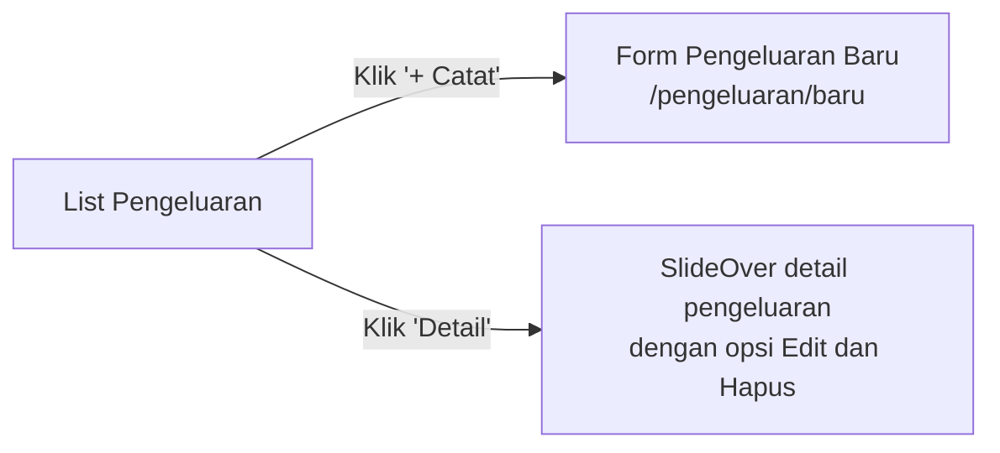
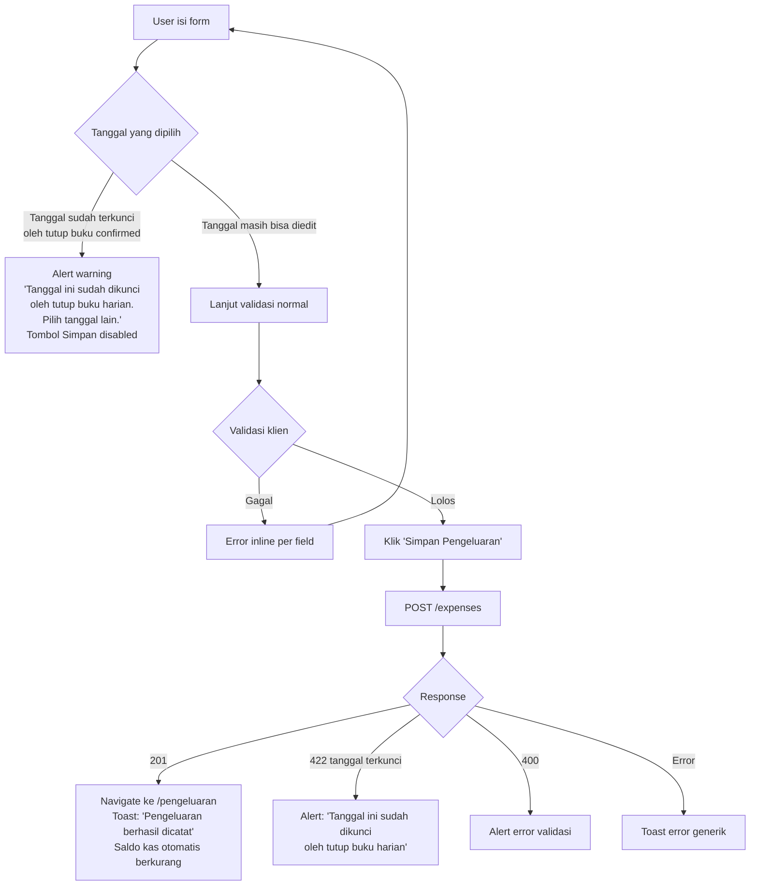
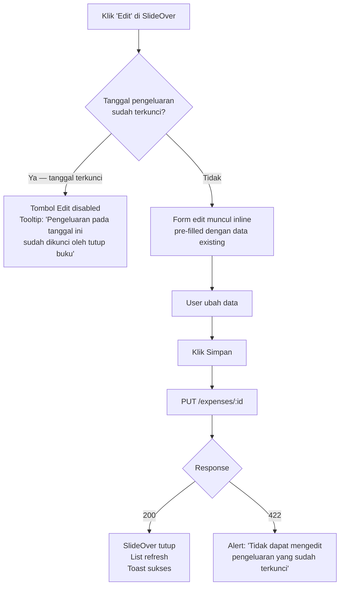
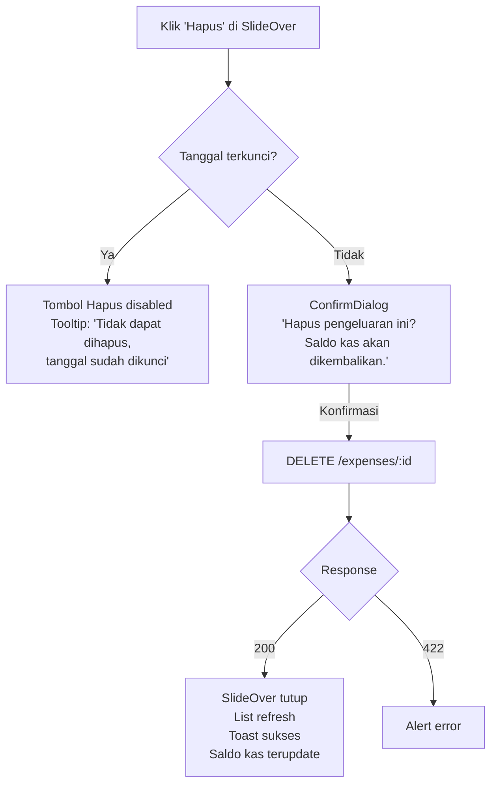
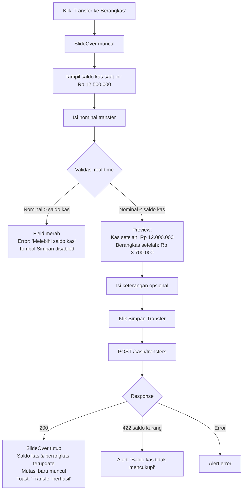
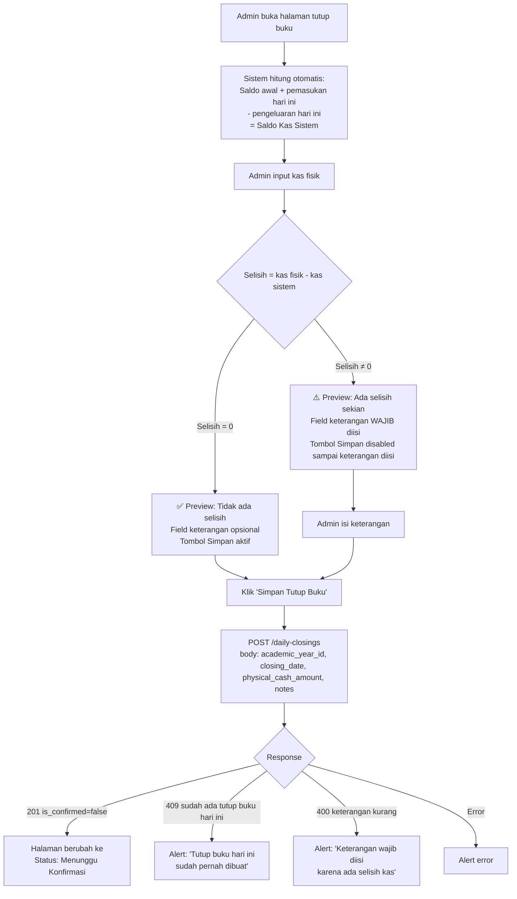
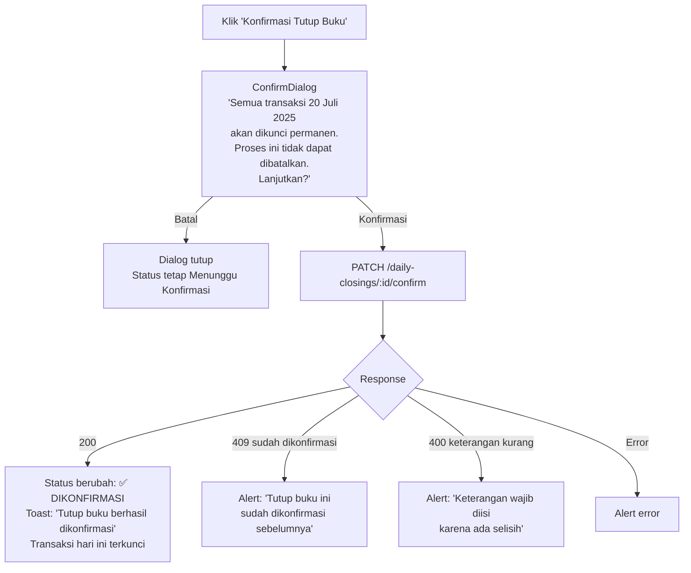
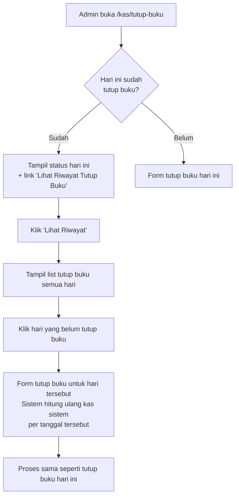

# UX Flow: Keuangan — Operasional Harian

> Berdasarkan: `prd-feature-detail.md`, `ux-flow-global.md`, `ux-flow-keuangan-transaksi.md`
> Direferensikan oleh: `ux-flow-keuangan-laporan.md`

---

## Konteks & Prinsip Desain

Domain ini mencakup aktivitas rutin admin keuangan setiap hari: mencatat pengeluaran, memantau saldo kas dan berangkas, dan menutup buku di akhir hari. Prinsip desain yang diterapkan:

1. **Rutinitas harus cepat** — admin keuangan menjalankan ini setiap hari, maka alur harus sesedikit mungkin langkah
2. **Tutup buku adalah aksi final** — setelah dikonfirmasi, transaksi hari itu terkunci. UI harus komunikasikan ini dengan jelas sebelum konfirmasi
3. **Saldo selalu real-time** — halaman kas dan berangkas harus menampilkan saldo terkini tanpa perlu refresh manual
4. **Kas dan berangkas adalah dua kantong terpisah** — UI harus membedakan keduanya dengan jelas agar admin tidak salah membaca saldo

---

## Sitemap (Scope Dokumen Ini)

```
/dashboard/keuangan/
├── /pengeluaran
│   ├── /                           → List pengeluaran
│   └── /baru                       → Form catat pengeluaran baru
└── /kas
    ├── /                           → Overview kas & berangkas
    ├── /transaksi                  → Riwayat transaksi kas lengkap
    ├── /berangkas
    │   └── /transaksi              → Riwayat transaksi berangkas
    └── /tutup-buku
        ├── /                       → Form tutup buku harian
        └── /riwayat                → Riwayat tutup buku semua hari
```

---

## 1. Pengeluaran

### 1.1 List Pengeluaran (`/keuangan/pengeluaran`)

#### Layout

```
┌────────────────────────────────────────────────────────┐
│ PageHeader: "Pengeluaran"           [+ Catat Pengeluaran]│
├────────────────────────────────────────────────────────┤
│ [🔍 Cari keterangan...] [Kategori ▼] [Tanggal dari-ke] │
│ [Reset Filter]                                         │
├────────────────────────────────────────────────────────┤
│                                                        │
│  TOTAL PENGELUARAN PERIODE INI       Rp 8.500.000      │
│                                                        │
├────────────────────────────────────────────────────────┤
│ ┌──┬────────────┬─────────────────┬─────────┬────────┐ │
│ │# │ Tanggal    │ Kategori        │ Nominal │ Aksi   │ │
│ ├──┼────────────┼─────────────────┼─────────┼────────┤ │
│ │1 │ 31 Jul 25  │ SPP > Gaji Guru │ 5jt     │[Detail]│ │
│ │2 │ 28 Jul 25  │ Registrasi >    │ 800rb   │[Detail]│ │
│ │  │            │ Alat Belajar    │         │        │ │
│ │3 │ 25 Jul 25  │ Biaya Awal >    │ 250rb   │[Detail]│ │
│ │  │            │ Infaq Sarpras   │         │        │ │
│ └──┴────────────┴─────────────────┴─────────┴────────┘ │
│ < 1 2 3 >                               Tampil 20/30   │
└────────────────────────────────────────────────────────┘
```

#### Flow: Navigasi dari List



### 1.2 Catat Pengeluaran Baru (`/keuangan/pengeluaran/baru`)

Form sederhana — admin mengisi empat field utama dan selesai.

#### Layout

```
┌────────────────────────────────────────────────────────┐
│ PageHeader: "Catat Pengeluaran"                        │
│ Breadcrumb: Pengeluaran > Catat Baru                   │
├────────────────────────────────────────────────────────┤
│                                                        │
│  Tanggal *                                            │
│  [📅 Hari ini — 31 Juli 2025]                          │
│                                                        │
│  Kategori *                                           │
│  [Pilih Kategori ▼]                                   │
│                                                        │
│  (Setelah kategori utama dipilih)                     │
│  Sub-kategori *                                       │
│  [Pilih Sub-kategori ▼]                               │
│                                                        │
│  ┌─────────────────────────┐                          │
│  │ Biaya Awal              │                          │
│  │  └ Infaq Sarpras        │ ← Sub-kategori           │
│  │  └ Infaq APE            │                          │
│  │  └ Biaya Psikotes IQ    │                          │
│  │  └ Koperasi             │                          │
│  ├─────────────────────────┤                          │
│  │ Biaya Registrasi        │                          │
│  │  └ Biaya MPLS           │                          │
│  │  └ Buku PK Karakter     │                          │
│  │  └ Alat Belajar         │                          │
│  │  └ ...                  │                          │
│  ├─────────────────────────┤                          │
│  │ SPP                     │                          │
│  │  └ Gaji Guru            │                          │
│  └─────────────────────────┘                          │
│                                                        │
│  Nominal *                                            │
│  [Rp ________________________]                        │
│                                                        │
│  Keterangan *                                         │
│  [Gaji guru bulan Juli 2025...]                       │
│                                                        │
│  Bukti Pengeluaran (opsional)                         │
│  [📎 Upload file...]                                   │
│  Foto struk, nota, atau bukti transfer                │
│                                                        │
├────────────────────────────────────────────────────────┤
│  [Batal]                          [Simpan Pengeluaran] │
└────────────────────────────────────────────────────────┘
```

#### Flow: Submit Pengeluaran Baru



### 1.3 Detail & Edit Pengeluaran (SlideOver)

Diklik dari tombol "Detail" di list pengeluaran.

#### Layout SlideOver

```
┌─────────────────────────────────┐
│ Detail Pengeluaran         [✕]  │
├─────────────────────────────────┤
│ Tanggal   : 31 Juli 2025        │
│ Kategori  : SPP                 │
│ Sub       : Gaji Guru           │
│ Nominal   : Rp 5.000.000        │
│ Keterangan: Gaji guru Juli 2025 │
│ Bukti     : [Lihat Bukti →]     │
│ Dicatat   : Admin Keuangan      │
│             31 Jul 09:15 WIB    │
├─────────────────────────────────┤
│ [Edit]              [Hapus]     │
└─────────────────────────────────┘
```

#### Flow: Edit Pengeluaran



#### Flow: Hapus Pengeluaran



#### State Halaman Pengeluaran

| State | Tampilan |
|---|---|
| Loading | Skeleton tabel |
| Empty | EmptyState: "Belum ada pengeluaran dicatat. Klik '+ Catat' untuk mulai." |
| Error | Alert + Retry |
| Success | Tabel pengeluaran + total periode |

---

## 2. Kas & Berangkas

### 2.1 Overview Kas & Berangkas (`/keuangan/kas`)

Halaman utama yang menampilkan kondisi kas dan berangkas secara real-time beserta mutasi terkini hari ini.

#### Layout

```
┌────────────────────────────────────────────────────────┐
│ PageHeader: "Kas & Berangkas"                          │
│ TA 2025/2026  ·  Hari ini: Jumat, 20 Juli 2025        │
├─────────────────────────────┬──────────────────────────┤
│ KAS                         │ BERANGKAS                │
│                             │                          │
│ Saldo                       │ Saldo                    │
│ Rp 12.500.000               │ Rp 3.200.000             │
│                             │                          │
│ Pemasukan hari ini          │ Tab. Umum (semua siswa)  │
│ ↑ Rp 1.500.000              │ Rp 1.800.000             │
│                             │                          │
│ Pengeluaran hari ini        │ Tab. Wajib (Berlian)     │
│ ↓ Rp 250.000                │ Rp 1.400.000             │
│                             │                          │
│ Tutup buku terakhir:        │ [Lihat Riwayat           │
│ Kamis, 19 Juli 2025 ✅      │  Transaksi Berangkas →]  │
│                             │                          │
│ [Lihat Riwayat Transaksi →] │                          │
│ [Transfer ke Berangkas]     │                          │
├─────────────────────────────┴──────────────────────────┤
│                                                        │
│  [Tutup Buku Hari Ini]                                 │
│                                                        │
│  MUTASI HARI INI                                       │
│  ┌────────────────────────────────────────────────┐   │
│  │ ↑ 09:30  Pembayaran Ahmad Fauzan   +Rp 190.000 │   │
│  │ ↑ 09:45  Pembayaran Budi Santosa   +Rp 327.000 │   │
│  │ ↓ 10:00  Pengeluaran Gaji Guru     -Rp 250.000 │   │
│  │ ↑ 10:15  Pembayaran Citra Dewi     +Rp 983.000 │   │
│  └────────────────────────────────────────────────┘   │
│                                                        │
└────────────────────────────────────────────────────────┘
```

**Status tutup buku:**
- ✅ = tutup buku hari sebelumnya sudah dikonfirmasi → tampil hijau
- ⚠️ = tutup buku hari sebelumnya belum dilakukan → tampil kuning dengan peringatan

#### Flow: Transfer Kas ke Berangkas



### 2.2 Riwayat Transaksi Kas (`/keuangan/kas/transaksi`)

#### Layout

```
┌────────────────────────────────────────────────────────┐
│ PageHeader: "Riwayat Transaksi Kas"                    │
│ Breadcrumb: Kas & Berangkas > Riwayat Transaksi        │
├────────────────────────────────────────────────────────┤
│ [Tanggal dari-ke]  [Jenis ▼: Masuk/Keluar]  [Tipe ▼]  │
│ [Reset Filter]                                         │
├────────────────────────────────────────────────────────┤
│                                                        │
│  SALDO PERIODE INI                                     │
│  Pemasukan: Rp 24.300.000  Pengeluaran: Rp 8.500.000   │
│  Saldo Akhir: Rp 12.500.000                           │
│                                                        │
├────────────────────────────────────────────────────────┤
│ ┌──┬────────────┬─────────────────────────┬──────────┐ │
│ │# │ Tanggal    │ Keterangan              │ Nominal  │ │
│ ├──┼────────────┼─────────────────────────┼──────────┤ │
│ │  │ 20 Jul 25  │                         │          │ │
│ │1 │            │ ↑ Pembayaran Ahmad F.   │+Rp190.000│ │
│ │2 │            │ ↑ Pembayaran Budi S.    │+Rp327.000│ │
│ │3 │            │ ↓ Pengeluaran Gaji Guru │-Rp250.000│ │
│ ├──┼────────────┼─────────────────────────┼──────────┤ │
│ │  │ 19 Jul 25  │                         │          │ │
│ │4 │            │ ↑ Pembayaran Citra D.   │+Rp 83.000│ │
│ └──┴────────────┴─────────────────────────┴──────────┘ │
│ < 1 2 3 >                               Tampil 20/200  │
└────────────────────────────────────────────────────────┘
```

Transaksi dikelompokkan per hari dengan pemisah tanggal. Pemasukan ditampilkan hijau dengan prefix `↑`, pengeluaran merah dengan prefix `↓`.

---

## 3. Tutup Buku Harian

Ini adalah flow paling penting di dokumen ini karena berdampak pada penguncian data.

### 3.1 Halaman Tutup Buku (`/keuangan/kas/tutup-buku`)

Diakses dari tombol "Tutup Buku Hari Ini" di overview kas, atau dari sidebar jika admin menjadikannya rutinitas.

#### Layout Awal — Belum Ada Tutup Buku Hari Ini

```
┌────────────────────────────────────────────────────────┐
│ PageHeader: "Tutup Buku Harian"                        │
│ Breadcrumb: Kas & Berangkas > Tutup Buku               │
│ Jumat, 20 Juli 2025                                    │
├────────────────────────────────────────────────────────┤
│                                                        │
│  RINGKASAN TRANSAKSI HARI INI                         │
│  ┌──────────────────────────────────────────────────┐ │
│  │                                                  │ │
│  │  Saldo Kas Awal (kemarin)     Rp 11.500.000      │ │
│  │                                                  │ │
│  │  + Pemasukan Hari Ini                            │ │
│  │    (8 transaksi pembayaran)   + Rp  1.500.000    │ │
│  │                                                  │ │
│  │  - Pengeluaran Hari Ini                          │ │
│  │    (1 transaksi pengeluaran)  - Rp    250.000    │ │
│  │                               ─────────────────  │ │
│  │  Saldo Kas Sistem             Rp 12.750.000      │ │
│  │                                                  │ │
│  └──────────────────────────────────────────────────┘ │
│                                                        │
│  HITUNG KAS FISIK                                     │
│  Masukkan jumlah uang fisik yang ada di kas:          │
│                                                        │
│  ┌──────────────────────────────────────────────────┐ │
│  │ Rp [____________________________]                │ │
│  └──────────────────────────────────────────────────┘ │
│                                                        │
│  (Setelah nominal diisi — Preview Selisih)            │
│  ┌──────────────────────────────────────────────────┐ │
│  │                                                  │ │
│  │  Kas Fisik (diinput)    Rp 12.750.000            │ │
│  │  Kas Sistem             Rp 12.750.000            │ │
│  │  ─────────────────────────────────────           │ │
│  │  Selisih                Rp          0  ✅        │ │
│  │                                                  │ │
│  └──────────────────────────────────────────────────┘ │
│                                                        │
│  Keterangan (wajib jika ada selisih)                  │
│  [_______________________________________________]     │
│                                                        │
│  ⚠️  Setelah dikonfirmasi, seluruh transaksi hari ini  │
│     tidak dapat diedit atau dihapus.                  │
│                                                        │
│  [Simpan Tutup Buku]                                  │
└────────────────────────────────────────────────────────┘
```

#### Flow: Proses Tutup Buku



#### Layout Setelah Simpan — Menunggu Konfirmasi

```
┌────────────────────────────────────────────────────────┐
│ PageHeader: "Tutup Buku Harian"                        │
│ Jumat, 20 Juli 2025                                    │
├────────────────────────────────────────────────────────┤
│                                                        │
│  STATUS: ⏳ MENUNGGU KONFIRMASI                        │
│                                                        │
│  ┌──────────────────────────────────────────────────┐ │
│  │ Kas Fisik     Rp 12.750.000                      │ │
│  │ Kas Sistem    Rp 12.750.000                      │ │
│  │ Selisih       Rp          0                      │ │
│  │ Keterangan    —                                  │ │
│  │ Dibuat        Admin Keuangan · 16:30 WIB         │ │
│  └──────────────────────────────────────────────────┘ │
│                                                        │
│  ⚠️  Setelah dikonfirmasi, seluruh transaksi tanggal   │
│     20 Juli 2025 akan dikunci permanen.               │
│                                                        │
│  [Konfirmasi Tutup Buku]                              │
│                                                        │
└────────────────────────────────────────────────────────┘
```

#### Flow: Konfirmasi Tutup Buku



#### Layout Setelah Konfirmasi — Terkunci

```
┌────────────────────────────────────────────────────────┐
│ PageHeader: "Tutup Buku Harian"                        │
│ Jumat, 20 Juli 2025                                    │
├────────────────────────────────────────────────────────┤
│                                                        │
│  STATUS: ✅ DIKONFIRMASI & TERKUNCI                    │
│                                                        │
│  ┌──────────────────────────────────────────────────┐ │
│  │ Kas Fisik     Rp 12.750.000                      │ │
│  │ Kas Sistem    Rp 12.750.000                      │ │
│  │ Selisih       Rp          0                      │ │
│  │ Keterangan    —                                  │ │
│  │ Dikonfirmasi  Admin Keuangan · 16:35 WIB         │ │
│  └──────────────────────────────────────────────────┘ │
│                                                        │
│  🔒 Seluruh transaksi 20 Juli 2025 telah dikunci.     │
│     Pengeluaran dan pembayaran pada tanggal ini       │
│     tidak dapat diedit atau dihapus.                  │
│                                                        │
│  [Lihat Laporan Harian →]                             │
│                                                        │
└────────────────────────────────────────────────────────┘
```

### 3.2 Tutup Buku Hari yang Terlewat

Jika admin keuangan tidak melakukan tutup buku pada hari tertentu, mereka masih bisa membuat tutup buku untuk hari yang sudah lewat.

#### Flow: Akses Tutup Buku Hari Lama



#### Layout Riwayat Tutup Buku

```
┌────────────────────────────────────────────────────────┐
│ PageHeader: "Riwayat Tutup Buku"                       │
├────────────────────────────────────────────────────────┤
│ [Bulan ▼]  [Status ▼: Semua/Dikonfirmasi/Belum]       │
├────────────────────────────────────────────────────────┤
│ ┌────────────┬────────────┬────────────┬─────────────┐ │
│ │ Tanggal    │ Kas Fisik  │ Selisih    │ Status      │ │
│ ├────────────┼────────────┼────────────┼─────────────┤ │
│ │ 20 Jul 25  │ 12.750.000 │ 0          │ ✅ Terkunci  │ │
│ │ 19 Jul 25  │ 11.500.000 │ -50.000    │ ✅ Terkunci  │ │
│ │ 18 Jul 25  │ —          │ —          │ ⚠️ Belum     │ │
│ │ 17 Jul 25  │ —          │ —          │ ⚠️ Belum     │ │
│ └────────────┴────────────┴────────────┴─────────────┘ │
│                                                        │
│ [Buat Tutup Buku] per baris yang belum                 │
└────────────────────────────────────────────────────────┘
```

---

## 4. State & Edge Cases per Halaman

### State Global Domain Ini

| Halaman | Loading | Empty | Error |
|---|---|---|---|
| List Pengeluaran | Skeleton tabel | EmptyState: "Belum ada pengeluaran dicatat" | Alert + Retry |
| Form Pengeluaran | — | — | Alert error inline |
| Overview Kas | Skeleton 2 kolom + skeleton list mutasi | — | Alert + Retry |
| Riwayat Transaksi Kas | Skeleton tabel | EmptyState: "Belum ada transaksi" | Alert + Retry |
| Tutup Buku | Skeleton ringkasan transaksi | — | Alert |
| Riwayat Tutup Buku | Skeleton tabel | EmptyState: "Belum ada tutup buku" | Alert + Retry |

### Edge Cases Penting

| Skenario | Penanganan |
|---|---|
| Tutup buku hari ini sudah ada (duplikat) | Form tutup buku diganti dengan tampilan status hari ini. Tidak ada cara membuat tutup buku kedua untuk hari yang sama |
| Tutup buku hari yang terlewat banyak (misal 5 hari) | Bisa dilakukan satu per satu dari riwayat. Tidak ada batch tutup buku |
| Selisih kas negatif (kas fisik < sistem) | Preview menampilkan selisih dengan warna merah. Keterangan wajib diisi |
| Selisih kas positif (kas fisik > sistem) | Preview menampilkan selisih dengan warna hijau. Keterangan tetap wajib diisi |
| Edit pengeluaran setelah tutup buku dikonfirmasi | Tombol Edit dan Hapus disabled di SlideOver. Tooltip: "Tidak dapat diubah, tanggal sudah dikunci tutup buku" |
| Transfer kas ke berangkas saat kas = 0 | Tombol Transfer disabled. Tooltip: "Saldo kas kosong" |
| Upload bukti pengeluaran — format tidak didukung | Validasi di klien, alert: "Hanya mendukung format JPG, PNG, atau PDF" |
| Hari ini belum ada transaksi sama sekali | Ringkasan tutup buku menampilkan semua 0. Masih bisa melakukan tutup buku |
| Overview kas saat berangkas > total saldo tabungan semua siswa | Tidak ada error UI — ini bisa terjadi jika ada transfer manual. Tampilkan apa adanya |
| Admin keuangan mencoba akses tutup buku hari kemarin yang sudah dikonfirmasi orang lain | Tampil status ✅ Terkunci dengan info siapa yang mengkonfirmasi — tidak ada tombol apapun |
