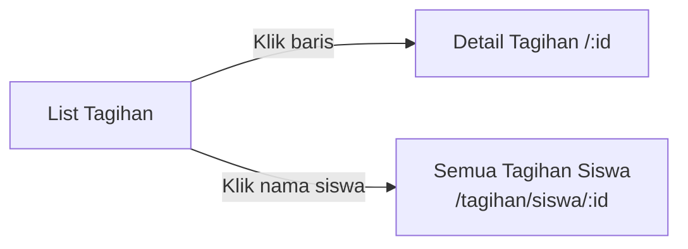
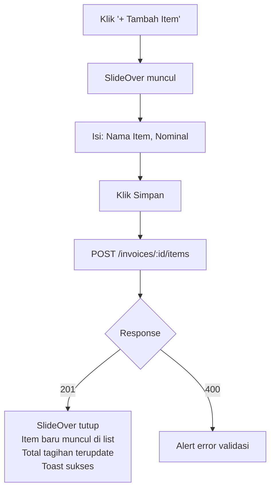
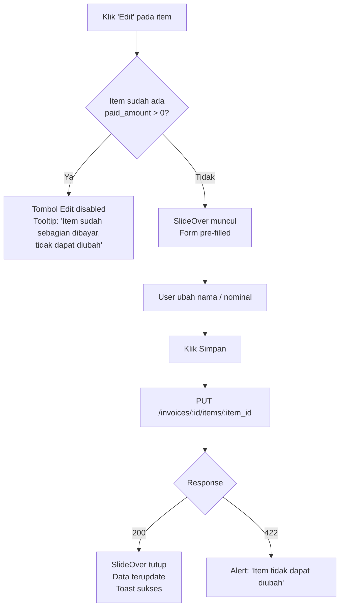
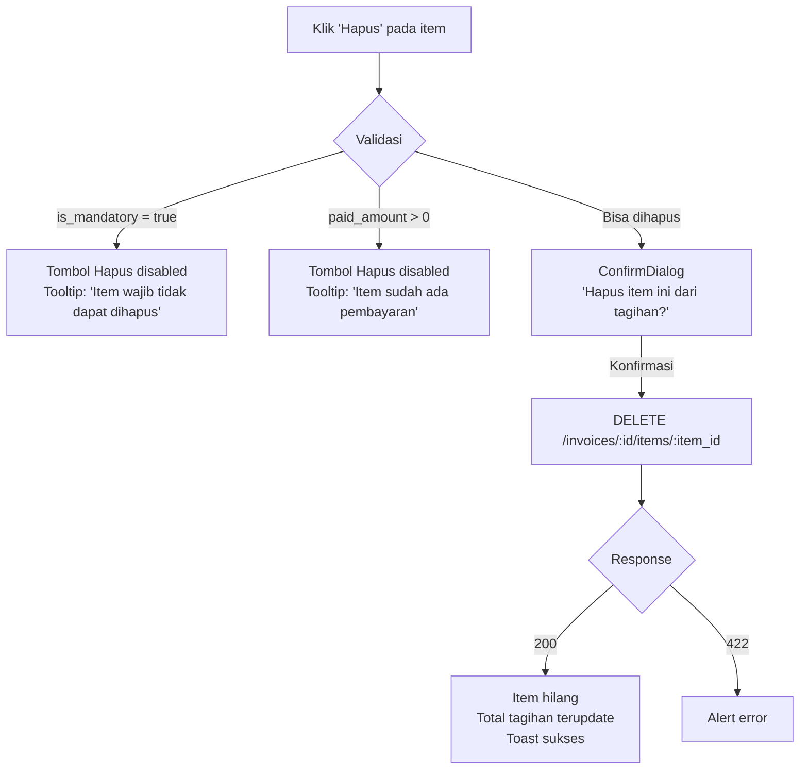
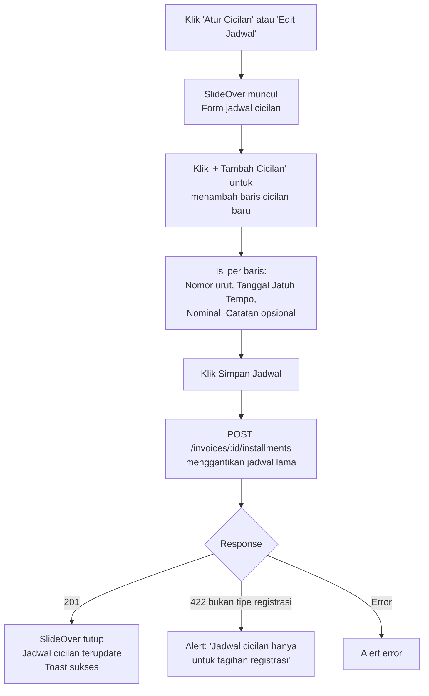
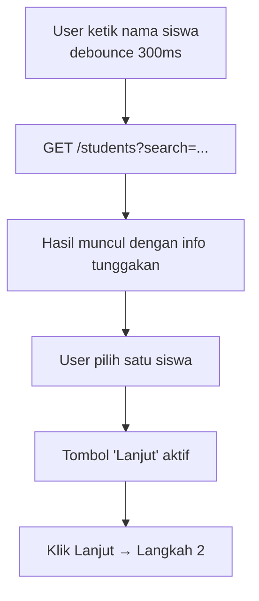
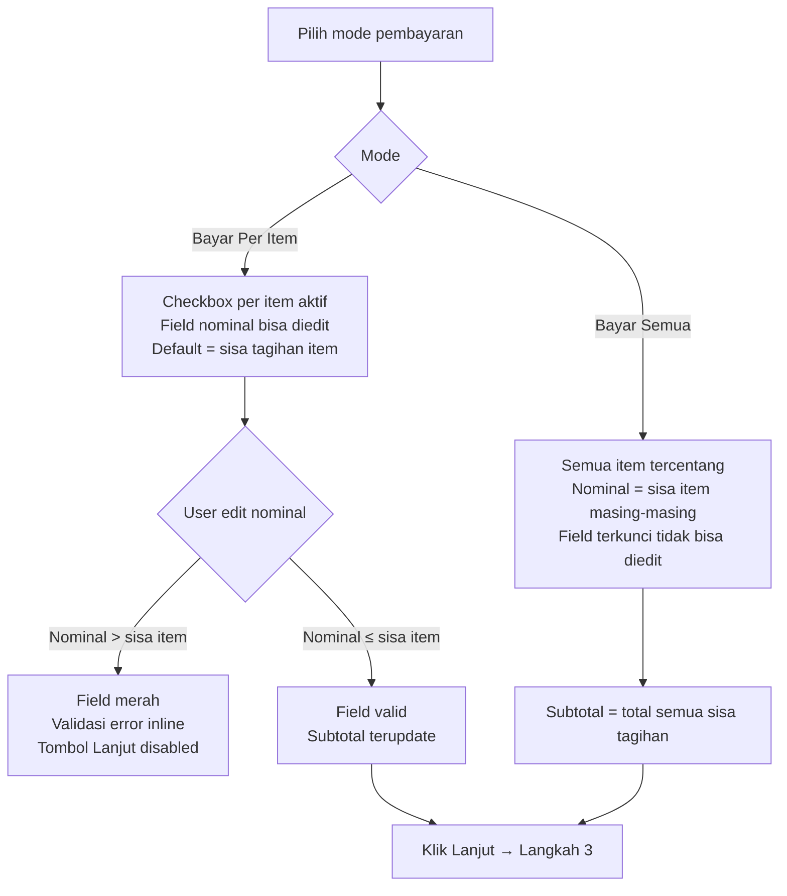
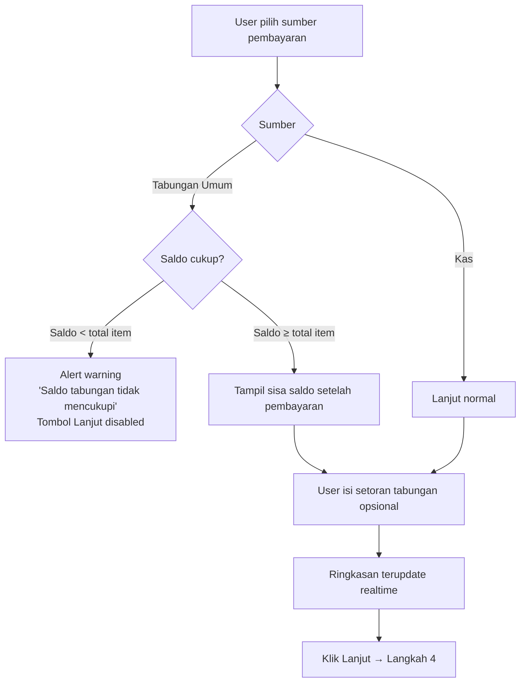
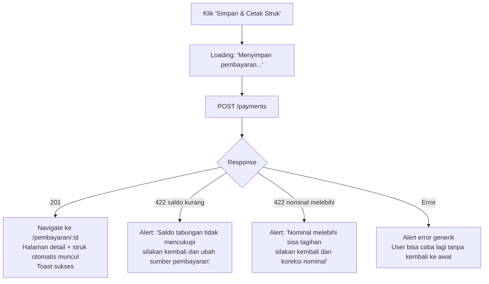
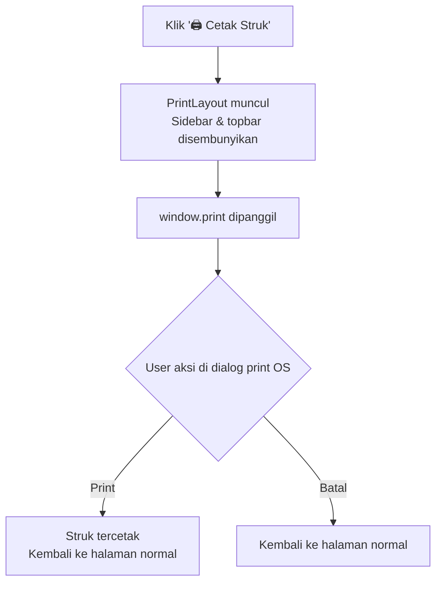

# UX Flow: Keuangan — Transaksi Siswa

> Berdasarkan: `prd-feature-detail.md`, `ux-flow-global.md`, `ux-flow-administrasi-master-data.md`
> Direferensikan oleh: `ux-flow-keuangan-operasional.md`, `ux-flow-keuangan-laporan.md`

---

## Konteks & Prinsip Desain

Tiga domain di dokumen ini — Tagihan, Pembayaran, dan Tabungan — adalah jantung dari modul keuangan. Prinsip desain yang diterapkan:

1. **Pembayaran sebagai wizard** — proses pembayaran melibatkan banyak keputusan (pilih siswa, pilih item, pilih sumber dana) sehingga dibagi menjadi langkah-langkah yang jelas
2. **Tagihan sebagai pusat informasi** — halaman tagihan harus bisa menjawab pertanyaan "berapa yang masih harus dibayar?" dengan cepat tanpa perlu navigasi tambahan
3. **Tabungan sebagai fitur pendukung** — tabungan tidak berdiri sendiri, selalu terkait dengan konteks siswa
4. **Selalu tampilkan sisa hutang** — setiap tampilan tagihan dan pembayaran selalu menampilkan sisa yang belum dibayar secara eksplisit

---

## Sitemap (Scope Dokumen Ini)

```
/dashboard/keuangan/
├── /                               → Overview keuangan
├── /tagihan
│   ├── /                           → List semua tagihan
│   ├── /:id                        → Detail tagihan + kelola item + cicilan
│   └── /siswa/:id                  → Semua tagihan satu siswa
├── /pembayaran
│   ├── /                           → List + riwayat pembayaran
│   ├── /baru                       → Wizard pembayaran baru
│   └── /:id                        → Detail pembayaran + cetak struk
└── /tabungan
    ├── /                           → List siswa + saldo tabungan
    └── /siswa/:id                  → Detail tabungan + riwayat mutasi
```

---

## 1. Overview Keuangan

### 1.1 Halaman Overview (`/keuangan`)

Pintu masuk modul keuangan. Menampilkan kondisi keuangan hari ini secara sekilas.

#### Layout

```
┌────────────────────────────────────────────────────────┐
│ PageHeader: "Keuangan"                                 │
│ TA: 2025/2026                                          │
├────────────────────────────────────────────────────────┤
│                                                        │
│  ┌─────────────┐ ┌─────────────┐ ┌─────────────────┐  │
│  │ Saldo Kas   │ │ Berangkas   │ │ Total Tunggakan  │  │
│  │             │ │             │ │ Bulan Ini        │  │
│  │ Rp 12,5 jt  │ │ Rp 3,2 jt  │ │ Rp 4,8 jt        │  │
│  │             │ │             │ │                  │  │
│  │ [Lihat Kas]→│ │[Lihat Kas]→ │ │ [Lihat Tagihan]→ │  │
│  └─────────────┘ └─────────────┘ └─────────────────┘  │
│                                                        │
│  ┌─────────────────────────────┐ ┌─────────────────┐  │
│  │ Pemasukan Hari Ini          │ │ Pengeluaran Hari │  │
│  │ Rp 1,5 jt                   │ │ Ini              │  │
│  │ dari 8 transaksi            │ │ Rp 250.000       │  │
│  └─────────────────────────────┘ └─────────────────┘  │
│                                                        │
│  TAGIHAN JATUH TEMPO MINGGU INI                       │
│  ┌──────────────────────────────────────────────────┐ │
│  │ ⚠ Ahmad Fauzan    Juli 2025    Rp 177.000        │ │
│  │ ⚠ Citra Dewi      Juli 2025    Rp 327.000        │ │
│  │ [Lihat semua tagihan →]                          │ │
│  └──────────────────────────────────────────────────┘ │
│                                                        │
│  AKSI CEPAT                                           │
│  [+ Catat Pembayaran]    [+ Catat Pengeluaran]        │
│  [Tutup Buku Hari Ini]                                │
│                                                        │
└────────────────────────────────────────────────────────┘
```

"Aksi Cepat" di overview adalah shortcut langsung ke halaman yang paling sering diakses admin keuangan setiap harinya.

---

## 2. Tagihan

### 2.1 List Tagihan (`/keuangan/tagihan`)

#### Layout

```
┌────────────────────────────────────────────────────────┐
│ PageHeader: "Tagihan"                                  │
├────────────────────────────────────────────────────────┤
│ [🔍 Cari nama siswa...]                                │
│ [Jenis ▼] [Status ▼] [Bulan ▼] [Tahun ▼] [Kelas ▼]   │
│ [Reset Filter]                                         │
├────────────────────────────────────────────────────────┤
│ ┌──┬────────────────┬──────────┬──────────┬──────────┐ │
│ │# │ Nama Siswa     │ Jenis    │ Periode  │ Status   │ │
│ ├──┼────────────────┼──────────┼──────────┼──────────┤ │
│ │1 │ Ahmad Fauzan   │ Bulanan  │ Jul 2025 │⚠ Sebagian│ │
│ │  │ Intan 1        │          │          │327.000   │ │
│ │  │                │          │          │Sisa:177rb│ │
│ ├──┼────────────────┼──────────┼──────────┼──────────┤ │
│ │2 │ Budi Santosa   │ Bulanan  │ Jul 2025 │● Lunas   │ │
│ │  │ Berlian 2      │          │          │327.000   │ │
│ ├──┼────────────────┼──────────┼──────────┼──────────┤ │
│ │3 │ Citra Dewi     │Registrasi│ 2025/26  │✗ Belum   │ │
│ │  │ Mutiara 3      │Tahunan   │          │725.000   │ │
│ └──┴────────────────┴──────────┴──────────┴──────────┘ │
│ < 1 2 3 >                              Tampil 20/240   │
└────────────────────────────────────────────────────────┘
```

Setiap baris menampilkan sisa tagihan secara langsung tanpa harus masuk ke detail — ini penting untuk admin yang perlu overview cepat status pembayaran.

#### Flow: Navigasi dari List



### 2.2 Semua Tagihan Satu Siswa (`/keuangan/tagihan/siswa/:id`)

Halaman ini diakses dari dua titik: daftar tagihan dan shortcut dari tab keuangan detail siswa di modul administrasi.

#### Layout

```
┌────────────────────────────────────────────────────────┐
│ PageHeader: "Tagihan — Ahmad Fauzan"                   │
│ Breadcrumb: Tagihan > Ahmad Fauzan                     │
│                                                        │
│ Intan 1 · TK-A · TA 2025/2026                         │
├────────────────────────────────────────────────────────┤
│                                                        │
│  RINGKASAN                                             │
│  ┌──────────────┬──────────────┬────────────────────┐ │
│  │ Total Tagihan│ Sudah Dibayar│ Sisa Tunggakan      │ │
│  │ Rp 3.270.000 │ Rp 3.093.000 │ Rp 177.000          │ │
│  └──────────────┴──────────────┴────────────────────┘ │
│                                                        │
│  Tab Saldo Tabungan: Umum Rp 150.000 | Wajib Rp 80.000│
│                                                        │
│  [+ Catat Pembayaran untuk Siswa Ini]                  │
│                                                        │
├────────────────────────────────────────────────────────┤
│ [Semua ▼] [Belum Lunas] [Lunas]    [Jenis ▼]          │
├────────────────────────────────────────────────────────┤
│                                                        │
│  TAGIHAN BULANAN                                       │
│  ┌────────────────────────────────────────────────┐   │
│  │ Juli 2025               ⚠ Sebagian  [Detail →] │   │
│  │ Total: Rp 327.000 · Dibayar: Rp 150.000        │   │
│  │ Sisa: Rp 177.000                               │   │
│  ├────────────────────────────────────────────────┤   │
│  │ Juni 2025               ✅ Lunas   [Detail →]  │   │
│  │ Total: Rp 327.000 · Dibayar: Rp 327.000        │   │
│  └────────────────────────────────────────────────┘   │
│                                                        │
│  TAGIHAN REGISTRASI TAHUNAN                           │
│  ┌────────────────────────────────────────────────┐   │
│  │ TA 2025/2026           ✅ Lunas   [Detail →]   │   │
│  │ Total: Rp 725.000                              │   │
│  └────────────────────────────────────────────────┘   │
│                                                        │
│  TAGIHAN BIAYA AWAL                                   │
│  ┌────────────────────────────────────────────────┐   │
│  │ Masuk 14 Jul 2025      ✅ Lunas   [Detail →]   │   │
│  │ Total: Rp 2.410.000                            │   │
│  └────────────────────────────────────────────────┘   │
│                                                        │
└────────────────────────────────────────────────────────┘
```

### 2.3 Detail Tagihan (`/keuangan/tagihan/:id`)

Halaman paling lengkap untuk satu tagihan — admin bisa melihat, mengelola item, dan mengatur cicilan.

#### Layout

```
┌────────────────────────────────────────────────────────┐
│ PageHeader: "Tagihan Bulanan — Juli 2025"              │
│ Breadcrumb: Tagihan > Ahmad Fauzan > Juli 2025         │
│                                                        │
│ Ahmad Fauzan · Intan 1 · TK-A                         │
├────────────────────────────────────────────────────────┤
│                                                        │
│  STATUS     ⚠ SEBAGIAN DIBAYAR                        │
│  Total      Rp 327.000                                │
│  Dibayar    Rp 150.000                                │
│  Sisa       Rp 177.000                                │
│                                                        │
│  [+ Catat Pembayaran]          [Cetak Tagihan]        │
│                                                        │
├─────────────────────┬──────────────────────────────────┤
│ ITEM TAGIHAN [+ Tambah Item]  │ JADWAL CICILAN         │
│                               │ (hanya utk Registrasi) │
│ ┌───────────────────────────┐ │                        │
│ │ SPP TK          Rp150.000 │ │ (N/A untuk tagihan     │
│ │ ✅ Lunas                  │ │  bulanan)              │
│ ├───────────────────────────┤ │                        │
│ │ Infaq Harian    Rp140.000 │ │                        │
│ │ (20 hari × 7.000)         │ │                        │
│ │ ✗ Belum  Sisa: Rp140.000  │ │                        │
│ │ [Edit] [Hapus]            │ │                        │
│ ├───────────────────────────┤ │                        │
│ │ Pasta Robotika  Rp100.000 │ │                        │
│ │ ✗ Belum  Sisa: Rp 37.000  │ │                        │
│ │ dibayar sebagian          │ │                        │
│ └───────────────────────────┘ │                        │
│                               │                        │
│ RIWAYAT PEMBAYARAN            │                        │
│ ┌───────────────────────────┐ │                        │
│ │ 20 Jul 2025  Rp150.000    │ │                        │
│ │ Kas  [Lihat Detail →]     │ │                        │
│ └───────────────────────────┘ │                        │
└─────────────────────┴──────────────────────────────────┘
```

Kolom kanan (Jadwal Cicilan) hanya tampil untuk tagihan bertipe `registration`. Untuk tipe lain, kolom kiri penuh lebar.

#### Flow: Tambah Item Insidental



#### Flow: Edit Item Tagihan



#### Flow: Hapus Item Tagihan



### 2.4 Detail Tagihan — Jadwal Cicilan

Hanya tampil untuk tagihan bertipe `registration` (Registrasi Tahunan).

#### Layout Kolom Cicilan

```
┌──────────────────────────────────┐
│ JADWAL CICILAN                   │
│ Registrasi TA 2025/2026          │
│ Total: Rp 725.000                │
│                     [Atur Cicilan]│
├──────────────────────────────────┤
│ Cicilan 1  01 Agu 2025           │
│ Rp 250.000                       │
│                                  │
│ Cicilan 2  01 Okt 2025           │
│ Rp 250.000                       │
│                                  │
│ Cicilan 3  01 Des 2025           │
│ Rp 225.000                       │
│                    [Edit Jadwal] │
└──────────────────────────────────┘
```

#### Flow: Atur / Edit Jadwal Cicilan



---

## 3. Pembayaran

Pembayaran adalah flow paling kompleks di modul keuangan karena melibatkan banyak keputusan dalam satu sesi. Diimplementasikan sebagai **wizard 4 langkah**.

### 3.1 List Pembayaran (`/keuangan/pembayaran`)

#### Layout

```
┌────────────────────────────────────────────────────────┐
│ PageHeader: "Pembayaran"              [+ Catat Pembayaran]│
├────────────────────────────────────────────────────────┤
│ [🔍 Cari nama siswa...] [Sumber ▼] [Tanggal dari-ke]   │
│ [Reset Filter]                                         │
├────────────────────────────────────────────────────────┤
│ ┌──┬──────────────┬──────────────┬────────┬──────────┐ │
│ │# │ Tanggal      │ Nama Siswa   │ Total  │ Sumber   │ │
│ ├──┼──────────────┼──────────────┼────────┼──────────┤ │
│ │1 │ 20 Jul 2025  │ Ahmad Fauzan │ 150rb  │ Kas      │ │
│ │2 │ 20 Jul 2025  │ Budi Santosa │ 327rb  │ Kas      │ │
│ │3 │ 19 Jul 2025  │ Citra Dewi   │ 200rb  │ Tabungan │ │
│ └──┴──────────────┴──────────────┴────────┴──────────┘ │
│                       [Lihat Detail] per baris         │
│ < 1 2 3 >                               Tampil 20/150  │
└────────────────────────────────────────────────────────┘
```

### 3.2 Wizard Pembayaran Baru (`/keuangan/pembayaran/baru`)

Wizard empat langkah dengan progress indicator di bagian atas.

```
[1. Pilih Siswa] → [2. Pilih Item] → [3. Tabungan & Tambahan] → [4. Konfirmasi]
```

---

#### Langkah 1 — Pilih Siswa

```
┌────────────────────────────────────────────────────────┐
│ Langkah 1 dari 4: Pilih Siswa                         │
│ ━━━━━━━━━○─────────○──────────────○                    │
├────────────────────────────────────────────────────────┤
│                                                        │
│  [🔍 Cari nama siswa...]                               │
│                                                        │
│  (Hasil pencarian)                                     │
│  ┌──────────────────────────────────────────────────┐ │
│  │ ● Ahmad Fauzan  · Intan 1 · TK-A                │ │
│  │   Tunggakan: Rp 177.000                         │ │
│  ├──────────────────────────────────────────────────┤ │
│  │ ○ Budi Santosa  · Berlian 2 · TK-B              │ │
│  │   Tunggakan: Rp 0 (Lunas)                       │ │
│  └──────────────────────────────────────────────────┘ │
│                                                        │
│  [Batal]                               [Lanjut →]    │
└────────────────────────────────────────────────────────┘
```



---

#### Langkah 2 — Pilih Item Tagihan

```
┌────────────────────────────────────────────────────────┐
│ Langkah 2 dari 4: Pilih Item Tagihan                  │
│ ━━━━━━━━━━━━━━━━━━━━○──────────○                       │
│ Ahmad Fauzan · Intan 1                                │
├────────────────────────────────────────────────────────┤
│                                                        │
│  MODE PEMBAYARAN                                       │
│  ● Bayar Per Item  (pilih dan tentukan nominal)       │
│  ○ Bayar Semua     (bayar total semua tagihan belum   │
│                      lunas sekaligus)                  │
│                                                        │
├────────────────────────────────────────────────────────┤
│  TAGIHAN AKTIF                                         │
│                                                        │
│  Juli 2025 (Bulanan)                  Sisa: Rp177.000 │
│  ┌───┬────────────────────┬──────────┬───────────────┐ │
│  │ ☑ │ Infaq Harian       │ Rp140.000│ Bayar: [140rb]│ │
│  │ □ │ Pasta Robotika     │ Rp 37.000│ Bayar: [——]   │ │
│  └───┴────────────────────┴──────────┴───────────────┘ │
│                                                        │
│  Registrasi 2025/2026                 Sisa: Rp250.000 │
│  ┌───┬────────────────────┬──────────┬───────────────┐ │
│  │ □ │ Biaya MPLS         │ Rp100.000│ Bayar: [——]   │ │
│  │ □ │ Buku Kreativitas   │ Rp100.000│ Bayar: [——]   │ │
│  │ □ │ ... (lainnya)      │          │               │ │
│  └───┴────────────────────┴──────────┴───────────────┘ │
│                                                        │
│  SUBTOTAL ITEM DIPILIH: Rp 140.000                    │
│                                                        │
│  [← Kembali]                          [Lanjut →]     │
└────────────────────────────────────────────────────────┘
```

**Aturan input nominal per item:**
- Jika mode "Bayar Per Item": field nominal per item bisa diedit (default = sisa tagihan item tersebut)
- Nominal tidak boleh melebihi sisa tagihan item → validasi real-time, field berubah warna merah
- Jika mode "Bayar Semua": semua item tercentang otomatis, nominal diisi otomatis = sisa masing-masing item, tidak bisa diedit



---

#### Langkah 3 — Tabungan & Item Tambahan

```
┌────────────────────────────────────────────────────────┐
│ Langkah 3 dari 4: Tabungan & Item Tambahan            │
│ ━━━━━━━━━━━━━━━━━━━━━━━━━━━━━━━━━○                     │
│ Ahmad Fauzan · Intan 1                                │
├────────────────────────────────────────────────────────┤
│                                                        │
│  SUMBER PEMBAYARAN                                     │
│  ● Kas (tunai)                                        │
│  ○ Tabungan Umum  (Saldo: Rp 150.000)                 │
│                                                        │
│  (Jika pilih Tabungan)                                │
│  ⚠ Saldo tabungan Rp 150.000                          │
│    Dibutuhkan Rp 140.000                              │
│    Sisa tabungan setelah bayar: Rp 10.000             │
│                                                        │
├────────────────────────────────────────────────────────┤
│                                                        │
│  SETORAN TABUNGAN UMUM (opsional)                     │
│  Nominal setoran: [Rp ____________]                   │
│                                                        │
│  ℹ️  Setoran tabungan dicatat bersamaan dengan         │
│     pembayaran dalam satu kwitansi.                   │
│                                                        │
├────────────────────────────────────────────────────────┤
│                                                        │
│  RINGKASAN LANGKAH INI                                │
│  Item tagihan dibayar:  Rp 140.000                    │
│  Setoran tabungan:      Rp  50.000                    │
│  Total diterima:        Rp 190.000                    │
│                                                        │
│  [← Kembali]                          [Lanjut →]     │
└────────────────────────────────────────────────────────┘
```



---

#### Langkah 4 — Konfirmasi & Simpan

```
┌────────────────────────────────────────────────────────┐
│ Langkah 4 dari 4: Konfirmasi                          │
│ ━━━━━━━━━━━━━━━━━━━━━━━━━━━━━━━━━━━━━━━━━━━━━━━━━━━━━━│
│ Ahmad Fauzan · Intan 1 · TK-A                         │
├────────────────────────────────────────────────────────┤
│                                                        │
│  DETAIL PEMBAYARAN                                     │
│  Tanggal         20 Juli 2025 (hari ini)               │
│  Sumber          Kas                                   │
│                                                        │
│  ITEM YANG DIBAYAR                                     │
│  ┌────────────────────────────┬───────────────────┐   │
│  │ Infaq Harian (Jul 2025)    │ Rp 140.000        │   │
│  └────────────────────────────┴───────────────────┘   │
│                                                        │
│  SETORAN TABUNGAN UMUM                                │
│  ┌────────────────────────────┬───────────────────┐   │
│  │ Tabungan Umum              │ Rp  50.000        │   │
│  └────────────────────────────┴───────────────────┘   │
│                                                        │
│  ────────────────────────────────────────────────      │
│  TOTAL DITERIMA                    Rp 190.000          │
│                                                        │
│  SISA TAGIHAN SETELAH PEMBAYARAN                      │
│  Pasta Robotika (Jul 2025)         Rp  37.000          │
│                                                        │
├────────────────────────────────────────────────────────┤
│                                                        │
│  [← Kembali]     [Simpan & Cetak Struk]               │
│                                                        │
└────────────────────────────────────────────────────────┘
```



### 3.3 Detail Pembayaran & Struk (`/keuangan/pembayaran/:id`)

Halaman ini berfungsi sebagai **konfirmasi + struk** setelah pembayaran berhasil dicatat.

#### Layout

```
┌────────────────────────────────────────────────────────┐
│ PageHeader: "Detail Pembayaran #50"    [🖨 Cetak Struk]│
├────────────────────────────────────────────────────────┤
│                                                        │
│  Tanggal   : 20 Juli 2025                             │
│  Siswa     : Ahmad Fauzan · Intan 1 · TK-A            │
│  Sumber    : Kas                                      │
│  Dicatat   : Admin Keuangan · 09:30 WIB               │
│                                                        │
├────────────────────────────────────────────────────────┤
│  ITEM YANG DIBAYAR                                     │
│  ┌──────────────────────────────────────────────────┐ │
│  │ Infaq Harian (Juli 2025)            Rp 140.000   │ │
│  └──────────────────────────────────────────────────┘ │
│                                                        │
│  SETORAN TABUNGAN                                     │
│  ┌──────────────────────────────────────────────────┐ │
│  │ Tabungan Umum                        Rp  50.000  │ │
│  └──────────────────────────────────────────────────┘ │
│                                                        │
│  TOTAL DITERIMA                         Rp 190.000    │
│                                                        │
│  SISA TAGIHAN SISWA INI                               │
│  ┌──────────────────────────────────────────────────┐ │
│  │ Pasta Robotika (Juli 2025)           Rp  37.000  │ │
│  └──────────────────────────────────────────────────┘ │
│                                                        │
│  [← Kembali ke List]  [Catat Pembayaran Baru]         │
└────────────────────────────────────────────────────────┘
```

#### Flow: Cetak Struk



**Format struk cetak:**
```
┌────────────────────────────────┐
│   🏫 ALIZZAH MANAJEMEN         │
│   Kwitansi Pembayaran          │
│   No: #50  · 20 Juli 2025      │
├────────────────────────────────┤
│ Nama   : Ahmad Fauzan          │
│ Kelas  : Intan 1 · TK-A        │
├────────────────────────────────┤
│ Infaq Harian (Jul 2025)        │
│                      Rp140.000 │
│ Setoran Tabungan Umum          │
│                       Rp50.000 │
├────────────────────────────────┤
│ TOTAL DITERIMA      Rp190.000  │
├────────────────────────────────┤
│ Sisa Tagihan:        Rp37.000  │
│ (Pasta Robotika Jul 2025)      │
├────────────────────────────────┤
│ Dicatat oleh: Admin Keuangan   │
│ Terima kasih atas kepercayaan  │
│ Anda.                          │
└────────────────────────────────┘
```

---

## 4. Tabungan

### 4.1 List Tabungan (`/keuangan/tabungan`)

Menampilkan saldo tabungan semua siswa aktif.

#### Layout

```
┌────────────────────────────────────────────────────────┐
│ PageHeader: "Tabungan Siswa"                           │
├────────────────────────────────────────────────────────┤
│ [🔍 Cari nama siswa...]  [Jenjang ▼]  [Jenis ▼]       │
│ [Reset Filter]                                         │
├────────────────────────────────────────────────────────┤
│ ┌──┬──────────────┬──────────┬──────────┬───────────┐  │
│ │# │ Nama Siswa   │ Rombel   │Tab. Umum │Tab. Wajib │  │
│ ├──┼──────────────┼──────────┼──────────┼───────────┤  │
│ │1 │ Ahmad Fauzan │ Intan 1  │ Rp150.000│ —         │  │
│ │2 │ Budi Santosa │ Berlian 2│ Rp 80.000│ Rp510.000 │  │
│ │3 │ Citra Dewi   │ Mutiara 3│ Rp  0    │ —         │  │
│ └──┴──────────────┴──────────┴──────────┴───────────┘  │
│                                                        │
│ [Lihat Detail] per baris                              │
└────────────────────────────────────────────────────────┘
```

Kolom Tab. Wajib hanya tampil untuk siswa Berlian. Siswa jenjang lain menampilkan dash (—).

### 4.2 Detail Tabungan Siswa (`/keuangan/tabungan/siswa/:id`)

#### Layout

```
┌────────────────────────────────────────────────────────┐
│ PageHeader: "Tabungan — Budi Santosa"                  │
│ Breadcrumb: Tabungan > Budi Santosa                    │
│ Berlian 2 · TK-B · TA 2025/2026                       │
├──────────────────────────┬─────────────────────────────┤
│ TABUNGAN UMUM            │ TABUNGAN WAJIB BERLIAN       │
│ Saldo: Rp 80.000         │ Saldo: Rp 510.000            │
│ [+ Catat Penarikan]      │ Digunakan untuk wisuda       │
│                          │ Biaya wisuda: Rp 500.000     │
│                          │ Estimasi surplus: Rp 10.000  │
├──────────────────────────┴─────────────────────────────┤
│ [Semua] [Tabungan Umum] [Tabungan Wajib]               │
│ [Tanggal dari-ke]                                      │
├────────────────────────────────────────────────────────┤
│                                                        │
│ RIWAYAT MUTASI                                         │
│ ┌────────────────────────────────────────────────────┐ │
│ │ 20 Jul · Tabungan Umum  · Masuk   · Rp 50.000     │ │
│ │ Setoran via pembayaran                             │ │
│ ├────────────────────────────────────────────────────┤ │
│ │ 14 Jul · Tab. Wajib     · Masuk   · Rp 40.000     │ │
│ │ Tagihan bulanan Juli (4 Senin × Rp10.000)          │ │
│ ├────────────────────────────────────────────────────┤ │
│ │ 05 Jul · Tabungan Umum  · Keluar  · Rp 30.000     │ │
│ │ Penarikan wali murid · Adm: Rp 750                 │ │
│ │ Diterima: Rp 29.250                                │ │
│ └────────────────────────────────────────────────────┘ │
│                                                        │
└────────────────────────────────────────────────────────┘
```

Untuk siswa Berlian, box kanan menampilkan **estimasi surplus/kekurangan** saat wisuda berdasarkan saldo wajib saat ini vs biaya wisuda yang dikonfigurasi.

#### Flow: Catat Penarikan Wali Murid

```mermaid
flowchart TD
    A[Klik '+ Catat Penarikan'] --> B[SlideOver muncul]
    B --> C[Tampil saldo saat ini: Rp 80.000]
    C --> D[Isi nominal penarikan]
    D --> E{Validasi real-time}
    E -->|Nominal > saldo| F[Field merah\nError: 'Nominal melebihi saldo tabungan'\nTombol Simpan disabled]
    E -->|Nominal ≤ saldo| G[Preview biaya admin\nRp 2.000 (2,5% dari 80.000)\nDiterima wali: Rp 78.000]
    G --> H[Isi catatan opsional]
    H --> I[Klik Simpan Penarikan]
    I --> J[POST /students/:id/savings/withdrawals]
    J --> K{Response}
    K -->|200| L[SlideOver tutup\nSaldo terupdate\nMutasi baru muncul di riwayat\nToast sukses]
    K -->|422 saldo kurang| M[Alert: 'Saldo tidak mencukupi']
    K -->|Error| N[Alert error]
```

---

## 5. State & Edge Cases per Halaman

### State Global Domain Ini

| Halaman | Loading | Empty | Error |
|---|---|---|---|
| List Tagihan | Skeleton tabel | EmptyState: "Belum ada tagihan" | Alert + Retry |
| Detail Tagihan | Skeleton layout dua kolom | — | Alert + tombol Kembali |
| Tagihan Siswa | Skeleton per grup | EmptyState: "Siswa ini belum punya tagihan" | Alert + Retry |
| List Pembayaran | Skeleton tabel | EmptyState: "Belum ada riwayat pembayaran" | Alert + Retry |
| Wizard Pembayaran Langkah 1 | Skeleton list siswa | — | Alert |
| Wizard Pembayaran Langkah 2 | Skeleton daftar tagihan | EmptyState: "Siswa ini tidak memiliki tagihan aktif" | Alert |
| List Tabungan | Skeleton tabel | EmptyState: "Tidak ada data tabungan" | Alert + Retry |
| Detail Tabungan | Skeleton | EmptyState riwayat: "Belum ada mutasi tabungan" | Alert + Retry |

### Edge Cases Penting

| Skenario | Penanganan |
|---|---|
| Siswa tidak punya tunggakan di Langkah 2 wizard | EmptyState: "Semua tagihan siswa ini sudah lunas." + tombol Kembali Pilih Siswa |
| Sumber tabungan dipilih tapi saldo tidak cukup | Alert warning realtime di Langkah 3, tombol Lanjut disabled |
| Nominal input di Langkah 2 melebihi sisa item | Field berubah merah, validasi inline, tombol Lanjut disabled |
| User refresh browser di tengah wizard | State wizard hilang (tidak ada persistensi di URL) → kembali ke Langkah 1. Tampilkan info: "Silakan mulai ulang proses pembayaran" |
| Pembayaran dari tabungan untuk siswa Berlian | Hanya tabungan **umum** yang bisa dipakai — tabungan wajib tidak tersedia sebagai pilihan sumber pembayaran manual |
| Detail tagihan yang sudah lunas (status=paid) | Tombol "+ Tambah Item", "Edit", "Hapus" disembunyikan. Hanya tampilkan riwayat pembayaran |
| Catat penarikan tabungan wajib Berlian | Tidak ada tombol "Catat Penarikan" di box Tabungan Wajib — hanya informational. Penarikan otomatis terjadi saat kelulusan |
| Struk cetak dari riwayat (bukan langsung setelah bayar) | Tombol "Cetak Struk" tetap ada di detail pembayaran — bisa dicetak ulang kapan saja |
