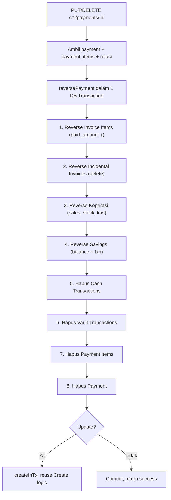

# Epic: Ubah & Hapus Pembayaran

> **Status:** Design ✅ | Implementation ⏳  
> **Tanggal:** 2026-07-14  
> **Prioritas:** HIGH

---

## 1. Ringkasan Masalah

Ada kasus salah tulis nominal pembayaran. Saat ini tidak ada mekanisme untuk mengubah atau menghapus data pembayaran yang sudah dicatat. Perlu aksi ubah (edit penuh: semua field + pilihan item tagihan) dan hapus, dengan membalikkan (reverse) seluruh efek keuangan.

---

## 2. Temuan Codebase (State Saat Ini)

| Layer | Endpoint/Halaman | Status |
|-------|-----------------|--------|
| Backend | `POST /v1/payments` (Create) | ✅ Ada |
| Backend | `GET /v1/payments` (List) | ✅ Ada |
| Backend | `GET /v1/payments/:id` (Detail) | ✅ Ada |
| Backend | `PUT /v1/payments/:id` | ❌ **Belum ada** |
| Backend | `DELETE /v1/payments/:id` | ❌ **Belum ada** |
| Frontend | `/keuangan/pembayaran/baru` (Form catat) | ✅ Ada |
| Frontend | `/keuangan/pembayaran/$id` (Detail struk) | ✅ Ada |
| Frontend | Tombol edit/hapus di mana pun | ❌ **Belum ada** |

**Efek samping dari `Create` payment (yang harus di-reverse):**

| # | Efek | Tabel Terkait |
|---|------|---------------|
| 1 | Update `invoice_items.paid_amount` & status | `invoice_items` |
| 2 | Update `invoices.status` | `invoices` |
| 3 | Buat invoice insidental (jika ada incidental_items) | `invoices`, `invoice_items` |
| 4 | Buat koperasi: Sale, SaleItem, kurangi stok, kas koperasi | `sales`, `sale_items`, `variants`, koperasi `kas` |
| 5 | Catat `cash_transactions` (kas masuk) | `cash_transactions` |
| 6 | Catat `savings_transactions` (debit tabungan utk bayar) | `savings_transactions`, `student_savings` |
| 7 | Catat `vault_transactions` (setoran tabungan) | `vault_transactions` |
| 8 | Update `student_savings.balance` | `student_savings` |
| 9 | Buat `payment_items` | `payment_items` |
| 10 | Buat expense koperasi (porsi koperasi) | `expenses`, `cash_transactions` |

**File kunci:**
- `app/apps/api/model/payment.go` — Payment model
- `app/apps/api/model/payment_item.go` — PaymentItem model
- `app/apps/api/handler/payment_handler.go` — Current handlers (List, Create, Get, GetByStudent)
- `app/apps/api/service/payment_service.go` — Create logic (~300 baris, banyak efek samping)
- `app/apps/api/dto/payment.go` — CreatePaymentRequest, PaymentDetailResponse
- `app/apps/api/service/koperasi_seam.go` — Koperasi seam: ProcessPaymentItems
- `app/apps/api/service/transaction_writer_service.go` — WriteCashCredit/Debit, DeleteCashBySource
- `app/apps/api/repository/cash_transaction_repository.go` — DeleteBySource (sudah ada)
- `app/apps/api/repository/vault_transaction_repository.go` — **Belum ada DeleteBySource**
- `app/apps/dashboard/src/routes/_authenticated/keuangan/pembayaran/index.tsx` — Daftar pembayaran
- `app/apps/dashboard/src/routes/_authenticated/keuangan/pembayaran/$id.tsx` — Detail struk
- `app/apps/dashboard/src/routes/_authenticated/keuangan/pembayaran/baru.tsx` — Form catat pembayaran
- `app/apps/dashboard/src/components/molecules/ConfirmDialog.tsx` — Komponen dialog konfirmasi (sudah ada)

---

## 3. Desain Solusi

### 3a. Arsitektur: Reverse + Create dalam 1 Transaksi



**Strategi update = delete + create lama:** Karena mengubah pembayaran bisa mengubah item, nominal, source, tabungan — lebih aman membalikkan total dulu lalu buat ulang, daripada "merge" partial.

### 3b. Detail Endpoint & DTO

#### `DELETE /v1/payments/:id`

```
Request:  Path param id
Response: 200 { "message": "Pembayaran berhasil dihapus" }
          404 { "message": "Pembayaran tidak ditemukan" }
```

#### `PUT /v1/payments/:id`

```
Request:  Path param id + Body CreatePaymentRequest (sama persis dengan POST)
Response: 200 { "message": "Pembayaran berhasil diperbarui", "data": PaymentDetailResponse }
          404 { "message": "Pembayaran tidak ditemukan" }
          422 { "message": "Validasi: ..." }
```

**Alasan reuse `CreatePaymentRequest`:** Struktur data pembayaran baru identik dengan create — tidak perlu DTO khusus.

#### Interface Baru

```go
// service/payment_service.go
type PaymentService interface {
    // ... existing ...
    Update(id uint, createdBy uint, req dto.CreatePaymentRequest) (*dto.PaymentDetailResponse, error)  // NEW
    Delete(id uint) error                                                                              // NEW
}
```

#### Route Baru

```go
// cmd/api/main.go
payments.PUT("/:id", paymentHandler.Update)
payments.DELETE("/:id", paymentHandler.Delete)
```

### 3c. Tabel Reverse per Efek Samping

| # | Efek dari Create | Cara Reverse | File yang disentuh |
|---|---|---|---|
| 1 | `invoice_items.paid_amount` ↑, status berubah | Kurangi paid_amount, update status (paid→partial→unpaid) | `invoice_item_repo.UpdatePaidAmount` |
| 2 | Invoice insidental (baru dibuat saat step A2) | Hapus invoice_items + invoice | `invoice_item_repo.DeleteByInvoiceID`, `invoice_repo.Delete` |
| 3 | Koperasi: Sale + SaleItem + stok -1 + kas koperasi | Hapus sale items, kembalikan stok (+1), hapus sale by payment_id, hapus kas | Koperasi seam: `ReversePaymentItems` (baru) |
| 4 | `savings_transactions` (credit/debit) | Balikkan `student_savings.balance`, hapus txn | `savingsRepo`, hapus via GORM |
| 5 | `cash_transactions` (debit/credit) | **`DeleteCashBySource` — SUDAH ADA** ✅ | `transaction_writer_service.go:100` |
| 6 | `vault_transactions` (debit/credit) | **PERLU TAMBAH** `DeleteVaultBySource` | `vault_repo` + `txn_writer` |
| 7 | `payment_items` | Hard delete semua items milik payment | `payment_item_repo.DeleteByPaymentID` (baru) |
| 8 | `payments` | Hard delete payment | `payment_repo.Delete` (baru) |

### 3d. Flow UI Frontend

#### Halaman Detail Struk (`$id.tsx`) — Tambah Tombol

```
┌─────────────────────────────────────────────────────┐
│  ← Kembali    [🖨 Cetak] [✏ Ubah] [🗑 Hapus] [⬇ PDF] │
├─────────────────────────────────────────────────────┤
│  BUKTI PEMBAYARAN                No. Ref: #42        │
│  ...                                                 │
└─────────────────────────────────────────────────────┘
```

- **Ubah:** `navigate({ to: "/keuangan/pembayaran/baru", search: { edit_id: payment.id } })`
- **Hapus:** Buka `ConfirmDialog` → konfirmasi → `DELETE /v1/payments/:id` → redirect list

#### Halaman Form (`baru.tsx`) — Mode Edit

- Search param baru: `edit_id?: number`
- Saat `edit_id` ada → fetch payment lama → pre-fill semua field (student, invoices, amounts, source, notes, incidental items)
- Header: "Edit Pembayaran" (bukan "Pembayaran")
- Submit: `PUT /v1/payments/:id` dengan `CreatePaymentRequest`
- On success: redirect ke struk baru

#### Komponen yang Sudah Ada (Tidak Perlu Buat Baru)

- `ConfirmDialog` — `app/apps/dashboard/src/components/molecules/ConfirmDialog.tsx`
- `useToast` — notifikasi sukses/gagal
- `Button` — varian `primary`, `secondary`, `danger`

### 3e. API Client Frontend (Sementara)

Karena file `payments.ts` adalah hasil generate orval dan PUT/DELETE belum ada di Swagger, kita **tambah 2 mutation hooks manual** di file terpisah:

```
app/apps/dashboard/src/api/endpoints/payments/useUpdatePayment.ts   (PUT)
app/apps/dashboard/src/api/endpoints/payments/useDeletePayment.ts   (DELETE)
```

Setelah Swagger & orval di-update, bisa diganti dengan generated hooks.

### 3f. Koperasi — Tambah Kolom `payment_id`

**Masalah:** Saat ini koperasi sale hanya menyimpan `Notes: "Otomatis dari pembayaran registrasi/SPP (Payment ID: 42)"`. Untuk reverse yang akurat, kita butuh foreign key langsung.

**Solusi:** Tambah kolom `payment_id INT NULL` di tabel `sales` dengan foreign key ke `payments(id) ON DELETE SET NULL`.

File yang disentuh:
- `migrations/xxx_add_payment_id_to_sales.sql` — migration
- `internal/modules/koperasi/penjualan/model.go` — tambah field `PaymentID *uint`
- `service/koperasi_seam.go` — set `sale.PaymentID = &paymentID` saat create

---

## 4. Edge Cases

| Edge Case | Handling |
|-----------|----------|
| Invoice item sudah di-bayar lagi oleh payment lain *setelah* payment ini | Aman — hanya kurangi `paid_amount` sebesar amount payment ini, sisanya tetap dari payment lain |
| Savings account dibuat *oleh* payment ini (step H Create) | Setelah reverse savings txn, cek apakah balance jadi 0 dan tidak ada txn lain → opsional hapus savings account |
| Daily closing (tutup buku) sudah terjadi setelah payment | **Defer ke v2** — abaikan dulu |
| Koperasi sale sudah di-edit/dihapus manual | Diatasi dengan kolom `payment_id` dedicated (bukan LIKE query di notes) |
| Koperasi seam sedang off | Method reverse tetap diimplementasi di koperasi seam, siap dipakai saat seam diaktifkan |

---

## 5. Repository Changes (Small)

### Method Baru yang Diperlukan

```go
// repository/payment_repository.go
Delete(id uint) error

// repository/payment_item_repository.go
DeleteByPaymentID(paymentID uint) error

// repository/vault_transaction_repository.go
DeleteBySource(tx *gorm.DB, sourceType string, sourceID uint) error

// service/transaction_writer_service.go
DeleteVaultBySource(tx *gorm.DB, sourceType string, sourceID uint) error

// service/koperasi_seam.go
ReversePaymentItems(tx *gorm.DB, paymentID uint) error
```

---

## 6. Struktur `reversePayment` (Pseudocode Detail)

```go
func (s *paymentService) reversePayment(tx *gorm.DB, paymentID uint) error {
    // 0. Load payment + items
    payment, err := s.paymentRepo.WithTx(tx).FindByID(paymentID)
    if err != nil { return err }
    items, _ := s.paymentItemRepo.WithTx(tx).FindByPaymentID(paymentID)

    // 1. REVERSE INVOICE ITEMS
    for _, item := range items {
        invItem, err := s.invoiceItemRepo.WithTx(tx).FindByID(item.InvoiceItemID)
        if err != nil { continue }
        newPaid := invItem.PaidAmount - item.Amount
        newStatus := "unpaid"
        if newPaid > 0 && newPaid < invItem.Amount { newStatus = "partial" }
        s.invoiceItemRepo.WithTx(tx).UpdatePaidAmount(invItem.ID, newPaid, newStatus)
    }

    // 2. REVERSE INCIDENTAL INVOICES
    //    Query invoice_items yg dibuat via payment ini dengan category=incidental
    //    → hapus invoice_item dan invoice-nya

    // 3. REVERSE KOPERASI (via seam)
    if s.koperasiSeam != nil {
        s.koperasiSeam.ReversePaymentItems(tx, paymentID)
    }

    // 4. REVERSE SAVINGS
    var savingsTxns []model.SavingsTransaction
    tx.Where("source_id = ? AND source_type IN ?", paymentID,
        []string{"payment_usage", "payment_deposit"}).Find(&savingsTxns)
    for _, st := range savingsTxns {
        var sv model.StudentSavings
        tx.First(&sv, st.StudentSavingsID)
        if st.TransactionType == "credit" {
            sv.Balance += st.NetAmount  // balik debit → kembalikan uang
        } else {
            sv.Balance -= st.NetAmount  // balik credit → tarik kembali
        }
        tx.Save(&sv)
    }
    tx.Where("source_id = ? AND source_type IN ?", paymentID,
        []string{"payment_usage", "payment_deposit"}).Delete(&model.SavingsTransaction{})

    // 5. DELETE CASH TRANSACTIONS (SUDAH ADA)
    s.txnWriter.DeleteCashBySource(tx, "payment", paymentID)
    s.txnWriter.DeleteCashBySource(tx, "transfer_to_vault", paymentID)

    // 6. DELETE VAULT TRANSACTIONS (BARU)
    s.txnWriter.DeleteVaultBySource(tx, "savings_deposit", paymentID)
    s.txnWriter.DeleteVaultBySource(tx, "savings_withdrawal", paymentID)

    // 7. DELETE PAYMENT ITEMS
    tx.Where("payment_id = ?", paymentID).Delete(&model.PaymentItem{})

    // 8. DELETE EXPENSE KOPERASI (jika ada, by source)
    //    Cari expense dengan description LIKE "%Payment ID: {id}%"
    //    → hapus expense + cash_transaction source_type="expense" terkait

    return nil
}
```

---

## 7. Requirements (IMMUTABLE)

- **R1:** User dengan akses modul keuangan dapat **mengubah** seluruh data pembayaran (item tagihan, nominal, sumber dana, setoran tabungan, catatan) melalui form yang sama dengan form catat pembayaran
- **R2:** User dengan akses modul keuangan dapat **menghapus** pembayaran, yang akan membalikkan (reverse) seluruh efek keuangan: invoice items, cash transactions, vault transactions, savings balance, dan koperasi
- **R3:** Aksi ubah/hapus hanya dapat diakses dari **halaman detail struk** (`/keuangan/pembayaran/$id`)
- **R4:** Hapus harus melalui **konfirmasi dialog** sebelum dieksekusi
- **R5:** Update payment dilakukan sebagai **reverse + create dalam 1 transaksi database**, bukan merge partial
- **R6:** Semua catatan keuangan yang dibuat oleh payment (cash_transactions, vault_transactions, savings_transactions, koperasi sales) harus ikut direverse — tidak boleh ada data yatim
- **R7:** Tabel koperasi `sales` ditambah kolom `payment_id` agar reversal koperasi bisa akurat (tidak bergantung pada LIKE query di notes)

---

## 8. Success Criteria (MUST ALL BE TRUE)

- [x] `PUT /v1/payments/:id` menerima `CreatePaymentRequest`, menghasilkan `PaymentDetailResponse` dengan data baru
- [x] `DELETE /v1/payments/:id` menghapus payment + membalikkan semua efek keuangan
- [ ] Setelah delete, `invoice_items.paid_amount` kembali seperti semula, `invoices.status` ter-update benar
- [ ] Setelah delete, `student_savings.balance` kembali seperti semula
- [ ] Setelah delete, `cash_transactions` dan `vault_transactions` milik payment terhapus
- [ ] Setelah delete, koperasi `sales`, `sale_items` terkait terhapus dan stok variant kembali
- [x] Tombol "Ubah" & "Hapus" muncul di halaman `$id.tsx` untuk user dengan akses keuangan
- [x] Klik "Ubah" navigasi ke `baru.tsx?edit_id=X` dengan semua field terisi data lama
- [x] Klik "Hapus" memunculkan `ConfirmDialog`, setelah konfirmasi hapus + redirect ke list
- [x] Tidak ada regresi di flow Create existing
- [x] Semua perubahan dalam 1 DB transaction — jika gagal di tengah, tidak ada data setengah berubah
- [x] Tidak ada compile error (Go + TypeScript)

---

## 9. Anti-Patterns (FORBIDDEN)

- ❌ **NO partial update / merge** (integritas: mengubah nominal tanpa reverse efek keuangan = data corrupt)
- ❌ **NO soft-delete saja** (integritas: invoice_items.paid_amount & savings.balance harus kembali seperti semula)
- ❌ **NO koperasi reversal pakai LIKE query di notes** (reliabilitas: notes bisa berubah manual, pakai kolom `payment_id` yang dedicated)
- ❌ **NO validasi daily closing di v1** (scope: defer ke iterasi berikutnya)
- ❌ **NO skip reverse vault_transactions** (completeness: harus sinkron dengan cash_transactions)

---

## 10. Scope Boundaries

### In Scope
- Backend: PUT & DELETE endpoint, `reversePayment`, refactor Create ke `createInTx`, migration `payment_id` di sales, koperasi reverse
- Frontend: tombol ubah/hapus di struk, mode edit di form, confirm dialog, manual mutation hooks

### Out of Scope (Defer)
- Validasi daily closing (tutup buku)
- Approval workflow untuk hapus
- Batch edit/hapus
- Regenerate Swagger + orval
- Soft-delete + audit trail

---

## 11. Design Discovery

### Key Decisions Made

| # | Pertanyaan | Jawaban User | Implikasi |
|---|-----------|-------------|-----------|
| 1 | Scope aksi: ubah nominal saja atau ubah + hapus? | Ubah penuh (semua field + item tagihan) + Hapus. Hanya user akses modul keuangan. | Form `baru.tsx` harus support mode edit penuh, butuh 2 endpoint baru |
| 2 | Dari mana aksi dimulai? | Dari halaman detail struk (`$id.tsx`) | Tombol Ubah & Hapus hanya di struk, bukan di list |
| 3 | Mekanisme edit: form baru atau reuse? | Reuse form `baru.tsx` dengan data lama terisi | Navigasi dengan `?edit_id=X`, tidak perlu form/halaman baru |
| 4 | Mekanisme delete: hard delete atau soft? | Hard delete + reverse SEMUA efek keuangan | Backend harus membalikkan semua efek Create dalam 1 transaksi |
| 5 | Validasi hapus? | Konfirmasi dialog saja, bisa kapan saja | Simple ConfirmDialog, tidak ada batasan waktu/approval |
| 6 | Koperasi sale reference? | Tambah kolom `payment_id` di tabel sales | Migrasi kecil, akurat untuk reverse (bukan LIKE query) |
| 7 | Daily closing validation? | Abaikan dulu untuk v1 | Defer ke iterasi berikutnya |

### Open Concerns Raised

- "Koperasi seam sedang off" → Method reverse tetap diimplementasi, siap pakai saat diaktifkan
- "Daily closing bisa bikin data inkonsisten" → Defer validasi ke v2, risiko diterima untuk v1

---

## 12. Tasks

### Task 1: Backend — Tambah `payment_id` di sales + extract `createInTx`

**Status:** ✅ Done  
**Dependencies:** None  
**Goal:** Menyiapkan fondasi backend agar method `reversePayment` dan `Update` bisa diimplementasikan dengan bersih di Task 2.

**Implementation Checklist:**

- [ ] **1.1** Migration: tambah kolom `payment_id INT NULL` di tabel `sales`
  - Foreign key ke `payments(id)` dengan `ON DELETE SET NULL`
  - File: `migrations/xxx_add_payment_id_to_sales.sql`

- [ ] **1.2** Update model `penjualan.Sale`
  - Tambah field `PaymentID *uint` dengan gorm tag
  - File: `app/apps/api/internal/modules/koperasi/penjualan/model.go`

- [ ] **1.3** Update `koperasi_seam.go` — `ProcessPaymentItems`
  - Set `sale.PaymentID = &paymentID` saat create sale (~line 65-76)
  - Tidak ada perubahan logika lain

- [ ] **1.4** Refactor `payment_service.go` — extract `createInTx`
  - Pindahkan logic baris ~117-370 dari `Create()` ke:
    ```go
    func (s *paymentService) createInTx(tx *gorm.DB, createdBy uint, req dto.CreatePaymentRequest) (*model.Payment, error)
    ```
  - Method `Create()` jadi wrapper:
    ```go
    func (s *paymentService) Create(...) {
        var result *model.Payment
        err := s.db.Transaction(func(tx *gorm.DB) error {
            var err error
            result, err = s.createInTx(tx, createdBy, req)
            return err
        })
        // ... fetch ulang + map response
    }
    ```
  - Tidak ada perubahan behavior

- [ ] **1.5** Verifikasi tidak ada regresi
  - Test `POST /v1/payments` masih berfungsi normal
  - Test dengan koperasi items → sale tercatat dengan `payment_id` terisi

**Success Criteria:**
- [ ] Kolom `payment_id` ada di tabel `sales` dengan foreign key benar
- [ ] `ProcessPaymentItems` mengisi `payment_id` saat create sale
- [ ] `Create()` behavior identik sebelum dan sesudah refactor
- [ ] Tidak ada compile error
- [ ] `POST /v1/payments` dengan item koperasi → sale tercatat dengan `payment_id` terisi

---

### Task 2: Backend — Implement `reversePayment`, `Delete`, `Update`

**Status:** ✅ Done  
**Dependencies:** Task 1 ✅  
**Goal:** Implementasi inti: method reverse, endpoint PUT & DELETE, handler, route, swagger docs.

---

#### 2.1 Repository — Tambah Method Baru

**2.1a:** `repository/payment_repository.go` — tambah `Delete` + `HardDelete`

```go
// Interface
type PaymentRepository interface {
    // ... existing ...
    Delete(id uint) error              // NEW
    HardDelete(tx *gorm.DB, id uint) error  // NEW: hard delete by id dalam tx
}

// Implementation
func (r *paymentRepository) Delete(id uint) error {
    return r.db.Delete(&model.Payment{}, id).Error
}
func (r *paymentRepository) HardDelete(tx *gorm.DB, id uint) error {
    return tx.Unscoped().Delete(&model.Payment{}, id).Error  // Unscoped untuk hard delete jika pakai soft delete gorm
}
```

**2.1b:** `repository/payment_item_repository.go` — tambah `DeleteByPaymentID`

```go
// Interface
type PaymentItemRepository interface {
    // ... existing ...
    DeleteByPaymentID(tx *gorm.DB, paymentID uint) error  // NEW
}

// Implementation
func (r *paymentItemRepository) DeleteByPaymentID(tx *gorm.DB, paymentID uint) error {
    return tx.Where("payment_id = ?", paymentID).Delete(&model.PaymentItem{}).Error
}
```

**2.1c:** `repository/vault_transaction_repository.go` — tambah `DeleteBySource`

```go
// Interface
type VaultTransactionRepository interface {
    // ... existing ...
    DeleteBySource(tx *gorm.DB, sourceType string, sourceID uint) error  // NEW
}

// Implementation
func (r *vaultTransactionRepository) DeleteBySource(tx *gorm.DB, sourceType string, sourceID uint) error {
    return tx.Where("source_type = ? AND source_id = ?", sourceType, sourceID).
        Delete(&model.VaultTransaction{}).Error
}
```

**2.1d:** `service/transaction_writer_service.go` — tambah `DeleteVaultBySource`

```go
// Interface
type TransactionWriterService interface {
    // ... existing ...
    DeleteVaultBySource(tx *gorm.DB, sourceType string, sourceID uint) error  // NEW
}

// Implementation
func (s *transactionWriterService) DeleteVaultBySource(tx *gorm.DB, sourceType string, sourceID uint) error {
    return s.vaultRepo.DeleteBySource(tx, sourceType, sourceID)
}
```

**2.1e:** `service/koperasi_seam.go` — tambah `ReversePaymentItems`

```go
// Interface
type KoperasiSeamService interface {
    ProcessPaymentItems(...) error
    ReversePaymentItems(tx *gorm.DB, paymentID uint) error  // NEW
}

// Implementation
func (s *koperasiSeamService) ReversePaymentItems(tx *gorm.DB, paymentID uint) error {
    // 1. Cari semua Sale dengan payment_id = paymentID
    var sales []penjualan.Sale
    if err := tx.Where("payment_id = ?", paymentID).Find(&sales).Error; err != nil {
        return err
    }
    if len(sales) == 0 {
        return nil  // tidak ada koperasi item untuk payment ini
    }

    for _, sale := range sales {
        // 2. Ambil sale items
        var saleItems []penjualan.SaleItem
        tx.Where("sale_id = ?", sale.ID).Find(&saleItems)

        // 3. Kembalikan stok untuk setiap item (+1 per item)
        for _, si := range saleItems {
            if si.VariantID > 0 {
                if err := s.barangRepo.AdjustVariantStockWithTx(tx, si.VariantID, 1); err != nil {
                    return fmt.Errorf("gagal mengembalikan stok varian %d: %w", si.VariantID, err)
                }
            }
        }

        // 4. Hapus sale items
        tx.Where("sale_id = ?", sale.ID).Delete(&penjualan.SaleItem{})

        // 5. Hapus kas koperasi (pembayaran.Record) by source
        //    Record membuat entry di tabel koperasi_payments dengan source_type="sale" source_id=sale.ID
        tx.Where("source_type = ? AND source_id = ?", "sale", sale.ID).
            Delete(&pembayaran.Payment{})

        // 6. Hapus sale
        tx.Delete(&sale)
    }

    return nil
}
```

> **Catatan:** Perlu cek nama tabel aktual untuk `pembayaran.Payment` — di koperasi mungkin `koperasi_payments`.

---

#### 2.2 Core — `reversePayment` Method

**File:** `service/payment_service.go`

Tambahkan private method setelah `createInTx`:

```go
// reversePayment membalikkan seluruh efek keuangan dari satu payment dalam transaksi.
// Tidak menghapus payment record — itu dilakukan oleh caller (Delete / Update).
func (s *paymentService) reversePayment(tx *gorm.DB, paymentID uint) error {
    // 0. Load payment + payment_items (pakai tx agar semua operasi dalam 1 transaksi)
    paymentItems, err := s.paymentItemRepo.FindByPaymentID(paymentID)
    if err != nil {
        return fmt.Errorf("gagal mengambil payment items: %w", err)
    }

    // 1. REVERSE INVOICE ITEMS — kembalikan paid_amount & status
    for _, item := range paymentItems {
        invItem, err := s.invoiceItemRepo.WithTx(tx).FindByID(item.InvoiceItemID)
        if err != nil {
            // Item mungkin sudah dihapus manual — skip
            continue
        }
        newPaid := invItem.PaidAmount - item.Amount
        if newPaid < 0 {
            newPaid = 0
        }
        newStatus := "unpaid"
        if newPaid > 0 && newPaid < invItem.Amount {
            newStatus = "partial"
        } else if newPaid >= invItem.Amount {
            newStatus = "paid"
        }
        if err := s.invoiceItemRepo.WithTx(tx).UpdatePaidAmount(invItem.ID, newPaid, newStatus); err != nil {
            return fmt.Errorf("gagal reverse invoice item %d: %w", invItem.ID, err)
        }

        // 1b. Update status invoice induk
        var invItemAfter model.InvoiceItem
        if err := tx.First(&invItemAfter, invItem.ID).Error; err == nil {
            if err := s.invoiceService.UpdateInvoiceStatus(invItemAfter.InvoiceID, tx); err != nil {
                return fmt.Errorf("gagal update status invoice %d: %w", invItemAfter.InvoiceID, err)
            }
        }
    }

    // 2. REVERSE INCIDENTAL INVOICES — hapus invoice insidental yg dibuat oleh payment ini
    //    Query: invoice_items yg ada di payment_items dgn category=incidental
    var incidentalInvoiceIDs []uint
    tx.Raw(`
        SELECT DISTINCT ii.invoice_id
        FROM payment_items pi
        JOIN invoice_items ii ON ii.id = pi.invoice_item_id
        WHERE pi.payment_id = ? AND ii.category = 'incidental'
    `, paymentID).Scan(&incidentalInvoiceIDs)

    for _, invID := range incidentalInvoiceIDs {
        // Hapus invoice_items dulu (foreign key), lalu invoice
        tx.Where("invoice_id = ?", invID).Delete(&model.InvoiceItem{})
        tx.Delete(&model.Invoice{}, invID)
    }

    // 3. REVERSE KOPERASI (via seam — sudah include stok, sale, kas koperasi)
    if s.koperasiSeam != nil {
        if err := s.koperasiSeam.ReversePaymentItems(tx, paymentID); err != nil {
            return fmt.Errorf("gagal reverse koperasi: %w", err)
        }
    }

    // 4. REVERSE SAVINGS — balikkan balance + hapus savings_transactions
    var savingsTxns []model.SavingsTransaction
    tx.Where("source_id = ? AND source_type IN (?)", paymentID,
        []string{"payment_usage", "payment_deposit"}).Find(&savingsTxns)

    for _, st := range savingsTxns {
        var sv model.StudentSavings
        if err := tx.First(&sv, st.StudentSavingsID).Error; err != nil {
            continue // savings account mungkin sudah dihapus
        }
        if st.TransactionType == "credit" {
            // credit = uang keluar dari tabungan (payment_usage) → balikkan: tambah balance
            sv.Balance += st.NetAmount
        } else {
            // debit = uang masuk ke tabungan (payment_deposit) → balikkan: kurangi balance
            sv.Balance -= st.NetAmount
            if sv.Balance < 0 {
                sv.Balance = 0
            }
        }
        tx.Save(&sv)
    }
    // Hapus semua savings_transactions milik payment ini
    tx.Where("source_id = ? AND source_type IN (?)", paymentID,
        []string{"payment_usage", "payment_deposit"}).Delete(&model.SavingsTransaction{})

    // 5. DELETE CASH TRANSACTIONS (pakai method yg sudah ada)
    if err := s.txnWriter.DeleteCashBySource(tx, "payment", paymentID); err != nil {
        return fmt.Errorf("gagal hapus cash payment: %w", err)
    }
    if err := s.txnWriter.DeleteCashBySource(tx, "transfer_to_vault", paymentID); err != nil {
        return fmt.Errorf("gagal hapus cash transfer_to_vault: %w", err)
    }

    // 6. DELETE VAULT TRANSACTIONS (pakai method baru)
    if err := s.txnWriter.DeleteVaultBySource(tx, "savings_deposit", paymentID); err != nil {
        return fmt.Errorf("gagal hapus vault savings_deposit: %w", err)
    }
    if err := s.txnWriter.DeleteVaultBySource(tx, "savings_withdrawal", paymentID); err != nil {
        return fmt.Errorf("gagal hapus vault savings_withdrawal: %w", err)
    }

    // 7. HAPUS EXPENSE KOPERASI (jika ada)
    //    Cari expense dengan description LIKE "%Pembayaran <nama>%" yg dibuat via payment ini.
    //    Karena tidak ada kolom payment_id di expenses, hapus cash_transaction source_type=expense
    //    yg terkait — dibuat di createInTx step koperasi.
    var expenseCashTxns []model.CashTransaction
    tx.Where("source_type = ? AND description LIKE ?", "expense",
        fmt.Sprintf("%%Pembayaran%%")).Find(&expenseCashTxns)
    // Hanya hapus expense cash txns — record expense biarkan (tidak ada FK ke payment)
    // Alternatif: cari expense_id dari cash_transactions tsb, hapus expense + cash_txn-nya

    // 8. DELETE PAYMENT ITEMS
    if err := s.paymentItemRepo.DeleteByPaymentID(tx, paymentID); err != nil {
        return fmt.Errorf("gagal hapus payment items: %w", err)
    }

    return nil
}
```

---

#### 2.3 Core — `Delete` Method

```go
func (s *paymentService) Delete(id uint) error {
    _, err := s.paymentRepo.FindByID(id)
    if err != nil {
        if errors.Is(err, gorm.ErrRecordNotFound) {
            return errors.New("Pembayaran tidak ditemukan")
        }
        return err
    }

    return s.db.Transaction(func(tx *gorm.DB) error {
        // 1. Reverse semua efek keuangan
        if err := s.reversePayment(tx, id); err != nil {
            return err
        }

        // 2. Hard delete payment record
        if err := s.paymentRepo.HardDelete(tx, id); err != nil {
            return fmt.Errorf("gagal menghapus payment: %w", err)
        }

        return nil
    })
}
```

---

#### 2.4 Core — `Update` Method (ganti stub)

```go
func (s *paymentService) Update(id uint, createdBy uint, req dto.CreatePaymentRequest) (*dto.PaymentDetailResponse, error) {
    // Validasi input
    if len(req.Items) == 0 && len(req.IncidentalItems) == 0 && req.SavingsDeposit == 0 {
        return nil, errors.New("Minimal ada item pembayaran, item insidental, atau setoran tabungan")
    }

    student, err := s.studentRepo.FindByID(req.StudentID)
    if err != nil || student.Status != "active" {
        return nil, errors.New("Siswa tidak ditemukan atau tidak aktif")
    }

    paymentDate, err := utility.ParseDate(req.PaymentDate)
    if err != nil {
        return nil, fmt.Errorf("Format payment_date tidak valid (YYYY-MM-DD): %w", err)
    }

    // Pastikan payment lama masih ada
    oldPayment, err := s.paymentRepo.FindByID(id)
    if err != nil {
        if errors.Is(err, gorm.ErrRecordNotFound) {
            return nil, errors.New("Pembayaran tidak ditemukan")
        }
        return nil, err
    }

    var result *model.Payment
    err = s.db.Transaction(func(tx *gorm.DB) error {
        // 1. Reverse payment lama
        if err := s.reversePayment(tx, id); err != nil {
            return err
        }

        // 2. Hard delete payment lama
        if err := s.paymentRepo.HardDelete(tx, id); err != nil {
            return fmt.Errorf("gagal menghapus payment lama: %w", err)
        }

        // 3. Buat payment baru dengan data koreksi (reuse createInTx)
        var createErr error
        result, createErr = s.createInTx(tx, createdBy, req, student, paymentDate)
        return createErr
    })

    if err != nil {
        return nil, err
    }

    _ = oldPayment // tidak dipakai tapi sudah divalidasi

    saved, err := s.paymentRepo.FindByID(result.ID)
    if err != nil {
        return nil, fmt.Errorf("gagal mengambil data pembayaran baru: %w", err)
    }
    resp := mapPaymentToDetailResponse(*saved)
    return &resp, nil
}
```

---

#### 2.5 Handler — `Update` & `Delete`

**File:** `handler/payment_handler.go`

Tambah 2 method baru di `PaymentHandler`:

```go
// Update godoc
// @Summary      Update payment
// @Description  Membatalkan payment lama & membuat payment baru dengan data koreksi
// @Tags         payments
// @Accept       json
// @Produce      json
// @Security     ApiKeyAuth
// @Param        id       path      int                      true  "Payment ID"
// @Param        request  body      dto.CreatePaymentRequest true  "Update payment request"
// @Success      200      {object}  dto.SuccessResponse{data=dto.PaymentDetailResponse}
// @Failure      400      {object}  dto.ErrorResponse
// @Failure      401      {object}  dto.ErrorResponse
// @Failure      404      {object}  dto.ErrorResponse
// @Failure      422      {object}  dto.ErrorResponse
// @Failure      500      {object}  dto.ErrorResponse
// @Router       /v1/payments/{id} [put]
func (h *PaymentHandler) Update(c echo.Context) error {
    id, err := strconv.Atoi(c.Param("id"))
    if err != nil {
        return c.JSON(http.StatusBadRequest, dto.ErrorResponse{
            Status: http.StatusBadRequest, Code: "BAD_REQUEST", Message: "ID tidak valid",
        })
    }

    var req dto.CreatePaymentRequest
    if err := c.Bind(&req); err != nil {
        return c.JSON(http.StatusBadRequest, dto.ErrorResponse{
            Status: http.StatusBadRequest, Code: "BAD_REQUEST", Message: err.Error(),
        })
    }
    if err := c.Validate(req); err != nil {
        return c.JSON(http.StatusBadRequest, dto.ErrorResponse{
            Status: http.StatusBadRequest, Code: "VALIDATION_ERROR", Message: err.Error(),
        })
    }

    createdBy, err := middleware.GetUserID(c)
    if err != nil {
        return err
    }

    payment, err := h.service.Update(uint(id), createdBy, req)
    if err != nil {
        status, code := utility.GetErrorStatusAndCode(err)
        return c.JSON(status, dto.ErrorResponse{Status: status, Code: code, Message: err.Error()})
    }

    return c.JSON(http.StatusOK, dto.SuccessResponse{
        Message: "Pembayaran berhasil diperbarui", Data: payment,
    })
}

// Delete godoc
// @Summary      Delete payment
// @Description  Membatalkan seluruh efek keuangan & menghapus payment
// @Tags         payments
// @Accept       json
// @Produce      json
// @Security     ApiKeyAuth
// @Param        id   path      int  true  "Payment ID"
// @Success      200  {object}  dto.SuccessResponse
// @Failure      400  {object}  dto.ErrorResponse
// @Failure      401  {object}  dto.ErrorResponse
// @Failure      404  {object}  dto.ErrorResponse
// @Failure      500  {object}  dto.ErrorResponse
// @Router       /v1/payments/{id} [delete]
func (h *PaymentHandler) Delete(c echo.Context) error {
    id, err := strconv.Atoi(c.Param("id"))
    if err != nil {
        return c.JSON(http.StatusBadRequest, dto.ErrorResponse{
            Status: http.StatusBadRequest, Code: "BAD_REQUEST", Message: "ID tidak valid",
        })
    }

    if err := h.service.Delete(uint(id)); err != nil {
        status, code := utility.GetErrorStatusAndCode(err)
        return c.JSON(status, dto.ErrorResponse{Status: status, Code: code, Message: err.Error()})
    }

    return c.JSON(http.StatusOK, dto.SuccessResponse{Message: "Pembayaran berhasil dihapus"})
}
```

---

#### 2.6 Route — Daftarkan Endpoint Baru

**File:** `cmd/api/main.go` (sekitar line 534-538)

```go
// Batch 6: Payments
payments := api.Group("/payments", middleware.JWTAuth(tokenBlacklistRepo), guard.RequireModule(middleware.ModuleKeuangan))
payments.GET("", paymentHandler.List)
payments.POST("", paymentHandler.Create)
payments.GET("/:id", paymentHandler.Get)
payments.PUT("/:id", paymentHandler.Update)    // NEW
payments.DELETE("/:id", paymentHandler.Delete)  // NEW
```

---

**Success Criteria:**
- [ ] `PUT /v1/payments/:id` berhasil update — payment lama direverse, payment baru dibuat
- [ ] `DELETE /v1/payments/:id` berhasil hapus — semua efek keuangan terbalikkan
- [ ] Setelah delete, `invoice_items.paid_amount` kembali seperti semula
- [ ] Setelah delete, `student_savings.balance` kembali seperti semula
- [ ] Setelah delete, `cash_transactions` dan `vault_transactions` milik payment terhapus
- [ ] Setelah delete, koperasi `sales` & `sale_items` terhapus, stok kembali
- [ ] Update payment dengan koperasi items → sale baru tercatat dengan `payment_id` baru
- [ ] `PUT` menerima body sama persis dengan `POST` (`CreatePaymentRequest`)
- [ ] Semua perubahan dalam 1 DB transaction — gagal di tengah = tidak ada data setengah berubah
- [ ] Tidak ada compile error
- [ ] Tidak ada regresi di `POST /v1/payments`

---

### Task 3: Frontend — Tombol Ubah/Hapus di Struk + Mode Edit di Form

**Status:** ✅ Done  
**Dependencies:** Task 2 ✅  
**Goal:** UI untuk user melakukan ubah dan hapus pembayaran.

---

#### 3a. Manual Mutation Hooks (File Baru)

**File:** `app/apps/dashboard/src/api/endpoints/payments/payments-manual.ts`

File baru berisi mutation hooks untuk PUT & DELETE sampai Swagger + orval diupdate.
Mengikuti pola yang sama dengan generated hooks (wrapper `{ mutation: ... }`).

#### 3b. Halaman Detail Struk (`$id.tsx`)

**File:** `app/apps/dashboard/src/routes/_authenticated/keuangan/pembayaran/$id.tsx`

- Import `Pencil`, `Trash2` icons, `ConfirmDialog`, `useToast`, `useNavigate`
- Import `useDeleteV1PaymentsId` dari manual hooks
- `deleteMutation` dengan `onSuccess` (toast + redirect list) & `onError`
- Tombol **Ubah**: `navigate({ to: "/keuangan/pembayaran/baru", search: { edit_id: Number(id) } })`
- Tombol **Hapus**: buka `ConfirmDialog` dengan `variant="danger"`

#### 3c. Halaman Form (`baru.tsx`)

**File:** `app/apps/dashboard/src/routes/_authenticated/keuangan/pembayaran/baru.tsx`

- Search param baru `edit_id` (optional, spread conditional)
- Import `useGetV1PaymentsId` (fetch lama) + `usePutV1PaymentsId` (update mutation)
- useEffect pre-fill: student, payAmounts, incidentalItems, source, notes
- StudentSearch `disabled={isEditMode}` — sembunyikan X
- Header dinamis: "Edit Pembayaran" vs "Pembayaran"
- `handleSubmit` bercabang: PUT (edit) vs POST (create)
- Tombol: "Simpan Perubahan" vs "Proses & Cetak Struk"

#### 3d. Komponen StudentSearch

**File:** `app/apps/dashboard/src/routes/_authenticated/keuangan/pembayaran/components/StudentSearch.tsx`

- +prop `disabled?: boolean` — saat true, tombol X tidak dirender

---

**Success Criteria:**
- [x] Tombol "Ubah" di struk → navigasi ke form terisi
- [x] Tombol "Hapus" di struk → ConfirmDialog → hapus → redirect
- [x] Form mode edit: semua field terisi data lama
- [x] Student tidak bisa diganti saat edit
- [x] PUT & DELETE mutation mengirim request benar
- [x] Tidak ada TypeScript error

---

### Task 4: Frontend — Manual Mutation Hooks (PUT, DELETE)

**Status:** ✅ Done (digabung dengan Task 3)  
**Dependencies:** Task 2 ✅

**File:** `app/apps/dashboard/src/api/endpoints/payments/payments-manual.ts`

- `usePutV1PaymentsId(options?)` — `PUT /v1/payments/:id` body `CreatePaymentRequest`
- `useDeleteV1PaymentsId(options?)` — `DELETE /v1/payments/:id`
- Menggunakan `customInstance` + pola wrapper `{ mutation: ... }`
