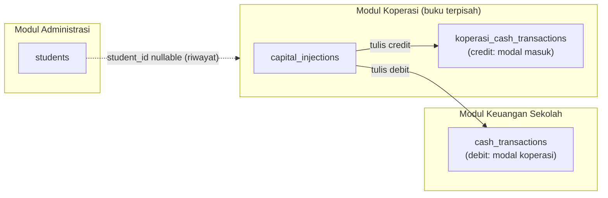

# ERD: Modul Koperasi

> Berdasarkan: [`prd.md`](./prd.md) · Turunan: [`api-contract.md`](./api-contract.md)

## Konvensi Model
- **PrimaryKey**: `id` uint auto-increment (embed `model.PrimaryKey`).
- **BaseModelTimeAt**: `created_at`, `updated_at`, `deleted_at` (soft delete) untuk entitas master/dokumen.
- Tabel **ledger** (`koperasi_cash_transactions`) mengikuti pola `cash_transactions` sekolah: hanya `created_at`/`updated_at`, **tanpa** soft delete (immutable; pembatalan via mutasi balik).
- **Referensi polimorfik** (`source_type` + `source_id`) mengikuti idiom yang sudah dipakai di `cash_transactions`/`vault_transactions` — **tanpa** FK constraint di DB.
- Semua tabel diberi prefix `koperasi_` agar tidak bentrok dengan tabel sekolah yang bernama mirip (`payments`, `cash_transactions`, dst).
- Penanda uang: `decimal(15,2)`. Scoping: `academic_year_id` pada entitas transaksional.

---

## Diagram

```mermaid
erDiagram
    ACADEMIC_YEARS ||--o{ KOPERASI_CAPITAL_INJECTIONS : "modal per TA"
    ACADEMIC_YEARS ||--o{ KOPERASI_SALES : ""
    ACADEMIC_YEARS ||--o{ KOPERASI_PURCHASES : ""
    ACADEMIC_YEARS ||--o{ KOPERASI_LOANS : ""
    ACADEMIC_YEARS ||--o{ KOPERASI_CASH_TRANSACTIONS : ""

    KOPERASI_MEMBERS ||--o{ KOPERASI_LOANS : "meminjam"
    KOPERASI_SUPPLIERS ||--o{ KOPERASI_PURCHASES : "memasok"

    KOPERASI_PRODUCTS ||--o{ KOPERASI_SALE_ITEMS : ""
    KOPERASI_PRODUCTS ||--o{ KOPERASI_PURCHASE_ITEMS : ""

    KOPERASI_SALES ||--o{ KOPERASI_SALE_ITEMS : "berisi"
    KOPERASI_PURCHASES ||--o{ KOPERASI_PURCHASE_ITEMS : "berisi"
    KOPERASI_LOANS ||--o{ KOPERASI_LOAN_INSTALLMENTS : "jadwal"

    STUDENTS ||--o{ KOPERASI_SALES : "pembeli (opsional)"

    KOPERASI_SALES ||--o{ KOPERASI_PAYMENTS : "ref piutang"
    KOPERASI_PURCHASES ||--o{ KOPERASI_PAYMENTS : "ref hutang"
    KOPERASI_LOANS ||--o{ KOPERASI_PAYMENTS : "ref angsuran"

    KOPERASI_MEMBERS {
        uint id PK
        string full_name
        string member_type "pegawai|pengurus_yayasan|pihak_luar"
        string phone
        string address
        bool is_active
        timestamp created_at
        timestamp updated_at
        timestamp deleted_at
    }

    KOPERASI_SUPPLIERS {
        uint id PK
        string name
        string contact_person
        string phone
        string address
        timestamp created_at
        timestamp updated_at
        timestamp deleted_at
    }

    KOPERASI_PRODUCTS {
        uint id PK
        string name
        string category
        string unit
        decimal cost_price "harga modal (manual)"
        decimal sale_price
        int stock
        bool is_active
        timestamp created_at
        timestamp updated_at
        timestamp deleted_at
    }

    KOPERASI_CAPITAL_INJECTIONS {
        uint id PK
        uint academic_year_id FK
        date injection_date
        decimal amount
        string notes
        uint school_cash_txn_id "ref debit kas sekolah"
        uint created_by FK
        timestamp created_at
        timestamp updated_at
    }

    KOPERASI_SALES {
        uint id PK
        uint academic_year_id FK
        uint student_id FK "nullable"
        string buyer_name "fallback non-siswa"
        date sale_date
        decimal total_amount
        decimal paid_amount
        string status "unpaid|partial|paid"
        string notes
        uint created_by FK
        timestamp created_at
        timestamp updated_at
        timestamp deleted_at
    }

    KOPERASI_SALE_ITEMS {
        uint id PK
        uint sale_id FK
        uint product_id FK
        string product_name "snapshot"
        int quantity
        decimal unit_price "harga jual saat transaksi"
        decimal unit_cost "harga modal saat transaksi (HPP)"
        decimal subtotal
        timestamp created_at
        timestamp updated_at
    }

    KOPERASI_PURCHASES {
        uint id PK
        uint academic_year_id FK
        uint supplier_id FK
        date purchase_date
        string reference_number
        decimal total_amount
        decimal paid_amount
        string status "unpaid|partial|paid"
        string notes
        uint created_by FK
        timestamp created_at
        timestamp updated_at
        timestamp deleted_at
    }

    KOPERASI_PURCHASE_ITEMS {
        uint id PK
        uint purchase_id FK
        uint product_id FK
        string product_name "snapshot"
        int quantity
        decimal unit_price "harga beli"
        decimal subtotal
        timestamp created_at
        timestamp updated_at
    }

    KOPERASI_LOANS {
        uint id PK
        uint academic_year_id FK
        uint member_id FK
        string purpose "keperluan"
        decimal principal "jumlah pinjaman"
        int tenor "jumlah angsuran"
        string repayment_method "potong_gaji|manual"
        date loan_date
        decimal paid_amount
        string status "unpaid|partial|paid"
        string notes
        uint created_by FK
        timestamp created_at
        timestamp updated_at
        timestamp deleted_at
    }

    KOPERASI_LOAN_INSTALLMENTS {
        uint id PK
        uint loan_id FK
        int sequence "angsuran ke-n"
        decimal amount_due
        decimal amount_paid
        date due_date "nullable"
        string status "unpaid|partial|paid"
        timestamp created_at
        timestamp updated_at
    }

    KOPERASI_PAYMENTS {
        uint id PK
        uint academic_year_id FK
        string ref_type "sale|purchase|loan"
        uint ref_id
        string direction "in|out"
        decimal amount
        date payment_date
        string method "cash|potong_gaji"
        string notes
        uint cash_txn_id "ref jurnal kas"
        uint created_by FK
        timestamp created_at
        timestamp updated_at
    }

    KOPERASI_MISC_TRANSACTIONS {
        uint id PK
        uint academic_year_id FK
        string flow "income|expense"
        string category
        decimal amount
        date transaction_date
        string description
        uint cash_txn_id "ref jurnal kas"
        uint created_by FK
        timestamp created_at
        timestamp updated_at
        timestamp deleted_at
    }

    KOPERASI_CASH_TRANSACTIONS {
        uint id PK
        uint academic_year_id FK
        date transaction_date
        string transaction_type "credit|debit"
        decimal amount
        string source_type "capital_injection|sale|sale_payment|purchase|purchase_payment|loan_disbursement|loan_payment|misc_income|misc_expense"
        uint source_id "nullable"
        string category "klasifikasi laporan"
        string description
        uint created_by FK
        timestamp created_at
        timestamp updated_at
    }
```

---

## Deskripsi Entitas

### 1. `koperasi_members` (Anggota) — D2
Anggota simpan-pinjam, independen dari modul SDM.

| Field | Type | Constraint | Keterangan |
|---|---|---|---|
| id | uint | PK | |
| full_name | varchar(100) | NOT NULL | Nama anggota |
| member_type | varchar(20) | NOT NULL | `pegawai` \| `pengurus_yayasan` \| `pihak_luar` |
| phone | varchar(20) | | |
| address | text | | |
| is_active | bool | default true | Anggota aktif |
| (timestamps + soft delete) | | | |

> **Forward-compat:** saat modul SDM hadir, tambahkan kolom nullable `employee_id` untuk menautkan ke data pegawai tanpa mengubah struktur ini.

### 2. `koperasi_suppliers` (Pemasok)
Pihak luar sekolah pemasok barang.

| Field | Type | Constraint | Keterangan |
|---|---|---|---|
| name | varchar(100) | NOT NULL | Nama pemasok/toko |
| contact_person | varchar(100) | | Narahubung |
| phone | varchar(20) | | |
| address | text | | |

### 3. `koperasi_products` (Barang) — D5
Master barang dengan **harga modal manual**.

| Field | Type | Constraint | Keterangan |
|---|---|---|---|
| name | varchar(100) | NOT NULL | Nama barang |
| category | varchar(50) | | Kategori (string; master menyusul — NTH) |
| unit | varchar(20) | | Satuan (pcs, lusin, dll) |
| cost_price | decimal(15,2) | NOT NULL | **Harga modal**, diset & diupdate manual |
| sale_price | decimal(15,2) | NOT NULL | Harga jual |
| stock | int | default 0 | Stok berjalan (≥0; ditambah pembelian, dikurangi penjualan) |
| is_active | bool | default true | |

### 4. `koperasi_capital_injections` (Modal) — D1
Penyaluran modal dari Keuangan sekolah per tahun ajaran.

| Field | Type | Constraint | Keterangan |
|---|---|---|---|
| academic_year_id | uint | FK, NOT NULL | Tahun ajaran modal |
| injection_date | date | NOT NULL | |
| amount | decimal(15,2) | NOT NULL | Nominal modal |
| notes | text | | |
| school_cash_txn_id | uint | NOT NULL | ID baris **debit** di `cash_transactions` sekolah (jejak ke modul Keuangan) |
| created_by | uint | FK users | |

> Saat dibuat → tulis **debit** `cash_transactions` sekolah (`source_type=koperasi_modal`) **dan** **credit** `koperasi_cash_transactions` (`source_type=capital_injection`). Lihat seam integrasi di [`integration-plan.md`](./integration-plan.md).

### 5. `koperasi_sales` + `koperasi_sale_items` (Penjualan) — D5, D6
Penjualan barang multi-item; bisa parsial (piutang).

`koperasi_sales`:
| Field | Type | Constraint | Keterangan |
|---|---|---|---|
| academic_year_id | uint | FK, NOT NULL | |
| student_id | uint | FK students, **nullable** | Pembeli siswa (relasi ringan D6) |
| buyer_name | varchar(100) | | Nama pembeli bila bukan siswa |
| sale_date | date | NOT NULL | |
| total_amount | decimal(15,2) | NOT NULL | Σ subtotal item |
| paid_amount | decimal(15,2) | default 0 | Akumulasi pembayaran |
| status | varchar(20) | default `unpaid` | `unpaid` \| `partial` \| `paid` |

`koperasi_sale_items`:
| Field | Type | Keterangan |
|---|---|---|
| sale_id | uint FK | |
| product_id | uint FK | |
| product_name | varchar(100) | _Snapshot_ nama saat transaksi |
| quantity | int | |
| unit_price | decimal(15,2) | Harga jual saat transaksi |
| unit_cost | decimal(15,2) | **HPP** — _snapshot_ `cost_price` produk saat transaksi (untuk laba) |
| subtotal | decimal(15,2) | `quantity × unit_price` |

> Saat penjualan dibuat: `product.stock -= quantity`; jika ada pembayaran awal → catat `koperasi_payments` (in) + credit kas.

### 6. `koperasi_purchases` + `koperasi_purchase_items` (Pembelian/Restock)
Pembelian dari pemasok; bisa parsial (hutang).

`koperasi_purchases`: seperti sales, dengan `supplier_id` (FK, NOT NULL) dan `reference_number` (no. nota pemasok), tanpa `student_id`.

`koperasi_purchase_items`: `product_id`, `product_name` (snapshot), `quantity`, `unit_price` (harga beli), `subtotal`.

> Saat pembelian dibuat: `product.stock += quantity`. **Harga modal TIDAK auto-update** (D5 — manual); admin memutakhirkan `cost_price` produk terpisah bila perlu. Jika ada pembayaran awal → `koperasi_payments` (out) + debit kas.

### 7. `koperasi_loans` + `koperasi_loan_installments` (Pinjaman) — D4
Pinjaman anggota tanpa bunga.

`koperasi_loans`:
| Field | Type | Keterangan |
|---|---|---|
| academic_year_id | uint FK | |
| member_id | uint FK | Peminjam |
| purpose | varchar(255) | **Keperluan** pinjaman |
| principal | decimal(15,2) | Jumlah pinjaman |
| tenor | int | **Jumlah angsuran** |
| repayment_method | varchar(20) | `potong_gaji` \| `manual` |
| loan_date | date | |
| paid_amount | decimal(15,2) | Akumulasi angsuran |
| status | varchar(20) | `unpaid` \| `partial` \| `paid` |

`koperasi_loan_installments` (jadwal, di-generate dari tenor):
| Field | Type | Keterangan |
|---|---|---|
| loan_id | uint FK | |
| sequence | int | Angsuran ke-n |
| amount_due | decimal(15,2) | `principal ÷ tenor` (sisa pembulatan ke angsuran terakhir) |
| amount_paid | decimal(15,2) | |
| due_date | date, nullable | Jatuh tempo (opsional) |
| status | varchar(20) | `unpaid` \| `partial` \| `paid` |

> Saat pinjaman dibuat: **debit** kas koperasi (uang keluar ke anggota, `source_type=loan_disbursement`) + generate jadwal angsuran.
> Pembayaran angsuran **fleksibel**: nominal bebas dialokasikan ke angsuran terurut (pas seangsuran atau lebih/sekaligus) → `koperasi_payments` (in) + credit kas.
> **Rekap per anggota** (PRD): `principal` (total) − `paid_amount` (dibayar) = sisa.

### 8. `koperasi_payments` (Pembayaran piutang/hutang/angsuran)
Tabel pembayaran terpadu untuk tiga konteks, memakai referensi polimorfik.

| Field | Type | Keterangan |
|---|---|---|
| academic_year_id | uint FK | |
| ref_type | varchar(20) | `sale` \| `purchase` \| `loan` |
| ref_id | uint | ID dokumen terkait |
| direction | varchar(3) | `in` (sale/loan) \| `out` (purchase) — turunan dari ref_type |
| amount | decimal(15,2) | Nominal bayar |
| payment_date | date | |
| method | varchar(20) | `cash` \| `potong_gaji` |
| cash_txn_id | uint | ID baris jurnal kas yang ditulis |
| created_by | uint FK | |

> Setiap baris menambah `paid_amount` dokumen induk, memutakhirkan `status`, dan menulis satu baris `koperasi_cash_transactions`.

### 9. `koperasi_misc_transactions` (Lain-lain)
Pemasukan/pengeluaran di luar kategori utama.

| Field | Type | Keterangan |
|---|---|---|
| academic_year_id | uint FK | |
| flow | varchar(10) | `income` \| `expense` |
| category | varchar(50) | Kategori bebas (klasifikasi laporan) |
| amount | decimal(15,2) | |
| transaction_date | date | |
| description | text | |
| cash_txn_id | uint | Ref jurnal kas |

### 10. `koperasi_cash_transactions` (Jurnal Arus Kas) — D1
Buku besar kas koperasi; sumber semua laporan.

| Field | Type | Keterangan |
|---|---|---|
| academic_year_id | uint FK | |
| transaction_date | date | |
| transaction_type | varchar(10) | `credit` (masuk) \| `debit` (keluar) |
| amount | decimal(15,2) | |
| source_type | varchar(30) | `capital_injection` \| `sale` \| `sale_payment` \| `purchase` \| `purchase_payment` \| `loan_disbursement` \| `loan_payment` \| `misc_income` \| `misc_expense` |
| source_id | uint, nullable | ID dokumen sumber |
| category | varchar(50) | Klasifikasi untuk laporan bulanan |
| description | varchar(255) | |
| created_by | uint FK | |

**Saldo kas koperasi** = Σ credit − Σ debit (per tahun ajaran).

---

## Relasi Lintas Modul

| Relasi | Jenis | Aturan |
|---|---|---|
| `koperasi_capital_injections.academic_year_id` → `academic_years.id` | FK | Modal per tahun ajaran (A2) |
| `koperasi_capital_injections.school_cash_txn_id` → `cash_transactions.id` | Ref (jejak) | Satu aksi menulis dua sisi (D1) |
| `koperasi_sales.student_id` → `students.id` | FK **nullable** | Relasi ringan untuk riwayat/laporan (D6); **tidak** memengaruhi keuangan siswa |
| `koperasi_*` → `users.id` (`created_by`) | FK | Audit pembuat |
| `koperasi_loans.member_id` → `koperasi_members.id` | FK | — |

> **Tidak ada** relasi ke `student_savings`/`payments` sekolah (konsekuensi D6 — relasi ringan). Bila kelak ingin bayar piutang koperasi dari tabungan siswa, itu masuk PTH dan butuh keputusan baru.
