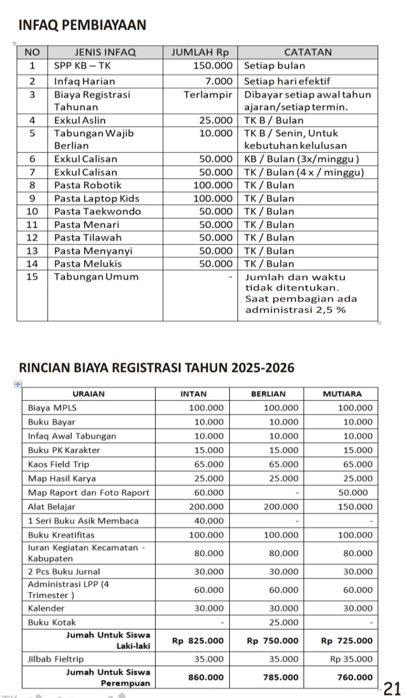
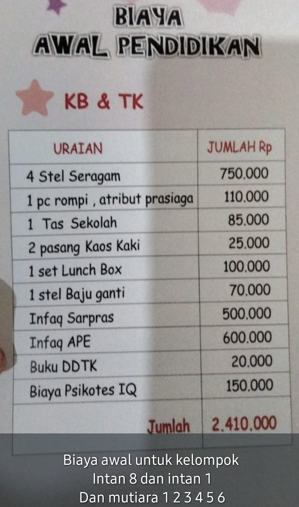
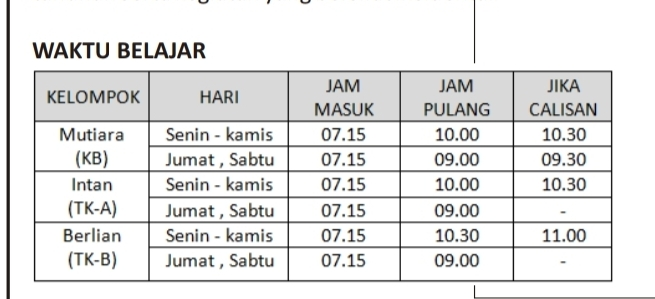
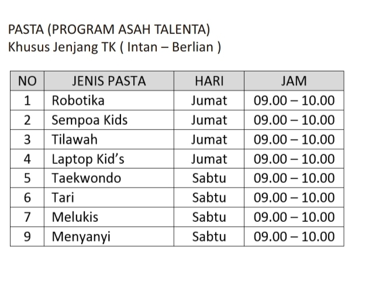
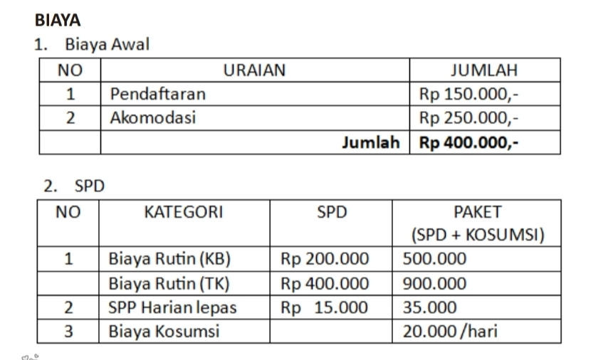

# Response Template Diskusi Kebutuhan Alizzah

### B. point 1. Apa saja jenis pembayaran yang ada?

berikut detail jenis pembayarannya:

### B. point 2. Apakah ada sistem diskon/potongan?

berikut detail sistem diskon/potongan:
diskon/dispensasi sistemnya bisa handle satu murid memiliki banyak diskon/dispensasi jenis pembayaran, lalu bisa dihitung secara otomatis ketika bill dibuat juga flexible jika ada diskon/dispensasi baru/diubah bisa langsung di disesuaikan.

selain response saya diatas, saya ingin menambahkan kebutuhan lain yaitu:

###jenjang

### pasta (ekstrakulikuler)

### daycare
daycare ini salah satu layanan terbaru di alizzah

